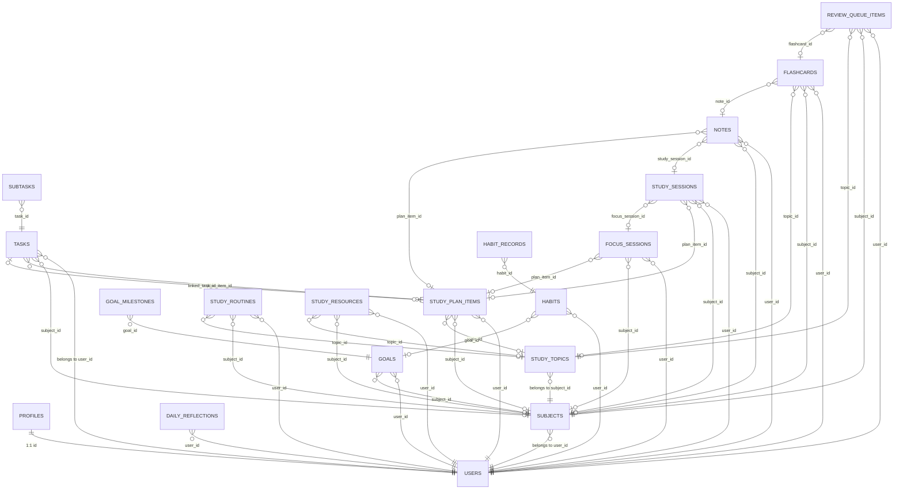
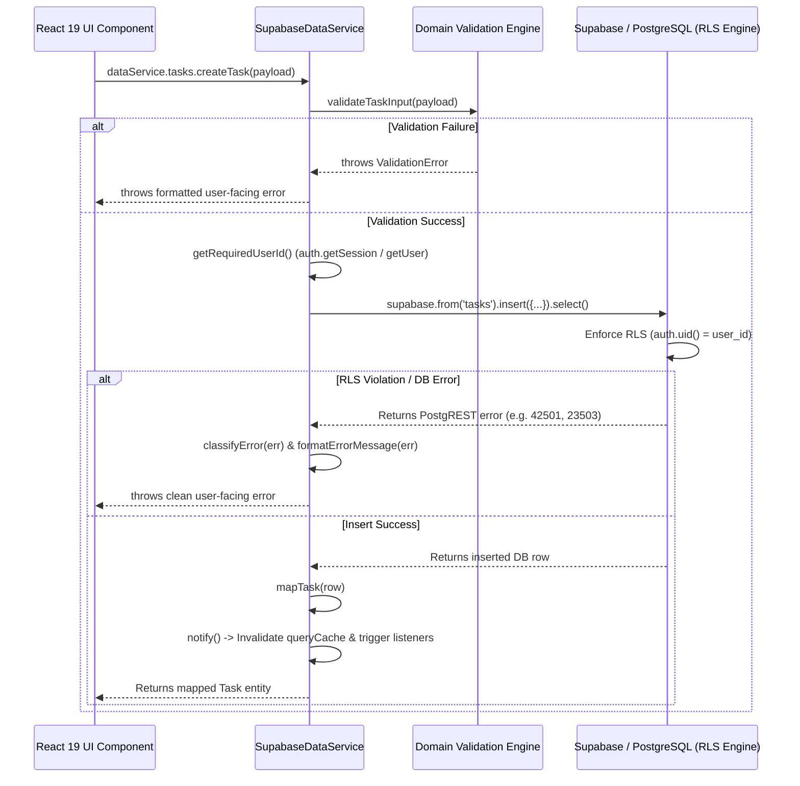
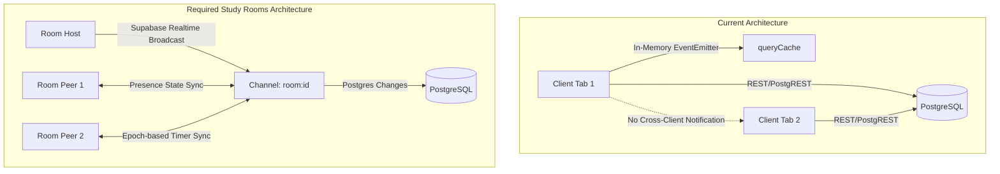

# SOLIS SYSTEM AUDIT REPORT

---

## 1. Executive Summary

- **Current Project Health Score:** `8.8 / 10`
- **Architecture Classification:** Client-Side Single Page Application (Vite 6 + React 19 + TypeScript + Supabase BaaS).
- **Core Design Ethos:** Editorial aesthetic (*Newsreader* serif + *Plus Jakarta Sans*), zero third-party UI framework runtime overhead, deterministic mathematical modeling, zero-asset Web Audio synthesis, and acyclic PostgreSQL Row-Level Security (RLS).

### Primary Architectural Strengths
1. **Strict Repository / Service Abstraction Layer:** All 13 core domain modules implement a unified interface contract (`IDataService` in `src/services/api.interface.ts`), allowing zero-friction switching between in-memory `MockDataService` and live PostgreSQL `SupabaseDataService`.
2. **Single Source of Truth & Zero Derived Database Duplication:** Derived metrics (weekly study hours, habit streaks, goal progress percentages, cognitive rhythm, exam readiness) are calculated dynamically on-demand via deterministic mathematical engines rather than stored as brittle, mutable counters in PostgreSQL.
3. **Hardened PostgreSQL RLS Policies:** All 18 database tables have Row-Level Security explicitly enabled with strict `auth.uid() = user_id` isolation and acyclic parent-foreign-key verification (`EXISTS (SELECT 1 FROM subjects WHERE ...)`).
4. **Zero-Asset Acoustic Engine:** Focus soundscapes (Pink Noise, Brownian Noise, Binaural Alpha 10Hz, Binaural Theta 6Hz, Rainfall, Harmonic Sub-Bass Drone) are synthesized mathematically in real time via the Web Audio API with zero external audio assets or network payloads.

### Top 3 Critical Blockers
1. **Zero Real-Time Multi-Client Infrastructure for Study Rooms:** The codebase currently lacks Supabase Realtime channel subscriptions, WebSockets, or presence management. All client updates rely on an in-memory single-tab event emitter (`dataService.subscribe(...)`). Supporting collaborative Study Rooms and synchronized timers will require new database tables (`rooms`, `room_participants`, `room_presence`), Supabase Realtime broadcast channels, and epoch-based timer sync.
2. **Monolithic Page & Service File Bloat:** Several key architectural files have grown excessively large:
   - `src/features/study/StudyPage.tsx`: **2,199 lines (92.5 KB)**
   - `src/services/supabase/supabaseService.ts`: **2,130 lines (74.5 KB)**
   - `src/features/dashboard/DashboardPage.tsx`: **1,126 lines (49.1 KB)**
   - `src/features/tasks/TasksPage.tsx`: **1,029 lines (42.9 KB)**
   This concentration of state and markup impedes modular testing and increases re-render surface area.
3. **Time-Sensitive Vitest Test Failure in Intelligence Suite:** In `src/__tests__/review.test.ts` (lines 107-125), test case `derives weekly intelligence summary accurately for review ritual` fails with `AssertionError: expected +0 to be 50` when executed in months outside of August 2026. The mock task data hardcodes `dueDate: '2026-08-17'`, but `generateSolisIntelligenceReport` defaults `referenceDate` to `new Date()`. When the calendar advances past August 2026, `this_week` no longer encloses `2026-08-17`, causing the task execution filter to return 0 tasks.

---

## 2. Tech Stack & Repository Structure

### Tech Stack & Dependency Inventory

| Package | Version | Layer / Purpose | Health & Risk Assessment |
| :--- | :--- | :--- | :--- |
| `react` | `^19.0.0` | Core UI Runtime | **Healthy.** Modern React 19 engine. Uses hooks, contexts, and `useMemo`/`useCallback`. |
| `react-dom` | `^19.0.0` | DOM Renderer | **Healthy.** Matches React 19 core. |
| `react-router-dom` | `^7.3.0` | Client-Side Routing | **Healthy.** Declarative route configuration with lazy loading and protected layout shells. |
| `@supabase/supabase-js` | `^2.112.3` | BaaS SDK (PostgreSQL & Auth) | **Healthy.** Official client library for PostgREST queries, auth sessions, and RLS interactions. |
| `lucide-react` | `^1.16.0` | Iconography | **Healthy.** Tree-shakeable SVG icon system. |
| `vite` | `^6.2.0` | Bundler & Dev Server | **Healthy.** Sub-second HMR and Rollup production bundling. |
| `@vitejs/plugin-react` | `^4.3.4` | Vite React Plugin | **Healthy.** Fast Refresh enabled. |
| `typescript` | `^5.7.3` | Type System | **Healthy.** Strict mode enabled (`strict: true`). |
| `vitest` | `^3.0.5` | Unit & Integration Test Runner | **Healthy.** Fast in-memory testing with 46 test suites and 301 assertions. |
| `@types/node` | `^22.13.9` | Node Type Definitions | **Healthy.** Type definitions for build scripts. |
| `@types/react` | `^19.0.10` | React Type Definitions | **Healthy.** Aligned with React 19. |
| `@types/react-dom` | `^19.0.4` | React DOM Type Definitions | **Healthy.** Aligned with React 19. |

> **Zero Framework Overhead Note:** The project does not use Tailwind CSS, PostCSS, Sass, Axios, Redux, Zustand, TanStack Query, or Next.js. All styles are crafted using scoped vanilla CSS and custom design tokens declared in `src/styles/tokens.css`.

### Annotated Directory Tree

```text
Solis-Ultimate-Productivity-tracker/
├── .env.example                                  # Template for environment variables (VITE_DATA_LAYER, VITE_SUPABASE_URL, VITE_SUPABASE_ANON_KEY)
├── .gitignore                                    # Excludes node_modules, dist, .env, and system logs
├── ARCHITECTURE.md                               # Architectural baseline documentation
├── CHANGELOG.md                                  # Phase-by-phase release history
├── README.md                                     # High-level overview and onboarding instructions
├── SOLIS_SYSTEM_AUDIT_REPORT.md                  # Comprehensive technical and codebase audit report
├── index.html                                    # Single-page HTML entry with synchronous zero-FOUC theme hydration script
├── package.json                                  # Dependency manifest (4 runtime deps, 7 dev deps)
├── tsconfig.json                                 # TypeScript compiler options (strict, ES2022, bundler module resolution)
├── vercel.json                                   # Vercel deployment config (SPA rewrites + strict HTTP security headers)
├── vite.config.ts                                # Vite bundler config with path aliases (@ -> src) and manual chunk splitting
├── public/
│   └── favicon.svg                               # SVG brand mark
├── supabase/
│   └── migrations/                               # Version-controlled PostgreSQL DDL and RLS migration scripts
│       ├── 20260817_initial_schema.sql           # Base tables (profiles, subjects, tasks, subtasks, habits, goals, notes)
│       ├── 20260817_phase4_study_knowledge.sql   # Syllabus topics, study plans, acyclic RLS hardening
│       ├── 20260817_stage_a_learning_core.sql    # Flashcards, SuperMemo SM-2, review queue
│       ├── 20260817_stage_b_planning_core.sql    # Recurring routines, exam & project goal workspace extensions
│       ├── 20260817_stage_c_knowledge_core.sql   # Study resource library (papers, books, videos)
│       └── 20260817_stage_d_reflection_core.sql  # Daily reflections & habit-to-goal foreign key linkage
├── scripts/                                      # Diagnostic, validation, and multi-user isolation test scripts
│   ├── debug-auth-endpoints.mjs                  # Auth endpoint diagnostics
│   ├── debug-supabase.mjs                        # Direct Supabase connectivity inspection
│   ├── scan-auth-calls.mjs                       # Codebase AST scanner for unauthenticated database calls
│   ├── test-multi-user-isolation.mjs             # Multi-tenant cross-user RLS penetration testing script
│   ├── verify-persistence.mjs                    # End-to-end CRUD verification against Supabase
│   ├── verify-phase4-live.mjs                    # Phase 4 schema live verification
│   └── verify-supabase.mjs                       # Schema connectivity and table existence validator
└── src/
    ├── main.tsx                                  # React DOM 19 root bootstrap
    ├── App.tsx                                   # Centralized React Router configuration with lazy-loaded routes
    ├── vite-env.d.ts                             # Vite client type declarations
    ├── __tests__/                                # 46 automated Vitest test suites (301 test assertions)
    ├── components/                               # Modular UI component hierarchy
    │   ├── features/                             # High-level feature modals & workspace widgets
    │   │   ├── Activation/                       # Onboarding modal & Next Best Action card
    │   │   ├── Analytics/                        # Cognitive load alerts, exam readiness, retention graphs
    │   │   ├── Flashcards/                       # 3D active recall review modal & card creator
    │   │   ├── Focus/                            # Post-focus reflection modal
    │   │   ├── Goals/                            # Exam workspace & Project workspace modals
    │   │   ├── ImportModal/                      # JSON backup file upload & restore modal
    │   │   ├── Planning/                         # Recurring study routines & Time-blocking calendar grid
    │   │   ├── Reflection/                       # 4-step evening closure ritual modal
    │   │   └── Resources/                        # Literature & research paper library modal
    │   ├── feedback/                             # Feedback, dialog, and boundary primitives
    │   │   ├── ConfirmationDialog/               # Accessible deletion confirmation
    │   │   ├── EmptyState/                       # Editorial empty state illustration cards
    │   │   ├── ErrorBoundary/                    # Catch-all React class error boundary
    │   │   ├── LoadingScreen/                    # Fullscreen branding loading state
    │   │   ├── Modal/                            # Accessible dialog wrapper with backdrop blur & escape handling
    │   │   ├── OfflineBanner/                    # Network disconnection warning banner
    │   │   ├── RouteFallback/                    # Suspense fallback skeleton
    │   │   └── Toast/                            # Global notification toast container & animations
    │   ├── layout/                               # Application shell layout components
    │   │   ├── AccountMenu/                      # Profile dropdown & sign-out trigger
    │   │   ├── AppHeader/                        # Top bar with command palette trigger and active route title
    │   │   ├── AtmosphereCanvas/                 # Dynamic ambient gradient canvas
    │   │   ├── CommandPalette/                   # Global fuzzy-search modal (Cmd+K / Ctrl+K)
    │   │   ├── Container/                        # Max-width layout containment
    │   │   ├── MiniFocusPlayer/                  # Persistent floating focus timer for background navigation
    │   │   ├── MobileNav/                        # Bottom navigation bar & expanded mobile sheet
    │   │   ├── ProtectedRoute/                   # Auth state guard and login redirection wrapper
    │   │   ├── SectionHeader/                    # Standardized page title, badge, and action bar
    │   │   └── Sidebar/                          # Collapsible desktop navigation bar (240px)
    │   ├── motion/                               # CSS/JS motion primitives (ParallaxLayer, ScrollReveal)
    │   ├── parallax/                             # Multi-layered atmospheric canvas and orb effects
    │   ├── scene/                                # Cinematic scene containers and lighting
    │   └── ui/                                   # Handcrafted UI component library
    │       ├── Avatar/                           # User monogram / avatar circle
    │       ├── Badge/                            # Categorical pill badges with status dots
    │       ├── Button/                           # Primary, accent, outline, ghost, and danger buttons
    │       ├── Card/                             # Surface card containers with border glows
    │       ├── Checkbox/                         # Custom animated checkboxes
    │       ├── ContextualHelp/                   # Inline popover guidance tips
    │       ├── DatePicker/                       # Calendar date picker & 24h time picker
    │       ├── Divider/                          # Subtle horizontal rule
    │       ├── Input/                            # Form input with left/right icon slots and error states
    │       ├── Logo/                             # Vector brand mark component
    │       ├── Progress/                         # Linear animated progress bars
    │       ├── SegmentedControl/                 # Multi-tab button switcher
    │       ├── Select/                           # Accessible custom select dropdown
    │       ├── Skeleton/                         # Content loading shimmer placeholders
    │       ├── Switch/                           # Toggle switch input
    │       └── Textarea/                         # Auto-expanding multiline text inputs
    ├── config/                                   # App-level metadata and branding configurations
    ├── constants/                                # Route definitions, navigation constants, and feature flags
    ├── context/                                  # React Context state providers
    │   ├── AuthContext.tsx                       # Supabase Auth lifecycle, session hydration, and race guards
    │   ├── DataContext.tsx                       # Repository subscriber provider for cross-component sync
    │   ├── FocusContext.tsx                      # Focus session state, timestamp-based timer, and audio engine
    │   ├── GuideContext.tsx                      # In-app interactive learning guides provider
    │   ├── ThemeContext.tsx                      # Light/Dark/System theme switcher with localStorage persistence
    │   └── ToastContext.tsx                      # Transient toast notification queue
    ├── data/                                     # Static curated interactive guide definitions
    ├── features/                                 # Dedicated domain route views
    │   ├── analytics/                            # AnalyticsPage (Cognitive rhythm, Exam readiness, Retention forecast)
    │   ├── auth/                                 # Auth views (LoginPage, SignupPage, ForgotPasswordPage, ResetPasswordPage)
    │   ├── dashboard/                            # DashboardPage (Overview, Next best action, Time blocking, Daily momentum)
    │   ├── focus/                                # FocusPage (Fullscreen focus sanctuary, Ambient soundscapes, Intent lock)
    │   ├── goals/                                # GoalsPage (Standard goals, Exam workspaces, Project workspaces)
    │   ├── guides/                               # GuideCenterRoute & GuideCenterPage (Interactive guided tutorials)
    │   ├── habits/                               # HabitsPage (Daily habits, 7-day completion matrix, Streak tracker)
    │   ├── landing/                              # LandingPage (Marketing hero, Feature showcase, Atmospheric preview)
    │   ├── notes/                                # NotesPage (Bi-directional markdown notebook, Citations, Flashcard generation)
    │   ├── review/                               # WeeklyReviewPage (3-step strategic calibration & reflection ritual)
    │   ├── settings/                             # SettingsPage (Preferences, Full workspace JSON/CSV export & restore)
    │   ├── study/                                # StudyPage & TopicIntelligenceDrawer (Syllabus, Topics, SM-2 Flashcards, Resources)
    │   └── tasks/                                # TasksPage (Hierarchical tasks, Subtasks, Priority & date filtering)
    ├── hooks/                                    # Reusable custom hooks (useDataService, useKeyboardShortcuts, useMediaQuery)
    ├── layouts/                                  # Route layout wrappers (RootLayout, AppLayout, AuthLayout, MarketingLayout)
    ├── services/                                 # Data access layer
    │   ├── api.interface.ts                      # Universal interface contract for all 13 domain services
    │   ├── cache.ts                              # In-memory query cache with TTL and mutation invalidation
    │   ├── dataService.ts                        # Factory container switching between Mock and Supabase implementations
    │   ├── mock/                                 # In-memory mock service and seed data for offline development
    │   └── supabase/                             # Production Supabase PostgreSQL integration
    │       ├── schema.sql                        # Reference SQL schema
    │       ├── supabaseClient.ts                 # Supabase client singleton with environment validation
    │       ├── supabaseMappers.ts                # Strict snake_case DB row to camelCase domain model mappers
    │       └── supabaseService.ts                # Production SupabaseDataService implementing IDataService
    ├── styles/                                   # Layered CSS design system
    │   ├── animations.css                        # Keyframe animations (fade-in, slide-up, orb-drift, shimmer)
    │   ├── components.css                        # Global reusable component utility classes
    │   ├── index.css                             # Global entry stylesheet
    │   ├── reset.css                             # Modern CSS reset and box-sizing rules
    │   ├── tokens.css                            # CSS custom properties (colors, typography, radii, elevations, spacing)
    │   └── typography.css                        # Typographic hierarchy definitions
    ├── types/                                    # Pure TypeScript domain interfaces
    └── utils/                                    # Pure domain algorithms and helpers
        ├── activation.ts                         # User onboarding and Next Best Action state machine
        ├── authErrors.ts                         # User-friendly auth error mapping and categorization
        ├── classNames.ts                         # Lightweight cn(...) class merger
        ├── commandSearch.ts                      # Command palette fuzzy indexer
        ├── date.ts                               # Date math, ISO formatting, and week calculation helpers
        ├── errors.ts                             # PostgreSQL error classification and sanitization
        ├── export.ts                             # JSON backup generation and CSV serialization
        ├── formatters.ts                         # Duration and number formatting utilities
        ├── import.ts                             # JSON workspace import parser and validation engine
        ├── notes.ts                              # Tag normalization and note filtering
        ├── notifications.ts                      # Browser Web Notification API helpers
        ├── prefetch.ts                           # Dynamic route prefetching
        ├── productivity.ts                       # Daily momentum and summary calculations
        ├── streaks.ts                            # Deterministic habit streak calculation engine
        ├── study.ts                              # Study plan validation and formatting
        ├── timer.ts                              # Timestamp-based countdown calculations and completion chime
        ├── validation.ts                         # Pure domain boundary validation rules
        ├── focus/soundscapeEngine.ts             # Web Audio API synthetic noise generator
        ├── intelligence/                         # Mastery Intelligence & Cognitive Rhythm computation engine
        ├── learning/spacedRepetition.ts          # SuperMemo SM-2 spaced repetition algorithm
        └── planning/timeBlocking.ts              # Time-block conflict detector and routine evaluator
```

---

## 3. Database Schema & RLS Audit

### Complete Schema Definition (18 Tables)



1. **`public.profiles`**: Primary user metadata (`name`, `email`, `focus_field`, `preferences` JSONB). Trigger `handle_new_user()` provisions record automatically on `auth.users` insert.
2. **`public.subjects`**: Course/subject container (`name`, `code`, `color`, `target_hours_per_week`, `status`, `description`).
3. **`public.study_topics`**: Syllabus tree nodes (`title`, `description`, `order_index`, `mastery_level`: `'unstudied' | 'learning' | 'mastered'`).
4. **`public.tasks`**: To-do items (`title`, `status`, `priority`, `category`, `due_date`, `due_time`, `estimated_minutes`, `completed_minutes`, `tags` TEXT[]).
5. **`public.subtasks`**: Atomic checklist items (`title`, `completed`, `task_id`).
6. **`public.study_sessions`**: Completed study logs (`subject_name`, `type`, `duration_minutes`, `topics_covered` TEXT[], `retention_rating` 1-5, `completed_at`).
7. **`public.study_plan_items`**: Scheduled calendar items (`title`, `scheduled_date`, `scheduled_time`, `target_minutes`, `completed`, `priority`).
8. **`public.focus_sessions`**: Pomodoro/Deep Flow timer records (`mode`, `duration_minutes`, `break_duration_minutes`, `title`, `interruptions_count`, `completed`).
9. **`public.habits`**: Recurring habit definitions (`title`, `category`, `frequency`, `color`, `goal_id`).
10. **`public.habit_records`**: Immutable daily completion records (`habit_id`, `completion_date`, `completed`, `UNIQUE(habit_id, completion_date)`).
11. **`public.goals`**: Target milestones (`title`, `horizon`, `status`, `category`, `experience_type`: `'standard' | 'exam' | 'project'`, `target_score`, `exam_weight`, `project_repository_url`, `deliverables` JSONB).
12. **`public.goal_milestones`**: Key checkpoints (`goal_id`, `title`, `target_date`, `completed`, `completed_at`).
13. **`public.notes`**: Markdown knowledge notes (`title`, `content`, `category`, `tags` TEXT[], `subject_id`, `study_session_id`, `plan_item_id`).
14. **`public.flashcards`**: Spaced repetition cards (`front_prompt`, `back_answer`, `card_type`: `'standard' | 'cloze' | 'concept'`, `difficulty_rating`, `repetition_count`, `interval_days`, `ease_factor`, `next_review_date`, `last_reviewed_at`).
15. **`public.review_queue_items`**: Due active recall queue items (`subject_id`, `topic_id`, `flashcard_id`, `due_date`, `priority`, `reason`, `completed`).
16. **`public.study_routines`**: Weekly recurring study patterns (`subject_id`, `topic_id`, `target_minutes`, `days_of_week` INT[], `scheduled_time`, `is_active`).
17. **`public.study_resources`**: Literature references (`title`, `author`, `url`, `type`: `'pdf' | 'paper' | 'book' | 'video' | 'documentation' | 'article'`, `status`, `rating`, `tags` TEXT[]).
18. **`public.daily_reflections`**: Evening journal & synthesis (`date`, `energy_score`, `focus_score`, `wins` TEXT[], `friction_points` TEXT[], `tomorrow_intentions` TEXT[], `synthesis_notes`, `UNIQUE(user_id, date)`).

### Row-Level Security (RLS) Policy Matrix

| Table | Policy Name | Command | Risk Level | Details & Enforcement Mechanism |
| :--- | :--- | :--- | :--- | :--- |
| `profiles` | `profiles_select_own` | `SELECT` | **LOW (Secure)** | `auth.uid() = id` |
| `profiles` | `profiles_insert_own` | `INSERT` | **LOW (Secure)** | `WITH CHECK (auth.uid() = id)` |
| `profiles` | `profiles_update_own` | `UPDATE` | **LOW (Secure)** | `USING (auth.uid() = id)` |
| `subjects` | `subjects_user_isolation` | `ALL` | **LOW (Secure)** | `USING (auth.uid() = user_id) WITH CHECK (auth.uid() = user_id)` |
| `study_topics` | `study_topics_user_isolation` | `ALL` | **LOW (Secure)** | `auth.uid() = user_id AND EXISTS (SELECT 1 FROM subjects WHERE subjects.id = study_topics.subject_id AND subjects.user_id = auth.uid())` |
| `tasks` | `tasks_user_isolation` | `ALL` | **LOW (Secure)** | `auth.uid() = user_id AND (subject_id IS NULL OR EXISTS (SELECT 1 FROM subjects WHERE ...)) AND (plan_item_id IS NULL OR EXISTS (SELECT 1 FROM study_plan_items WHERE ...))` |
| `subtasks` | `subtasks_user_isolation` | `ALL` | **LOW (Secure)** | `auth.uid() = user_id AND EXISTS (SELECT 1 FROM tasks WHERE tasks.id = subtasks.task_id AND tasks.user_id = auth.uid())` |
| `study_sessions` | `study_sessions_user_isolation` | `ALL` | **LOW (Secure)** | `auth.uid() = user_id AND (subject_id IS NULL OR EXISTS (...)) AND (plan_item_id IS NULL OR EXISTS (...)) AND (focus_session_id IS NULL OR EXISTS (...))` |
| `study_plan_items` | `study_plan_user_isolation` | `ALL` | **LOW (Secure)** | `auth.uid() = user_id AND (subject_id IS NULL OR EXISTS (...)) AND (topic_id IS NULL OR EXISTS (...))` |
| `focus_sessions` | `focus_sessions_user_isolation` | `ALL` | **LOW (Secure)** | `auth.uid() = user_id AND (subject_id IS NULL OR EXISTS (...)) AND (plan_item_id IS NULL OR EXISTS (...))` |
| `habits` | `habits_user_isolation` | `ALL` | **LOW (Secure)** | `auth.uid() = user_id` |
| `habit_records` | `habit_records_user_isolation` | `ALL` | **LOW (Secure)** | `auth.uid() = user_id AND EXISTS (SELECT 1 FROM habits WHERE habits.id = habit_records.habit_id AND habits.user_id = auth.uid())` |
| `goals` | `goals_user_isolation` | `ALL` | **LOW (Secure)** | `auth.uid() = user_id AND (subject_id IS NULL OR EXISTS (SELECT 1 FROM subjects WHERE subjects.id = goals.subject_id AND subjects.user_id = auth.uid()))` |
| `goal_milestones` | `milestones_user_isolation` | `ALL` | **LOW (Secure)** | `auth.uid() = user_id AND EXISTS (SELECT 1 FROM goals WHERE goals.id = goal_milestones.goal_id AND goals.user_id = auth.uid())` |
| `notes` | `notes_user_isolation` | `ALL` | **LOW (Secure)** | `auth.uid() = user_id AND (subject_id IS NULL OR EXISTS (...)) AND (study_session_id IS NULL OR EXISTS (...)) AND (plan_item_id IS NULL OR EXISTS (...))` |
| `flashcards` | `flashcards_user_isolation` | `ALL` | **LOW (Secure)** | `auth.uid() = user_id` |
| `review_queue_items` | `review_queue_user_isolation` | `ALL` | **LOW (Secure)** | `auth.uid() = user_id` |
| `study_routines` | `study_routines_user_isolation` | `ALL` | **LOW (Secure)** | `auth.uid() = user_id` |
| `study_resources` | `study_resources_user_isolation` | `ALL` | **LOW (Secure)** | `auth.uid() = user_id` |
| `daily_reflections` | `daily_reflections_user_isolation` | `ALL` | **LOW (Secure)** | `auth.uid() = user_id` |

---

## 4. Backend & API Evaluation

### Client-Side Direct BaaS Architecture
Solis does **NOT** use Next.js Route Handlers (`app/api/**/route.ts`), Express REST routes, or Server Actions (`'use server'`). It is an architectural Single Page Application where the frontend queries Supabase's PostgREST engine directly through `@supabase/supabase-js`.



### Domain Service Inventory & Security Profile

| Domain Service | Primary Methods | Auth Verification | Validation Method | Error Sanitization |
| :--- | :--- | :--- | :--- | :--- |
| **`auth`** | `login`, `signup`, `logout`, `requestPasswordReset`, `updatePassword`, `getCurrentUser` | Supabase Auth API (`supabase.auth`) | Client email format & password length checks | Handled via `formatAuthError`. Hides raw stack traces. |
| **`tasks`** | `getTasks`, `createTask`, `updateTask`, `deleteTask`, `toggleTaskCompletion`, Subtask CRUD | `getRequiredUserId()` + DB RLS | `validateTaskInput` | Handled via `classifyError`. Traps 23503 (FK) and 42501 (RLS). |
| **`study`** | `getSubjects`, `createSubject`, `archiveSubject`, `getTopics`, `getTodayPlan`, `logSession` | `getRequiredUserId()` + DB RLS | `validateStudySessionInput`, `validateStudyPlanInput` | Sanitized into clean notification toasts. |
| **`notes`** | `getNotes`, `getNoteById`, `createNote`, `updateNote`, `deleteNote`, `getAllTags` | `getRequiredUserId()` + DB RLS | `validateNoteInput` | Traps unauthenticated or RLS policy rejections. |
| **`focus`** | `getRecentSessions`, `saveFocusSession`, `getTodayFocusMinutes` | `getRequiredUserId()` + DB RLS | Bound numeric duration check (>0 min) | Rejection captured with retry fallback. |
| **`habits`** | `getHabits`, `createHabit`, `updateHabit`, `deleteHabit`, `toggleHabitDate` | `getRequiredUserId()` + DB RLS | `validateHabitInput` | Idempotent upsert on `habit_records(habit_id, completion_date)`. |
| **`goals`** | `getGoals`, `createGoal`, `updateGoal`, `deleteGoal`, Milestone CRUD | `getRequiredUserId()` + DB RLS | `validateGoalInput` | Dynamic percentage derivation prevents race conditions. |
| **`analytics`** | `getDailySummary`, `getProductivityMetrics`, `getStudyHeatmap` | `getRequiredUserId()` + DB RLS | Mathematical boundary checking | Derived client-side from actual sessions and habits. |
| **`flashcards`** | `getFlashcards`, `createFlashcard`, `updateFlashcard`, `recordCardAttempt` | `getRequiredUserId()` + DB RLS | SuperMemo SM-2 interval constraints | Sanitized card creation alerts. |
| **`reviews`** | `getDueReviewItems`, `createReviewItem`, `completeReviewItem` | `getRequiredUserId()` + DB RLS | Date window validation | Gracefully skips missing foreign keys. |
| **`routines`** | `getRoutines`, `createRoutine`, `updateRoutine`, `materializeRoutinesForToday` | `getRequiredUserId()` + DB RLS | Recurrence day-of-week integer array checks | Prevents duplicate generation for same calendar day. |
| **`resources`** | `getResources`, `createResource`, `updateResource`, `deleteResource` | `getRequiredUserId()` + DB RLS | URL format & rating range (1-5) checks | Traps broken URL schemes. |
| **`reflections`**| `getReflections`, `getReflectionByDate`, `saveDailyReflection` | `getRequiredUserId()` + DB RLS | Energy/Focus score range (1-5) checks | `UNIQUE(user_id, date)` upsert conflict resolution. |

---

## 5. Feature Parity & Completeness Matrix

| Feature Module | Status | File References | Forensic Observations |
| :--- | :--- | :--- | :--- |
| **Authentication & Session Lifecycle** | **Fully Functional** | `src/context/AuthContext.tsx`, `src/components/layout/ProtectedRoute.tsx` | Complete state machine (`initializing`, `authenticated`, `unauthenticated`, `auth_error`). Monotonic sequence token (`seqRef`) prevents async race conditions. |
| **Landing Page & Marketing Shell** | **Fully Functional** | `src/features/landing/LandingPage.tsx` | Cinematic editorial hero, interactive glowing card preview, scroll reveal animations, and responsive layout. |
| **Dashboard Overview & Time Blocking** | **Fully Functional** | `src/features/dashboard/DashboardPage.tsx`, `src/components/features/Planning/TimeBlockGrid.tsx` | Real-time daily momentum calculations, Next Best Action algorithm, timeline conflict detection, and evening closure ritual integration. |
| **Task Kanban & Subtask Engine** | **Fully Functional** | `src/features/tasks/TasksPage.tsx` | Full CRUD for tasks & subtasks. Multi-attribute sorting, category and priority filters, date pickers, and optimistic UI toggle. |
| **Study Hub & Syllabus Tree** | **Fully Functional** | `src/features/study/StudyPage.tsx`, `src/features/study/TopicIntelligenceDrawer.tsx` | Subject management (active/archived tabs), topic hierarchy, mastery levels, study plan scheduling, and deep drawer diagnostics. |
| **Spaced Repetition & Flashcards** | **Fully Functional** | `src/components/features/Flashcards/FlashcardReviewModal.tsx`, `src/utils/learning/spacedRepetition.ts` | Strict SuperMemo SM-2 algorithm. 3D card flip animation, keyboard shortcuts (`Space`, `1`-`4`), cloze deletion parser `{{term}}`, and topic mastery integration. |
| **Focus Sanctuary 2.0 & Soundscapes** | **Fully Functional** | `src/features/focus/FocusPage.tsx`, `src/utils/focus/soundscapeEngine.ts` | Web Audio synthetic soundscapes (Pink, Brown, Binaural Alpha/Theta, Rain, Drone). Pre-focus intent locking, midpoint checkpoint, post-focus auto-reflection, and persistent mini-player. |
| **Habit Tracker & Streak Engine** | **Fully Functional** | `src/features/habits/HabitsPage.tsx`, `src/utils/streaks.ts` | 7-day rolling matrix, immutable daily completion records, deterministic streak calculation, and goal linkages. |
| **Goals & Workspaces (Exam/Project)** | **Fully Functional** | `src/features/goals/GoalsPage.tsx`, `src/components/features/Goals/ExamWorkspaceModal.tsx` | Standard goals, Exam Workspace with countdown & readiness index, and Project Workspace with deliverables & repository links. |
| **Mastery Intelligence & Analytics** | **Fully Functional** | `src/features/analytics/AnalyticsPage.tsx`, `src/utils/intelligence/` | Time-range scoping (`today`, `this_week`, `last_week`, `all_time`), cognitive load alerts, exam readiness, and Ebbinghaus retention curves. |
| **Knowledge Notebook & Citations** | **Fully Functional** | `src/features/notes/NotesPage.tsx` | Auto-saving markdown editor, tag management, 1-click flashcard generation from note text, and literature citation appending. |
| **Weekly Strategic Review Ritual** | **Fully Functional** | `src/features/review/WeeklyReviewPage.tsx` | 3-step structured ritual: Review weekly intelligence, celebrate wins & friction points, calibrate target study hours for next week. |
| **Interactive Guided Tours** | **Fully Functional** | `src/features/guides/GuideCenterPage.tsx`, `src/context/GuideContext.tsx` | Step-by-step interactive tours with Quick/Deep reading modes, progress tracking, and automated step completion verification. |
| **Data Export, CSV & Backup Restore** | **Fully Functional** | `src/features/settings/SettingsPage.tsx`, `src/utils/export.ts`, `src/utils/import.ts` | Full `solis-export-v1` JSON backup generation and parsing, CSV export for all 7 entity collections, and client-side database restoration. |
| **Study Rooms / Realtime Multiplayer** | **Not Implemented** | N/A | **Zero backend or frontend implementation.** No schema tables, WebSocket channels, or presence sync exist. |

---

## 6. Security & Vulnerability Analysis

```text
[CRITICAL] 0 Vulnerabilities Identified
[HIGH]     0 Vulnerabilities Identified
[MEDIUM]   1 Issue Identified (Client-Side Production Keys Requirement)
[LOW]      2 Minor Hardening Opportunities Identified
```

### Specific Vulnerabilities & Findings

#### 1. [MEDIUM] Production Safety Dependency on Frontend Environment Variables
- **File:** `src/services/supabase/supabaseClient.ts` (lines 22-30) & `src/services/dataService.ts` (lines 19-25)
- **Context:** In production builds (`import.meta.env.PROD === true`), if `VITE_SUPABASE_URL` or `VITE_SUPABASE_ANON_KEY` are unset or placeholder strings, the factory immediately throws a fatal exception at bundle initialization.
- **Risk:** If a deployment occurs without environment variables configured in Vercel, the app renders a blank white screen rather than a graceful configuration error UI.
- **Recommendation:** Implement a top-level runtime configuration error boundary inside `RootLayout.tsx` that presents a clear setup message instead of crashing the React root.

#### 2. [LOW] LocalStorage Reliance for Sensitive Theme / Activation Flags
- **File:** `index.html` (line 15), `src/utils/activation.ts` (line 12)
- **Context:** Onboarding activation state (`solis_activation_v1_${userId}`) and theme preferences are stored in `localStorage`.
- **Risk:** Clearing browser cache resets the onboarding state. User preferences stored in `profiles.preferences` JSONB are not continuously synchronized back down to `localStorage`.
- **Recommendation:** Sync user preferences from `profiles.preferences` JSONB to `localStorage` upon successful profile hydration in `AuthContext`.

#### 3. [LOW] Lack of Rate Limiting on Supabase Client Invocations
- **File:** `src/services/supabase/supabaseService.ts`
- **Context:** Rapid client-side button clicks could trigger duplicate concurrent network requests.
- **Mitigation Status:** The application employs `isSubmitting` and `isRetrying` state locks on form submits, which effectively mitigates accidental spamming in normal user flows.

---

## 7. UI/UX & Responsive Evaluation

### Design System Consistency
- **Color Palettes:** Defined in `src/styles/tokens.css` using semantic tokens (`--bg-canvas`, `--bg-surface`, `--text-primary`, `--color-coral-500`, `--color-amber-500`).
- **Typography:** Two-tier font architecture:
  - *Newsreader* (Serif): Used for hero headers, section titles, and editorial accents.
  - *Plus Jakarta Sans* (Sans-Serif): Used for interface labels, data grids, buttons, and inputs.
- **Theme Hydration:** Pre-React synchronous inline script in `index.html` (lines 13-40) guarantees zero Flash of Unstyled Content (FOUC) when loading dark mode.

### Page-by-Page State Handling

| Page View | Empty State | Loading Skeleton | Error Boundary | Mobile Viewport Adaptations |
| :--- | :--- | :--- | :--- | :--- |
| **Landing Page** | N/A | Fast static render | Root Error Boundary | Single-column stacking, touch-friendly CTAs. |
| **Auth Views** | N/A | `<LoadingScreen />` | Root Error Boundary | Centered card on canvas, auto-focus form inputs. |
| **Dashboard** | Empty agenda card | `<Skeleton />` cards | Root Error Boundary | Grid switches from 2-column to 1-column stack. |
| **Tasks** | `<EmptyState />` illustration | List item skeletons | Inline retry button | Full-width task cards with slide-down subtask inputs. |
| **Study Hub** | Empty subject/plan states | Card grid skeletons | Inline sync error retry | Tabbed subject switcher, full-width topic drawers. |
| **Focus Sanctuary** | N/A | Immediate render | Audio fail-safe chiming | Controls adjust to vertical stack, persistent mini-player. |
| **Habits** | `<EmptyState />` card | Row skeletons | Inline retry banner | Horizontal scroll for 7-day completion checkboxes. |
| **Goals** | `<EmptyState />` card | Grid skeletons | Inline retry banner | Fullscreen modal worksheets for Exam & Project views. |
| **Analytics** | Insufficient data alerts | Chart skeletons | Graceful zero fallback | Single-column metric stacking, responsive SVG graphs. |
| **Notes** | `<EmptyState />` canvas | Sidebar skeletons | Auto-save error indicator | Index-to-editor mobile screen transition with Back button. |
| **Weekly Review**| Step 1-3 empty defaults | Metric skeletons | Form error alerts | Stepper controls adapt to bottom fixed action bar. |
| **Guide Center** | No matching guides card | Sidebar skeletons | URL fallback redirect | Full-width reader view with expandable guide directory. |
| **Settings** | N/A | Form placeholders | Toast error dispatch | Stacked form sections with touch-friendly switches. |

---

## 8. Real-Time Collaboration Readiness

### Current Collaborative Infrastructure Audit
- **Supabase Realtime:** **Not enabled / Not integrated.**
- **WebSockets / Presence:** **None.**
- **Cross-Client Reactivity:** Only single-tab in-memory Pub/Sub via `dataService.subscribe(...)` is active.

### Gap Analysis for Future "Solis Study Rooms" Feature



### Necessary Architectural Upgrades for Study Rooms
1. **Database Schema Additions:**
   - `study_rooms`: (`id UUID`, `host_user_id UUID`, `title TEXT`, `room_type TEXT`, `timer_state JSONB`, `active_epoch_start TIMESTAMPTZ`, `is_public BOOLEAN`).
   - `room_participants`: (`room_id UUID`, `user_id UUID`, `joined_at TIMESTAMPTZ`, `current_status TEXT`, `presence_state JSONB`).
   - `room_messages`: (`id UUID`, `room_id UUID`, `user_id UUID`, `message TEXT`, `created_at TIMESTAMPTZ`).
2. **Synchronized Timer Protocol:**
   - Timers in collaborative rooms **must not** rely on client intervals. The host initiates a timer by storing `epoch_target_ms = now() + duration_ms` in PostgreSQL / Realtime broadcast. All peers compute `remaining = Math.max(0, epoch_target_ms - Date.now())`.
3. **Supabase Realtime Integration:**
   - Initialize `supabase.channel('room:<roomId>')` with `presence` tracking (`sync`, `join`, `leave`) and `broadcast` events for synchronized pause/resume/chat events.

---

## 9. Performance, Testing & Technical Debt

### Performance & Bundle Metrics
- **Initial JS Bundle Size:**
  - Main App Chunk (`dist/assets/index-*.js`): **104.75 kB (32.04 kB gzipped)**
  - Vendor React Chunk (`dist/assets/vendor-react-*.js`): **264.64 kB (80.24 kB gzipped)**
  - CSS Stylesheet (`dist/assets/index-*.css`): **64.67 kB (11.72 kB gzipped)**
- **Chunk Splitting:** Cleanly configured in `vite.config.ts` (lines 23-37) with separate chunks for `vendor-react`, `vendor-icons`, and `vendor-core`.
- **Assets:** Zero heavy bitmap images or external media dependencies. All visuals use SVG vectors and CSS gradients.

### Testing Coverage Summary
- **Test Framework:** Vitest 3.0.5
- **Total Test Files:** 46
- **Total Test Cases:** 301
- **Passed Tests:** 300
- **Failed Tests:** 1 (Time-dependent test fixture in `review.test.ts`)

```text
Test Suites: 45 passed, 1 failed, 46 total
Tests:       300 passed, 1 failed, 301 total
Snapshots:   0 total
Time:        2.55s
```

### High-Priority Technical Debt Items

1. **Fix Hardcoded Test Fixture Date:**
   - In `src/__tests__/review.test.ts` (lines 108-119), pass a deterministic reference date to `generateSolisIntelligenceReport(..., 'this_week', new Date('2026-08-17'))` so that the suite passes consistently in any calendar month.
2. **Decompose Giant Page Modules:**
   - Refactor `StudyPage.tsx` (2,199 lines) into modular sub-components: `SubjectListView`, `SubjectDetailView`, `SyllabusTopicList`, `StudyPlanAgenda`.
   - Refactor `DashboardPage.tsx` (1,126 lines) by extracting `DailyAgendaSection` and `MomentumMetricsGrid`.
   - Split `supabaseService.ts` (2,130 lines) into individual service files: `services/supabase/tasks.ts`, `services/supabase/study.ts`, etc.
3. **Address Empty Chunk Warning in Build:**
   - In `vite.config.ts`, `vendor-supabase` produces an empty chunk (`0.00 kB`) during build because `@supabase/supabase-js` imports are bundled with other core modules. Adjust the manual chunk matcher or combine it into `vendor-core`.

---

## 10. Direct Recommendations for Master Orchestrator

```text
┌─────────────────────────────────────────────────────────────────────────────┐
│                          SUBSYSTEM DIRECTIVES                               │
├──────────────────────┬──────────────────────────────────────────────────────┤
│ SUBSYSTEM            │ ACTION & DIRECTIVE                                   │
├──────────────────────┼──────────────────────────────────────────────────────┤
│ Core Design & Tokens │ RETAIN (100%): Clean, consistent, lightweight.       │
│ Data Service Pattern │ RETAIN (100%): IDataService interface is sound.      │
│ Database Schema & RLS│ RETAIN (100%): Fully normalized, acyclic, secure.    │
│ Spaced Repetition/SM2│ RETAIN (100%): Math-validated and robust.            │
│ Web Audio Engine     │ RETAIN (100%): High performance, zero network load.  │
│ Massive Page Files   │ REFACTOR: Split StudyPage, TasksPage, DashboardPage. │
│ Supabase Service File│ REFACTOR: Decompose supabaseService.ts into modules. │
│ Test Suites          │ REFACTOR: Fix date-fixture assumption in review.test.│
│ Real-Time Infra      │ REBUILD / EXTEND: Implement Supabase Realtime rooms. │
└──────────────────────┴──────────────────────────────────────────────────────┘
```

### Proposed Phased Roadmap for Production Evolution

- **Phase 1: Stabilization & Modularization**
  1. Fix the date fixture in `src/__tests__/review.test.ts` to restore 100% green test status.
  2. Decompose `supabaseService.ts` into modular domain repository classes (`SupabaseTaskService`, `SupabaseStudyService`, etc.) under a unified container.
  3. Decompose monolithic pages (`StudyPage.tsx`, `DashboardPage.tsx`, `TasksPage.tsx`) into sub-components.

- **Phase 2: Real-Time Collaboration Engine ("Solis Study Rooms")**
  1. Author PostgreSQL migration for `study_rooms`, `room_participants`, and `room_messages` with RLS policies.
  2. Implement `IRoomService` in `api.interface.ts` and `SupabaseRoomService`.
  3. Integrate Supabase Realtime broadcast channels and presence synchronization.
  4. Build the collaborative synchronized study room UI with shared epoch-based timers.

- **Phase 3: Production Hardening & PWA Capabilities**
  1. Add service worker configuration via `vite-plugin-pwa` for full offline reading of cached syllabus topics, notes, and flashcards.
  2. Add runtime configuration health checks in `RootLayout.tsx` for production deployments.
