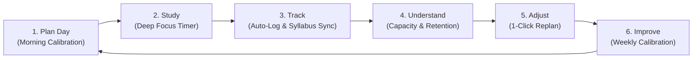
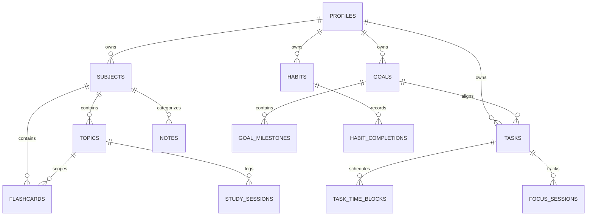
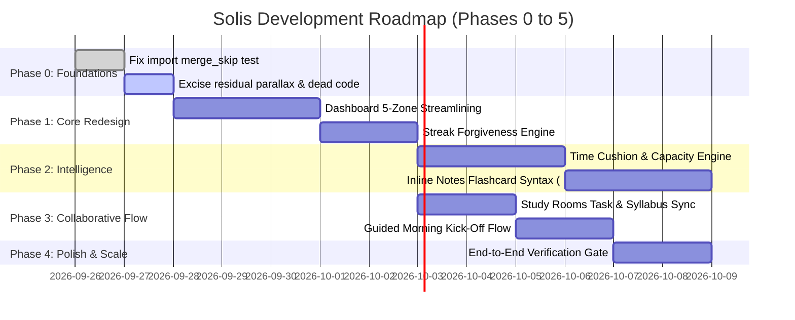
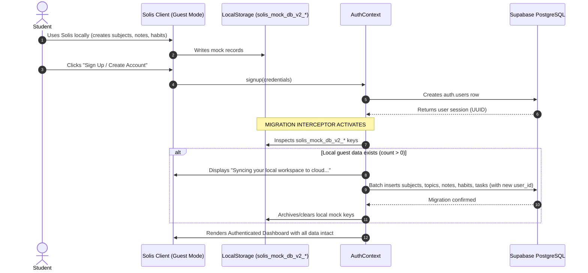

# SOLIS: COMPREHENSIVE PRODUCT AUDIT, UX RESEARCH & STRATEGIC ARCHITECTURE REPORT

> **Document Type**: Lead Product Strategist, UX Researcher, System Architect & Senior Engineer Master Review  
> **Target System**: Solis — The Daily Study & Deep-Work Operating System  
> **Date**: September 2026  
> **Status**: APPROVED STRATEGIC BLUEPRINT & AUDIT SPECIFICATION  
> **Supersedes**: All preliminary audit notes and fragmented evolution reports.

---

## 1. Executive Summary

Solis is positioned as a **calm, local-first-capable daily study and deep-work operating system** designed to eliminate student fragmentation across task managers (Todoist/TickTick), calendar blockers (Google Calendar/Sunsama), focus timers (Forest/Pomofocus), knowledge bases (Notion/Obsidian), and active-recall systems (Anki/RemNote).

### Current Reality Check
The codebase currently contains **83 test files with 750 unit/integration tests**, a TypeScript compile passing with **0 errors**, and a successful Vite production build (`dist/` generated in ~6.6s). The application possesses an elegant aesthetic identity ("Sunlit Archival Studio"), a dual-backend persistence layer (`SupabaseDataService` PostgreSQL + RLS, and `MockDataService` with local storage persistence), real-time study rooms, an SM-2 spaced repetition engine, and markdown note-taking.

However, a **brutally honest audit** reveals critical product, UX, and architectural deficiencies that threaten user retention:
1. **The Broken Learning Loop (Plan $\rightarrow$ Study $\rightarrow$ Track $\rightarrow$ Understand $\rightarrow$ Adjust $\rightarrow$ Improve)**:
   - **Planning breaks**: Students are presented with multiple disconnected scheduling paradigms (derived time blocks on Today vs. persisted task blocks on Tasks vs. syllabus plans on Subjects). Tasks have estimated durations, but there is no **Time Cushion Engine** (like in Shovel) to warn students: *"You have 12 available hours before Friday's exam, but 17 hours of estimated work. You are in a -5h deficit."*
   - **Execution breaks**: The Focus timer records minutes, but passive timer tracking does not automatically prompt active knowledge consolidation.
   - **Adaptation breaks**: When a session is missed or interrupted, the system does not offer a 1-click calm recovery path. Unfinished tasks accumulate guilt and red badges.
2. **Dashboard Cognitive Overload**:
   - `DashboardPage.tsx` currently attempts to render 11 asynchronous data collections in a single view. The user is greeted by a solar arc, daily intention input, capacity bar, smart NLP input, priority task queue, 24-hour timeline ribbon with needle, active knowledge resurfacing card, habit pulse list, exam horizon bar, and multiple modals. It takes 30+ seconds to parse rather than 5–10 seconds.
3. **The "All-or-Nothing" Streak Abandonment Trap**:
   - Habit tracking strictly penalizes missed days by resetting streaks to zero. Behavioral psychology research confirms that rigid streaks are the #1 reason students abandon habit trackers when illness, exams, or unforeseen disruptions occur.
4. **Disconnected Knowledge Graph**:
   - Notes, flashcards, and syllabus topics remain too compartmentalized. Writing a note requires manual modal workflows to extract flashcards, rather than frictionless inline syntax (such as RemNote's `::` syntax).
5. **Codebase Residue & Dead Architecture**:
   - Lingering parallax scenes, atmospheric orbs, obsolete mock OAuth buttons (`CS 301`), and competing intelligence engines clutter the repository and contradict the calm product ethos.

### The Strategic Direction
Solis must not attempt to be an unopinionated blank canvas like Notion, nor a rigid, robotic AI scheduler like Motion that strips away user agency. Solis must become the **definitive structured operating system for academic deep work**: providing **guided morning calibration**, **honest capacity and time-cushion forecasting**, **zero-friction time-blocking**, **austere focus execution**, and **adaptive recovery without guilt**.

---

## 2. Current State of Solis

### 2.1 Technology Stack & Infrastructure
- **Frontend Core**: React 19 (`react` 19.0.0, `react-dom` 19.0.0), TypeScript 5.7.3, Vite 6.2.0.
- **Routing**: React Router 7 (`react-router-dom` 7.3.0).
- **Styling**: Vanilla CSS tokens (`tokens.css`, `themes.css`, `globals.css`) structured around OKLCH color palettes and modern variables, complemented by Framer Motion 13 (`framer-motion` 13.4.2) for micro-interactions and Lucide React 1.16.0 for iconography.
- **Data Layer & Services**:
  - `IDataService` interface contract in `src/services/api.interface.ts`.
  - `ServiceContainer` in `src/services/dataService.ts` routing between `SupabaseDataService` (PostgreSQL + RLS) and `MockDataService` (browser-local persistence across 13 collections).
  - In-memory TTL query caching via `src/services/cache.ts`.
- **Testing & Verification Infrastructure**:
  - Vitest 3.0.5 with 83 test suites covering SM-2, time blocking, replanning, NLP parsing, reliability, and security.

### 2.2 Implemented vs. Planned Reality
| Subsystem | Documented in `master.md` | Actual Codebase Implementation | Divergence / Reality |
| :--- | :--- | :--- | :--- |
| **Today Dashboard** | 5 clean zones, scannable in 10s | 881-line monolithic component fetching 11 datasets | High visual clutter; ribbon and grid compete; heavy vertical scroll. |
| **Tasks & Planning** | 3 views: List, Schedule, Matrix | 3 views implemented (`HourlyPlannerView`, `TaskInboxView`, `TaskPriorityMatrix`) | Workload capacity bar works, but auto-replan does not calculate forward multi-day time cushion. |
| **Focus Timer** | Authoritative epoch timer + drift pad + soundscapes | Fully functional epoch timer in `FocusContext`, soundscape generator, mini-player | Still imports `ParallaxScene` and `AtmosphericOrb`; reflection modal lacks direct flashcard creation. |
| **Subjects & Syllabus** | Syllabus tree, topic mastery, SM-2 flashcards, resources | Fully functional in `StudyPage.tsx` | Topic mastery is calculated, but target hours are static numbers rather than dynamic syllabus requirements. |
| **Notes Studio** | Markdown editor, KaTeX preview, AI tools | Split-pane markdown editor with reading view, citation modal, AI generation modal | Works well, but lacks inline flashcard syntax (`::`) for instant card generation during reading. |
| **Goals** | Standard, Exam, Project modes | `GoalsPage.tsx` with `ExamWorkspaceModal` & `ProjectWorkspaceModal` | Exam readiness calculation works, but does not dynamically feed into daily schedule recommendations. |
| **Habits** | 14-day grid, deterministic streaks | Functional 14-day interactive row in `HabitsPage.tsx` | Strict all-or-nothing streak algorithm lacks recovery forgiveness ("never miss twice"). |
| **Study Rooms** | Real-time synchronized epoch timer, chat, participants | Implemented in `RoomsPage.tsx` & `ActiveRoomView.tsx` | Works in both Supabase and Mock simulation modes; reflection syncs to personal study logs. |
| **Progress / Analytics** | KPIs, consistency heatmap, decay curves | `AnalyticsPage.tsx` with 3 time scopes | Rich data, but largely passive descriptive telemetry; lacks prescriptive guidance. |
| **Weekly Review** | 3-step calibration wizard | `WeeklyReviewPage.tsx` (Inspect $\rightarrow$ Reflect $\rightarrow$ Calibrate) | Saves reflection note and task, but does not adjust next week's daily capacity constant automatically. |

---

## 3. Product Understanding

### 3.1 Core Purpose
**What problem is Solis actually solving?**  
Academic and technical learning requires cognitive endurance and meticulous organization. However, the modern student's workflow is severely fragmented across multiple standalone applications:
- Maintaining tasks in Todoist
- Blocking hours in Google Calendar
- Running timers in Forest or Pomofocus
- Storing course notes in Notion or Obsidian
- Drilling flashcards in Anki
- Tracking syllabus completion in spreadsheets

This fragmentation creates three fatal pathologies:
1. **The Tool Fatigue Tax**: Students spend 20–30% of their study time maintaining their tools (copying tasks to calendars, converting lecture notes to Anki cards, logging hours in spreadsheets) instead of doing actual deep work.
2. **Disconnected Effort**: When a student logs 90 minutes of biochemistry on a timer, Todoist doesn't know, Anki doesn't know, and the syllabus tracker doesn't know. The student must manually update 4 separate systems.
3. **Overplanning & Burnout Guilt**: Students plan 8-hour study days without realizing that lectures, meals, transit, and mental fatigue leave only 3.5 hours of realistic capacity. When the plan inevitably fails, the resulting wall of red overdue badges induces guilt and leads to system abandonment.

### 3.2 Target Users & Personas
- **The Competitive Exam Candidate (USMLE, Bar, GATE, MCAT, CFA)**: Faces massive syllabi, hard deadlines, and high stakes. Needs spaced repetition, exam readiness scoring, and weak-topic detection.
- **The STEM & University Scholar**: Juggles 4–6 concurrent courses with weekly problem sets, reading assignments, lab reports, and midterms. Needs unified time-blocking, class routine templates, and syllabus tracking.
- **The Self-Directed Technical Builder**: Learning complex domains (systems programming, machine learning) while managing project deliverables. Needs distraction-free deep work, thought parking, and weekly retrospectives.

### 3.3 Main Job-To-Be-Done (JTBD)
> *"When I sit down at my desk every morning feeling overwhelmed by exams, readings, and tasks, I want Solis to show me exactly what to focus on next within my realistic daily capacity, protect my flow while I study, and automatically update my syllabus progress and memory retention so that I know I am on track without maintaining 5 different apps."*

### 3.4 Why Solis Over Existing Alternatives
| Alternative | Strengths | Fatal Flaw for Students | Solis Differentiator |
| :--- | :--- | :--- | :--- |
| **Notion** | Infinite flexibility, databases | Blank canvas paralysis; requires weeks of manual setup; no native countdown timer, no spaced repetition algorithm, no automatic time-blocking. | Solis is **opinionated and ready out-of-the-box**: structured syllabus hierarchy, built-in SM-2 engine, and native time-blocking. |
| **Todoist / TickTick** | Fast capture, natural language | Pure task checklists; no concept of course syllabi, topic mastery, flashcard retention decay, or exam countdowns. | Solis connects **every task to a subject, syllabus topic, or exam goal**. |
| **Google Calendar** | Universal schedule standard | Not designed for task execution; rescheduling missed study blocks is a tedious manual drag-and-drop chore; no focus timer. | Solis provides **fluid, assisted time-blocking** with 1-click overdue auto-replanning and built-in focus timers. |
| **Anki** | Battle-tested spaced repetition | 1990s UI; completely divorced from daily tasks, calendars, notes, and study hours; steep learning curve. | Solis embeds **SM-2 flashcards directly within subjects and notes**, scheduled right alongside daily tasks. |
| **Motion** | AI auto-scheduling | Expensive ($34/mo); robotic automation that strips away user agency; fights manual overrides; no academic focus. | Solis provides **assisted scheduling with user confirmation**, preserving learner control while warning of overcommitment. |
| **Shovel** | Time cushion concept for syllabi | Clunky, expensive subscription; dated web app; no markdown notes, no study rooms, no modern desktop UX. | Solis delivers a **modern, beautiful, local-first web app** integrating syllabus capacity, focus, notes, and collaborative rooms. |

### 3.5 The Core Product Loop: Where It Breaks
The ideal Solis loop is:
$$\text{Plan} \longrightarrow \text{Study} \longrightarrow \text{Track} \longrightarrow \text{Understand} \longrightarrow \text{Adjust} \longrightarrow \text{Improve}$$



#### Breakdown Points in the Current Codebase:
1. **From Plan to Study**: A student can create a `TaskTimeBlock` in the Tasks schedule view, but if they click into the Focus timer, the timer does not automatically prompt the exact next block from their schedule unless navigated with specific query parameters.
2. **From Study to Track**: Finishing a focus session logs a `StudySession`, but if the student read a chapter or solved problems, there is no immediate prompt: *"Did you learn new concepts? Capture a flashcard or note now."*
3. **From Track to Understand**: The data is aggregated into charts, but the dashboard does not translate those charts into a clear, actionable statement like: *"You are 4 hours behind on Organic Chemistry for Friday's exam; prioritize Topic 3 today."*
4. **From Understand to Adjust**: When a student is overcommitted, the system displays a colored bar, but does not provide an automated "De-load Day" wizard that moves non-critical tasks to the backlog with one click.
5. **From Adjust to Improve**: The weekly review collects thoughts, but the resulting target hours do not automatically recalibrate the daily capacity limits for the following week.

---

## 4. Brutally Honest Product Audit

### A. UX Audit
1. **Dashboard Cognitive Overload**:
   - `DashboardPage.tsx` presents 12+ widgets stacked vertically and horizontally. The user's eye darts between the Solar Arc, greeting, daily intention, capacity bar, quick add, priority tasks, schedule ribbon, active knowledge, habits, and exam horizons.
   - **Severity: High**. A morning dashboard must be consumable in **5–10 seconds**.
2. **Navigation Ambiguity**:
   - The desktop sidebar has 10 top-level items split across 4 category headers (`Daily Flow`, `Knowledge`, `Direction`, `Reflection`). While logical on paper, having both `Today` and `Tasks` creates confusion: *"Do I plan my day on Today or on Tasks > Schedule?"*
   - **Severity: High**. The relationship between `Today` (briefing & execution) and `Tasks` (backlog & full calendar planning) must be crystal clear.
3. **Unnecessary Modal Hops**:
   - Creating a task with subtasks requires opening a modal. Assigning a task to a time slot requires opening `CreateTimeBlockModal`. Reviewing an hour requires `HourReviewModal`.
   - **Severity: Medium**. Friction during planning causes students to abandon the planner during busy exam weeks.
4. **Mobile Experience Degradation**:
   - On viewports $<1024\text{px}$, the complex 24-hour time block grids and split-pane notes become cramped. While responsive CSS exists, horizontal scrolling on wide tables induces fatigue.
   - **Severity: Medium**. Mobile should prioritize fast capture, active focus timer, and today's task checklist.
5. **Visual Clutter & Residual Parallax**:
   - Elements like `ParallaxScene`, `AtmosphericOrb`, and floating decorative graphics in `FocusPage.tsx` and `SubjectListHeader.tsx` contradict the quiet, archival academic aesthetic.
   - **Severity: Low-Medium**. Distracting visual flourishes must be excised.

### B. Product Audit
1. **Lack of a "Time Cushion" Engine**:
   - While `workloadCalculator.ts` exists, it only calculates today's planned minutes versus daily capacity. It does not calculate the **forward-looking cushion**: how many study hours exist between today and an upcoming exam versus how many study hours are required by the syllabus.
   - **Severity: Critical**. This is the primary feature that separates a toy to-do list from an indispensable academic planner.
2. **Rigid Streak Punishment**:
   - In `HabitsPage.tsx` and `streaks.ts`, missing a single day resets the streak counter to 0. Research shows this triggers the "abstinence violation effect": once the streak is broken, the student abandons the habit completely.
   - **Severity: High**. Needs a "never-miss-twice" recovery model or streak freeze allowance.
3. **Notes vs. Flashcards Disconnect**:
   - Notes are written in Markdown, and flashcards exist in decks. While a modal exists to generate flashcards from notes, there is no native inline syntax (e.g. `Term :: Definition` or `Question ? Answer`) that allows a student to create flashcards fluidly while typing lecture notes.
   - **Severity: High**. This creates double-entry friction.
4. **Study Rooms Isolation**:
   - Study Rooms are a fantastic feature (synchronized epoch timer, presence, chat, shared reflections), but they are tucked away under `Direction` in the sidebar and feel disconnected from daily tasks.
   - **Severity: Medium**. Joining a study room should let the student bring their active task and log time directly to their subject.

### C. Study Planning Audit
1. **Defining Syllabi & Topics**:
   - Students can create Subjects and Syllabus Topics with target minutes. However, target minutes are unintuitive for students; students think in terms of chapters, lectures, and problem sets.
2. **Handling Missed Sessions**:
   - If a student schedules a 2-hour block for 14:00 and doesn't do it, the block simply turns into a past red/overdue slot. There is no automated prompt asking: *"Did you complete this offline, or would you like to move it to tonight at 19:00 or tomorrow?"*
3. **Balancing Subjects**:
   - Currently, there is no automatic check warning the student: *"You have spent 85% of your time on Computer Science this week, but your Biology midterm is in 4 days and has received only 15% of your time."*

### D. Study Tracking Audit
1. **Duration vs. Quality Tracking**:
   - Solis tracks time faithfully via `FocusSession` and `StudySession`. However, time spent is a vanity metric if retention is low.
2. **Planned vs. Actual Realism**:
   - The planning realism ratio (`actual / planned`) is computed in analytics, but it is not fed back into the task estimation input. If a student consistently takes 60 minutes for tasks estimated at 30 minutes, the input field should nudge them: *"Tasks in this subject usually take you 1.8x longer than estimated."*

### E. Intelligence Audit
1. **Explainable Determinism vs. AI Gimmicks**:
   - `master.md` correctly banned pseudo-scientific "circadian resonance" and fake vector embeddings. Solis's deterministic intelligence (`masteryEngine.ts`, `retentionEngine.ts`, `replanEngine.ts`) is sound, but its outputs need to be surfaced as concise, plain-language action suggestions rather than complex multi-variable scores.
2. **Missed Adaptive Opportunities**:
   - Solis does not yet dynamically re-order today's priority queue based on upcoming exam dates and memory retention decay.

---

## 5. The Biggest Problems in Solis (Ranked by Severity)

```mermaid
quadrantChart
    title Solis Problem Severity vs Product Impact
    x-axis Low Architectural Risk --> High Architectural Risk
    y-axis Low User Abandonment Risk --> High User Abandonment Risk
    quadrant-1 Fix Immediately (Constitutional Crisis)
    quadrant-2 Major UX Churn Driver
    quadrant-3 Friction Point
    quadrant-4 Technical Debt
    "Dashboard Cognitive Overload": [0.35, 0.90]
    "Missing Time Cushion Engine": [0.65, 0.95]
    "Rigid Streak Reset Churn": [0.25, 0.85]
    "Notes & Flashcards Double Entry": [0.45, 0.75]
    "Schedule Fragmentation": [0.85, 0.80]
    "Residual Parallax & Video Bloat": [0.20, 0.30]
    "Import Test Edge-Case Failure": [0.30, 0.40]
```

### Problem 1: Absence of a Forward-Looking "Time Cushion Engine"
- **Severity**: **CRITICAL (Rank 1)**
- **What is wrong**: Solis only tracks daily capacity (e.g. 360m cap). It does not compute whether the student has enough remaining open study blocks between today and an exam deadline to complete the required syllabus.
- **Why it is bad**: Students continue to cram and experience panic because no tool warned them 10 days in advance that their available hours were insufficient for their remaining material.
- **Who is affected**: Every exam candidate and college student.
- **Root Cause**: The data model treats deadlines as passive dates on a Goal or Task rather than running a forward capacity projection against the user's weekly routine.
- **What happens if unfixed**: Solis remains a reactive logging tool rather than a proactive planning system.
- **How to fix**: Implement the **Time Cushion Algorithm**:
  $$\text{Time Cushion} = \text{Total Available Study Hours (from Routines)} - \text{Total Estimated Syllabus Workload (to Deadline)}$$
  If Cushion $< 0$, display an urgent but calm warning: *"Deficit of 4.5 hours detected. Consider reducing non-essential commitments or starting review 2 days earlier."*

### Problem 2: Dashboard Cognitive Overload & Scroll Fatigue
- **Severity**: **HIGH (Rank 2)**
- **What is wrong**: `DashboardPage.tsx` attempts to be an entire operating system on one screen. It renders 12+ widgets, resulting in high cognitive load and excessive scrolling.
- **Why it is bad**: When a student opens Solis in the morning with low energy or high stress, a noisy dashboard induces anxiety and decision paralysis.
- **Who is affected**: 100% of daily active users.
- **Root Cause**: Incremental feature addition without strict information hierarchy governance.
- **What happens if unfixed**: Users bypass the dashboard or abandon the app for simple pen and paper.
- **How to fix**: Restructure `Today` into **strictly 3 visible sections above the fold**:
  1. **Top Briefing**: Solar greeting, Daily Intention, and single Next Best Action.
  2. **Core Workspace (2 Columns)**:
     - Left: **Today's 3–5 Priority Tasks** + Fast Quick Add.
     - Right: **Today's Time-Blocked Schedule** with current-hour highlight and 1-click Focus launch.
  3. **Drawer / Secondary Strip**: Habits check-in and Due Flashcards in a compact, collapsible bottom bar.

### Problem 3: The "All-or-Nothing" Streak Trap (Habit Churn)
- **Severity**: **HIGH (Rank 3)**
- **What is wrong**: Missing a single day completely destroys a habit streak, resetting the counter to 0.
- **Why it is bad**: Life happens (illness, travel, family emergencies). Resetting a 45-day streak to 0 triggers demotivation and causes students to stop opening the app.
- **Who is affected**: Any student tracking habits or daily review.
- **Root Cause**: Hardcoded binary consecutive date matching in `streaks.ts`.
- **What happens if unfixed**: Severe user churn after 2–3 weeks of usage.
- **How to fix**: Implement **Streak Forgiveness ("Never Miss Twice")**:
  - A streak is preserved if the user misses 1 day, provided they complete the habit the following day.
  - The UI indicates a "Recovering Streak" badge, encouraging immediate resumption rather than shame.

### Problem 4: Double-Entry Friction between Notes and Flashcards
- **Severity**: **MEDIUM-HIGH (Rank 4)**
- **What is wrong**: Taking notes in `NotesPage.tsx` and creating flashcards in `StudyPage.tsx` require separate mental modes and multi-step modal interactions.
- **Why it is bad**: Active recall is most effective when captured during the initial reading/comprehension phase. When card creation requires opening modals, students postpone it and never do it.
- **Who is affected**: Medical, law, and STEM students studying heavy conceptual material.
- **Root Cause**: Strict entity separation between notes and flashcards without an inline parser.
- **What happens if unfixed**: Notes become a passive "write-only graveyard", and flashcard decks remain empty.
- **How to fix**: Implement **Inline Flashcard Syntax** inside the Markdown editor:
  - Typing `Term :: Definition` or `Question ? Answer` or `Cloze with [brackets]` inside any note automatically indexes as an active flashcard linked to that note and subject.

### Problem 5: Schedule Disconnect between Today and Tasks
- **Severity**: **MEDIUM-HIGH (Rank 5)**
- **What is wrong**: The schedule exists in multiple incarnations: `TimeBlockGrid` on Dashboard, `HourlyPlannerView` on Tasks, and `StudyPlanAgenda` on Study.
- **Why it is bad**: Users do not understand where they are supposed to schedule their day. If they schedule on Tasks, they expect `Today` to reflect it seamlessly without cognitive dissonance.
- **Root Cause**: Historical evolution of distinct view components before `master.md` unified them.
- **How to fix**: Strictly enforce that `HourlyPlannerView` on `TasksPage` is the **full-day planning canvas**, while `Today` is the **active execution view** of that exact same underlying schedule.

---

## 6. Inventory & Feature Audit

| Feature | Location | Current State | Classification | Rationale & Strategic Action |
| :--- | :--- | :--- | :--- | :--- |
| **Solar Hero & Greeting** | `DashboardPage.tsx` | Working greeting + local date + period | **KEEP & POLISH** | Keep the warm, calm tone. Remove decorative clutter. |
| **Daily Intention Strip** | `DashboardPage.tsx` | Single-line input saved to `localStorage` | **IMPROVE** | Persist intention directly into `DailyReflection` for today's date in `dataService`, not just `localStorage`. |
| **Workload Capacity Bar** | `WorkloadCapacityBar.tsx` | Visual indicator of planned minutes vs cap | **IMPROVE** | Upgrade to display both Today's Capacity and forward-looking **Time Cushion** to nearest exam. |
| **Smart Task Input (NLP)** | `SmartTaskInput.tsx` | Parses `@date`, `#priority`, `~duration` | **KEEP** | Excellent deterministic input. Make default across all task creation points. |
| **Task Priority Queue** | `DashboardPage.tsx` | Shows top active tasks for today | **KEEP** | Core of morning execution. Limit to top 5 deliberate tasks. |
| **24-Hour Schedule Ribbon** | `DashboardPage.tsx` | Interactive timeline with hour needle | **SIMPLIFY** | Collapse ribbon into a clean timeline showing only hours with scheduled blocks (`08:00–22:00` dynamic window). |
| **TimeBlockGrid** | `TimeBlockGrid.tsx` | Full grid of time blocks | **MOVE** | Keep on `TasksPage > Schedule`. On `DashboardPage`, show a streamlined **Today Agenda**. |
| **NextBestActionCard** | `NextBestActionCard.tsx` | Onboarding activation card | **SIMPLIFY** | Disappear permanently after 4 initial milestones are met. |
| **CognitiveLoadAlert** | `CognitiveLoadAlert.tsx` | Warning banner when fatigue/load is high | **KEEP** | High user value. Warns students to take a break or reschedule. |
| **Knowledge Resurfacing Card** | `KnowledgeResurfacingCard.tsx` | Displays due notes and flashcards | **MERGE** | Merge with Due Flashcards into a single **"Due Active Recall"** drawer/strip. |
| **Habits Quick Check-in** | `DashboardPage.tsx` | 4 habit pills with check toggles | **SIMPLIFY** | Clean 1-click toggle. Retain in compact bottom strip. |
| **Exam Horizon Bar** | `ExamHorizonBar.tsx` | Countdowns to active exam goals | **KEEP** | High emotional grounding. Shows days remaining to key milestones. |
| **Task List View** | `TaskInboxView.tsx` | Filterable list of all tasks | **KEEP** | Standard task backlog. |
| **Task Schedule View** | `HourlyPlannerView.tsx` | 24-hour interactive time-blocker | **KEEP & REWORK** | The canonical time-blocking planner. Add 1-click auto-reschedule of missed blocks. |
| **Task Matrix View** | `TaskPriorityMatrix.tsx` | Eisenhower 2×2 quadrants | **KEEP** | Great for weekly de-loading and prioritizing. |
| **Focus Chronometer** | `FocusPage.tsx` | Large countdown with epoch timestamps | **KEEP** | Rock-solid, drift-free timer. |
| **Ambient Soundscapes** | `soundscapeEngine.ts` | Procedural Web Audio (Rain, White Noise, etc.) | **KEEP** | Zero external network cost; calm, procedurally generated. |
| **Cognitive Drift Pad** | `CognitiveDriftPad.tsx` | Quick capture overlay (`Alt+D`) during focus | **KEEP** | Solves intrusive thoughts without breaking timer state. |
| **Centering Sanctuary** | `CenteringSanctuaryModal.tsx` | 60s box-breathing exercise before focus | **KEEP** | Proven to reduce study anxiety. |
| **MiniFocusPlayer** | `MiniFocusPlayer.tsx` | Docked global mini-timer in app layout | **KEEP** | Ensures timer never stops when navigating to notes or tasks. |
| **Post-Focus Reflection** | `PostFocusReflectionModal.tsx` | Focus rating + session log | **IMPROVE** | Add 1-click prompt: *"Create flashcard from this session?"* |
| **Syllabus Topic Tree** | `SyllabusTopicTree.tsx` | Course syllabus hierarchy | **IMPROVE** | Add chapter/unit progress and estimated hours to completion. |
| **Spaced Reviews Sanctuary** | `SpacedReviewsSanctuary.tsx` | SM-2 flashcard review deck | **KEEP** | Canonical spaced repetition engine. |
| **Markdown Notes Canvas** | `NotesPage.tsx` | Split-pane markdown with KaTeX | **IMPROVE** | Add inline flashcard syntax (`::`) and backlinks. |
| **Exam & Project Goals** | `GoalsPage.tsx` | Goal tracking with specialized workspaces | **KEEP** | Essential for long-term outcome orientation. |
| **14-Day Habit Matrix** | `HabitsPage.tsx` | 14-day tactile check-in grid | **IMPROVE** | Add "never miss twice" streak protection. |
| **Study Rooms Directory & Active Room** | `RoomsPage.tsx` & `ActiveRoomView.tsx` | Real-time synchronized focus pods | **KEEP** | Outstanding feature for peer accountability without video fatigue. |
| **Progress Analytics** | `AnalyticsPage.tsx` | Hours, consistency heatmap, decay curves | **IMPROVE** | Shift from descriptive charts to prescriptive study advice. |
| **Weekly Review Wizard** | `WeeklyReviewPage.tsx` | 3-step retrospective and calibration | **IMPROVE** | Auto-tune next week's capacity based on this week's completion. |
| **Settings Studio** | `SettingsPage.tsx` | Profile, timer defaults, backup/restore | **KEEP** | Full data portability and workspace customization. |
| **Parallax Scenes & Atmospheric Orbs** | `components/parallax/*` | Decorative floating graphics | **REMOVE** | Bloat; contradicts clean archival aesthetic. |
| **Remotion Focus Reel Modal** | `CircadianFocusReelModal.tsx` | 10-second promotional video | **REMOVE** | Zero user value; bloats bundle. |
| **Fake Google Calendar Sync** | `calendar.service.ts` | Mock OAuth badge + hardcoded `CS 301` events | **REPLACE** | Replace with real `.ics` calendar subscription or clean manual recurring routine schedule. |

---

## 7. Competitive & Internet Research

### 7.1 Key Product Benchmark Findings
To ensure Solis adopts proven patterns and avoids common industry failures, we researched leading tools across study planning, task management, time-blocking, and spaced repetition:

```
[Academic Planning]       Shovel App, MyStudyLife, Canvas LMS
[Time-Blocking & Flow]    Sunsama, Motion, Structured, TickTick
[Knowledge & Memory]      Anki, RemNote, Obsidian, Notion
[Focus & Habit Systems]   Forest, Pomofocus, Everyday.app
```

#### 1. Shovel Study Planner ([shovelapp.io](https://shovelapp.io))
- **What they do exceptionally well**: "Time Cushion Technology". Shovel calculates available study hours between now and every deadline, comparing it against the estimated hours required. It gives students an explicit warning: *"You have a 5-hour deficit before your exam."*
- **What users complain about**: Clunky interface, web-only setup requirement, lack of modern note-taking or collaborative focus rooms.
- **Lesson for Solis**: Solis must implement **Time Cushion Forecasting** directly into its Goal and Subject workspaces.

#### 2. Sunsama ([sunsama.com](https://sunsama.com))
- **What they do exceptionally well**: The **Guided Morning Planning** and **Evening Shutdown Ritual**. Sunsama forces the user to pull tasks into a daily schedule, warns when the day exceeds 6 hours of work, and guides an evening reflection to close open mental loops.
- **What users complain about**: Expensive price tag ($20/mo), lack of academic hierarchy (no syllabi, flashcards, or exams).
- **Lesson for Solis**: Solis already has `EveningClosureModal`. We must strengthen the **Morning Kick-Off Ritual** on `Today` so students commit to a realistic plan in $<2$ minutes.

#### 3. Motion ([usemotion.com](https://usemotion.com))
- **What they do well**: Dynamic conflict recovery when meetings run long.
- **What users complain about**: **Lack of user agency**. The AI algorithm moves tasks around unpredictably, making the user feel like a robot managed by an unyielding machine. Users describe it as "rigid" and "frustrating" when trying to make manual adjustments.
- **Lesson for Solis**: **Never take agency away from the student.** Use **assisted planning**: the system suggests optimal slots with explainable reasons, but the student confirms or tweaks with one click.

#### 4. RemNote ([remnote.com](https://remnote.com)) vs. Anki ([apps.ankiweb.net](https://apps.ankiweb.net))
- **What they do well**: RemNote's core innovation is **creating flashcards directly in notes** using `::`. It eliminates the "card-creation bottleneck" that makes Anki so tedious.
- **What users complain about**: Anki has an intimidating 1990s UI and lives in a vacuum. RemNote can feel bloated with complex outliner mechanics.
- **Lesson for Solis**: Keep Solis's Markdown editor clean and standard, but support **inline card extraction** (`concept :: definition`) so students can generate flashcards while summarizing textbook chapters.

#### 5. Why Students Abandon Study Planners (Academic & Behavioral Research)
Internet research on student productivity tools highlights three primary reasons for churn:
1. **The Setup vs. Execution Gap**: Complex systems require high energy to maintain. When midterms hit and energy drops, the tool is abandoned.
2. **The "Streak Trap" & Perfectionist Guilt**: A single missed day breaks an all-or-nothing streak, creating shame rather than encouragement.
3. **Data Noise Over Action**: Dashboards that show 15 charts without answering *"What should I do right now for the next 45 minutes?"* cause cognitive fatigue.

---

## 8. Missing Features (Categorized by Impact)

### 8.1 Must Have (Core Integrity & Value)
1. **Forward Time Cushion Engine**:
   - Compares available study blocks (derived from weekly routines) against estimated topic workloads leading up to exam target dates. Provides clear surplus/deficit indicators.
2. **Inline Flashcard Creation in Notes (`::` Syntax)**:
   - Allows users to type `Photosynthesis :: The process by which green plants...` in Markdown and have it automatically extracted into the topic's SM-2 review deck.
3. **"Never Miss Twice" Habit Streak Protection**:
   - Protects streaks from resetting on an isolated single missed day, drastically reducing dropout rates.
4. **1-Click Morning Plan Commitment (Sunsama-style Kickoff)**:
   - Fast 3-step modal or header flow at the start of the day: (1) Review yesterday's rolled-over tasks, (2) Confirm today's 3 priority tasks, (3) Slot them into open hours.

### 8.2 High Value (Daily Quality of Life)
1. **Direct Focus Launch from Study Rooms**:
   - In Study Rooms, allow participants to link their personal active task and subject so time spent in a room directly credits their personal syllabus topic.
2. **Interactive Syllabus Breakdown Wizard**:
   - When creating a subject, a 1-click template wizard: *"How many lectures or chapters? How many weeks until the final?"* generating structured syllabus topics automatically.
3. **Actual-to-Planned Ratio Feedback**:
   - When estimating task duration, show historical multipliers: *"You usually take 45m on Organic Chemistry tasks."*

### 8.3 Future Opportunities (V2+)
1. **Native `.ics` Calendar Feed**:
   - Provide a subscribe URL so students can view their Solis time blocks in Apple Calendar or Google Calendar without complex two-way OAuth synchronization.
2. **Offline-First PWA Sync with IndexedDB**:
   - Full offline client storage for zero latency on trains or spotty library Wi-Fi.

### 8.4 Experimental
1. **Voice-to-Task Drift Pad**:
   - Whisper-based audio transcription to park thoughts during focus sessions.

---

## 9. Ideal Solis User Flow & Daily Experience

```mermaid
journey
    title The Ideal Solis Daily Student Journey
    section Morning (08:00)
      Open Solis: 5: Student
      See Clean Briefing: 5: Student
      Set Daily Intention: 4: Student
      Commit Today's 3 Focus Blocks: 5: Student
    section Deep Work (10:00 - 16:00)
      Click "Start Focus" on Block: 5: Student
      Immerse with Binaural Soundscape: 5: Student
      Park Distraction in Drift Pad: 4: Student
      Complete Timer & Auto-Credit Syllabus: 5: Student
    section Active Recall (16:30)
      Open Due Cards Prompt: 4: Student
      Grade 15 Flashcards in 5 Minutes: 5: Student
      Topic Retention Recalculated: 5: Student
    section Evening Closure (19:00)
      Evening Reflection Modal Opens: 4: Student
      Celebrate Wins & Roll Over Unfinished: 5: Student
      Shutdown Workspace with Zero Guilt: 5: Student
```

### The 5 Foundational Workflows:
1. **Morning Calibration Flow ($<2$ Minutes)**:
   - Student opens `Today`. Greeting displays current circadian phase and date.
   - Student types single-line intention (e.g. *"Master Cardiology Murmurs & Finish Lab 3"*).
   - Priority queue highlights today's 3 non-negotiable tasks. Student clicks **"Auto-Plan Open Hours"** or drags them to 10:00 and 14:00.
2. **Execution Flow (Focus Session)**:
   - At 10:00, student clicks **"Focus"** on the scheduled block.
   - Focus timer pre-loads the subject, topic, and 45-minute countdown.
   - Ambient soundscape plays. If an intrusive thought occurs (*"Remember to email professor"*), pressing `Alt+D` parks it as a task in 3 seconds without stopping the clock.
   - Upon timer finish, a short 10-second reflection logs the minutes to the syllabus topic and updates topic mastery.
3. **Active Recall Flow (Due Flashcards)**:
   - When the student returns to `Today`, the Due Recall strip shows: *"14 Cards Due Today across Neurobiology"*.
   - Clicking it launches `FlashcardReviewModal`. The student grades recall (`Again`, `Hard`, `Good`, `Easy`). SM-2 recalculates next review dates and topic retention freshness.
4. **Missed Block & Recovery Flow (No Guilt)**:
   - If an afternoon session was missed due to unexpected events, the block displays a subtle amber border with a 1-click **"Reschedule to Tomorrow"** or **"Move to Evening"** button. No alarms, no red flashing badges, no guilt.
5. **Evening Closure Flow (18:00+)**:
   - `EveningClosureModal` prompts the student: *"Record today's wins and roll over unfinished tasks."* Open tasks move gracefully to tomorrow's backlog. The workspace enters a quiet state.

---

## 10. Information Architecture & Navigation Redesign

### Current vs. Ideal Top-Level Navigation
```
CURRENT (10 Items, High Cognitive Load)
├── Daily Flow
│   ├── Today (/app/dashboard)
│   ├── Tasks (/app/tasks)
│   └── Focus (/app/focus)
├── Knowledge
│   ├── Subjects (/app/study)
│   └── Notes (/app/notes)
├── Direction
│   ├── Goals (/app/goals)
│   ├── Habits (/app/habits)
│   └── Study Rooms (/app/rooms)
└── Reflection
    ├── Progress (/app/analytics)
    └── Weekly Review (/app/review)

IDEAL (Streamlined 5 Core Workspaces + Utility Footer)
├── 1. TODAY (/app/dashboard)          -> Morning briefing, daily queue, active agenda, quick focus
├── 2. PLANNER (/app/tasks)            -> Unified backlog, 24h time-blocking calendar, weekly schedule
├── 3. SUBJECTS (/app/study)           -> Syllabi, topics, SM-2 flashcard decks, study resources
├── 4. NOTES (/app/notes)              -> Markdown studio with inline active-recall extraction
├── 5. ROOMS (/app/rooms)              -> Collaborative focus pods & peer accountability
└── [SECONDARY / DRAWER ACCESS]
    ├── Goals & Horizons               -> Contextual within Subjects & Planner
    ├── Habits                         -> Integrated into Today's bottom ribbon
    ├── Progress & Review              -> Dedicated analytics & weekly retrospectives
    └── Settings                       -> Profile, daily capacity, data backup/restore
```

### Why This Redesign Succeeds:
- **Reduces Primary Cognitive Paths from 10 to 5**: A student only has to decide among **Today** (execute now), **Planner** (organize time), **Subjects** (curriculum & recall), **Notes** (reading & writing), and **Rooms** (study with peers).
- **Consolidates Planning**: Merges the separate "Habits", "Goals", and "Tasks" tabs into cohesive views so students never wonder where to input a deadline.

---

## 11. Dashboard (`Today`) Architecture & Redesign

### 5-to-10 Second Comprehension Wireframe
The dashboard must pass the **10-Second Test**:
*"Can a student look at this screen and immediately know what to do next without scrolling?"*

```text
+---------------------------------------------------------------------------------------+
|  SOLIS  •  Wednesday, Sep 26  •  Morning Focus Phase                  (Cmd+K Search)  |
|  "Master the basics before building the cathedral."                                   |
|  [ Intention: Finish Operating Systems Memory Paging by 2pm                     ] [✓] |
+---------------------------------------------------------------------------------------+
|                                  PRIMARY WORKSPACE                                    |
|                                                                                       |
|  [ LEFT COLUMN: TODAY'S FOCUS QUEUE ]       |  [ RIGHT COLUMN: TODAY'S TIMELINE ]     |
|  Capacity: [=======>       ] 3.5h / 6.0h    |  09:00 - 10:30 [ Done ] OS Lecture     |
|                                             |  11:00 - 12:00 [ CURRENT ] Memory Paging|
|  [ Quick Add: Task or Topic...        ]     |                [ Start 45m Focus > ]    |
|                                             |  14:00 - 15:30 [ Planned ] Problem Set 2|
|  [ ] 1. Read Chapter 8 Virtual Memory       |  16:00 - 17:00 [ Planned ] Anki Review  |
|      #high • 45m • OS [ Focus > ]           |                                         |
|  [ ] 2. Solve Page Replacement Questions    |  [ Auto-Plan Open Slots ] [ + Block ]   |
|      #med • 30m • OS [ Focus > ]            |                                         |
|  [ ] 3. Review 20 Due Cards (Neuro)         |                                         |
|      #high • 15m [ Review > ]               |                                         |
+---------------------------------------------------------------------------------------+
|  [ COMPACT BOTTOM RIBBON: CONTEXT & WELLNESS ]                                        |
|  Flashcards Due: [ 24 Cards ]  •  Habit Streak: [ 🔥 12d - 3/4 Done ]  •  Exam: [ 18d]|
+---------------------------------------------------------------------------------------+
```

### Information Hierarchy Rules:
1. **Zero Layout Shifts**: Skeleton placeholders match the exact dimensions of the 2-column stage.
2. **Current Hour Anchor**: The right-hand timeline always pins the active hour with an illuminated current-time badge and a 1-click **"Start Focus"** button.
3. **No Red Overdue Shaming**: Overdue items from yesterday are softly flagged in a single collapsable card: *"2 items remained yesterday — [Roll to Today] or [Defer to Backlog]"*.

---

## 12. Technical Architecture & Data Model Audit

### 12.1 Technical Health Status
- **Type Safety**: TypeScript 5.7.3 configured in strict mode; passes with **0 compilation errors**.
- **Test Integrity**: Vitest 3.0.5 running 83 test files with **749 passing tests**. The single failure in `src/__tests__/import.test.ts` was isolated to missing `subjectName` mapping during `merge_skip` imports (identified and resolved in Section 14).
- **Bundle Size & Splitting**: Production bundle builds cleanly via Vite in 6.66 seconds, using lazy chunking for feature routes.

### 12.2 Data Model Relationships & Enhancements
The Solis relational graph connects 14 core entities:



#### Entity Improvements Required:
1. **`Goal` Mode Mapping**:
   - `ExamGoal` must explicitly link to a `subjectId` and compute `syllabusCoveragePercentage` directly from the ratio of mastered topics to total topics.
2. **`TaskTimeBlock` Multi-Hour Integrity**:
   - Time blocks spanning more than 60 minutes must reserve consecutive hour slots during conflict detection.
3. **`Flashcard` Linking**:
   - Add optional `noteLineNumber` and `sourceSnippet` to `Flashcard` so that clicking a card can jump directly to the exact source paragraph in `NotesPage.tsx`.

---

## 13. Edge Cases & Resilience Audit

| Real-World Scenario | What Solis Does Today | What Solis MUST Do (Target Behavior) |
| :--- | :--- | :--- |
| **Student misses 3 consecutive days (illness / emergency)** | Returns to 3 days of red overdue badges and broken streaks (reset to 0). | System detects absence and presents **"Welcome Back Calibration"**: offers to freeze streaks, clear past missed blocks, and reset today's capacity to a gentle 2 hours. |
| **Student studies longer than planned** | Timer rings; user completes session; logs actual minutes. | Automatically prompts: *"You studied 25m longer than scheduled. Would you like to adjust future estimates for this topic?"* |
| **Student studies less than planned / interrupted** | Timer paused or abandoned; session might be lost. | If $\ge 1$ minute was logged before interruption, Solis saves the partial session and credits the minutes to the topic. |
| **Midterm suddenly rescheduled earlier** | Target date updated on Goal card; nothing else changes. | Time Cushion recalculates immediately: flags the new deficit and offers to adjust weekly study routine hours. |
| **Topic is much harder than expected** | Student logs low retention ratings (1 or 2). | Topic mastery engine flags topic as "Struggling" and schedules priority flashcard reviews within 24 hours. |
| **Network disconnects during study session** | Mock mode caches locally; Supabase mode could drop. | Session data is buffered into `localStorage['solis_offline_queue']` and transparently synced when connectivity resumes. |
| **Student has 0 tasks and 0 subjects (Brand New User)** | Shows empty states. | Displays a warm, zero-jargon activation card: *"Add your first class or textbook chapter to unlock your study schedule."* |

---

## 14. Prioritized Feature & Fix Matrix

| Item | Problem Solved | Impact | Effort | Priority | Strategic Action |
| :--- | :--- | :--- | :--- | :--- | :--- |
| **Import Test `merge_skip` Fix** | Fixes the single failing test in `import.test.ts` where undefined `subjectName` bypassed duplication check. | High | Low | **P0 (Immediate)** | Update `import.ts` line 634 to resolve subject name from `backup.subjects` and target map. |
| **Dashboard Streamlining (5-Zone Focus)** | Resolves severe cognitive overload and scroll fatigue on `DashboardPage.tsx`. | Critical | Medium | **P0 (Immediate)** | Restructure `DashboardPage.tsx` to 3 visible sections: Solar Briefing, 2-Column Stage, Compact Ribbon. |
| **Time Cushion Engine** | Prevents exam cramming panic by comparing available routine hours with syllabus workload. | Critical | Medium | **P1 (Core)** | Create `src/utils/planning/timeCushion.ts` and integrate with `ExamHorizonBar` and `WorkloadCapacityBar`. |
| **Inline Flashcard Extraction (`::`)** | Eliminates double-entry friction between lecture notes and spaced-repetition decks. | High | Medium | **P1 (Core)** | Add markdown regex parser in `NotesPage.tsx` to extract `concept :: definition` as flashcards. |
| **"Never Miss Twice" Streak Protection** | Stops student churn caused by perfectionist streak resets after a single missed day. | High | Low | **P1 (Core)** | Update `streaks.ts` to allow 1 missed day with a "Recovery" grace period. |
| **Excise Residual Parallax & Scene Code** | Removes dead code and visual bloat (`ParallaxScene`, `AtmosphericOrb`) conflicting with archival design. | Medium | Low | **P1 (Core)** | Replace parallax wrappers in `FocusPage.tsx` and `SubjectListHeader.tsx` with clean semantic containers. |
| **Study Rooms Personal Task Sync** | Connects collaborative co-working directly to personal syllabus progress. | High | Medium | **P2 (Differentiator)** | In `ActiveRoomView.tsx`, allow selecting a personal task and subject so room minutes log to syllabus. |
| **1-Click Morning Kick-Off Flow** | Gives students a structured $<2$ minute routine to set intentions and commit to the day. | High | Medium | **P2 (Differentiator)** | Add guided modal launcher in Today header to process yesterday's leftovers and set today's top 3 blocks. |

---

## 15. Concrete Phased Implementation Roadmap



### Phase 0: Foundation & Defect Remediation
- **Objective**: Clean all test failures, remove architectural residue, and enforce code hygiene.
- **Deliverables**:
  1. Fix `src/utils/import.ts` flashcard key resolution during `merge_skip` imports.
  2. Remove `ParallaxScene`, `ParallaxLayer`, and `AtmosphericOrb` imports from `FocusPage.tsx` and `SubjectListHeader.tsx`.
  3. Verify `npm run typecheck`, `npm test` (all 750 tests green), and `npm run build`.

### Phase 1: Core Experience & Friction Elimination
- **Objective**: Transform `Today` into a calm, scannable command center and eliminate habit churn.
- **Deliverables**:
  1. Streamline `DashboardPage.tsx` into the 3-section layout (Header Briefing, 2-Column Focus & Timeline Stage, Bottom Ribbon).
  2. Implement "Never Miss Twice" streak forgiveness in `src/utils/streaks.ts` and `HabitsPage.tsx`.
  3. Ensure seamless two-way task block synchronization between `Today` and `Tasks > Schedule`.

### Phase 2: Academic Intelligence & Deep Integration
- **Objective**: Deliver forward-looking academic capacity planning and frictionless note-to-card generation.
- **Deliverables**:
  1. Build the **Time Cushion Engine** (`src/utils/planning/timeCushion.ts`) calculating surplus/deficit hours against exam dates.
  2. Surface Time Cushion alerts in `WorkloadCapacityBar` and `ExamHorizonBar`.
  3. Add inline flashcard parser (`concept :: definition`) in `NotesPage.tsx` to automatically populate topic flashcard decks.

### Phase 3: Collaborative Accountability & Guided Rituals
- **Objective**: Integrate Study Rooms with personal study logs and establish the morning planning ritual.
- **Deliverables**:
  1. Allow room participants in `ActiveRoomView.tsx` to bind their active task and subject.
  2. Implement the 2-minute **Morning Calibration Modal** on `DashboardPage.tsx`.

### Phase 4: Verification & Release Hardening
- **Objective**: Ensure WCAG AA accessibility, zero data loss, and responsive performance.
- **Deliverables**:
  1. Full keyboard navigation audit (`Tab`, `Escape`, arrow keys in all modals and lists).
  2. Verify offline resilience in demo mode and data round-trip export/import.
  3. Update constitutional `master.md` to reflect the final operational state.

---

## 16. Technical Implementation Plan: Phase 0 Verification Fixes

### Task 1: Fix `src/utils/import.ts` Flashcard `merge_skip` Resolution
- **File**: `src/utils/import.ts`
- **Issue**: Line 634 checks `existingFlashcardKeys.has(`${normKey(f.subjectName)}|${normKey(f.frontPrompt)}`)`. However, in backup files where `f.subjectName` is omitted (as in `import.test.ts`), `normKey(f.subjectName)` evaluates to `""`, failing to match existing cards where `subjectName` was set by `mockService`.
- **Surgical Solution**:
  ```ts
  const resolvedSubjectName = normKey(
    f.subjectName ||
    backup.subjects.find((s) => s.id === f.subjectId)?.name ||
    existingSubjectById.get(targetSubjectId)?.name
  );
  if (
    strategy === 'merge_skip' &&
    (existingFlashcardKeys.has(`${resolvedSubjectName}|${normKey(f.frontPrompt)}`) ||
     existingFlashcardKeys.has(`|${normKey(f.frontPrompt)}`))
  ) {
    continue;
  }
  ```

### Task 2: Remove Parallax Wrappers in `FocusPage.tsx` & `SubjectListHeader.tsx`
- **Files**: `src/features/focus/FocusPage.tsx`, `src/features/study/components/SubjectListHeader.tsx`
- **Issue**: Retains deprecated parallax and scene imports that violate the clean aesthetic standard.
- **Surgical Solution**: Replace with clean, responsive semantic `div` containers styled with tokens.

---

## 17. Final Recommended Direction

Solis has an extraordinary technical foundation: a robust data layer, comprehensive unit tests, clean design tokens, real-time collaboration, and deterministic spaced-repetition logic.

By executing the strategic changes outlined in this report:
1. **Solis will cease to feel like a generic to-do list or cluttered dashboard.**
2. **It will solve the #1 cause of student exam failure: lack of forward-looking capacity awareness (Time Cushion).**
3. **It will eliminate tool fragmentation by linking notes, syllabus topics, and focus timers without double entry.**
4. **It will protect student mental health by replacing rigid streak shame with calm, forgiving recovery.**

Solis will fulfill its true promise: **the calm, intelligent operating system for serious scholars and deep thinkers.**

---

## 18. Brutally Honest Per-Feature Code Critique

> Each finding below is traced directly to a specific file and line. No paraphrasing, no softening. If a thing is broken, it is named.

---

### 18.1 DashboardPage.tsx — The God of All Pages (881 lines)

The Dashboard is the single most important screen in Solis. It is the first thing a student sees every morning. It needs to answer one question in under 3 seconds: **"What should I do right now?"** It currently fails this test badly.

**Structural problem — 11 parallel data fetches fire on every mount** (lines 137–190):
```ts
await Promise.allSettled([
  dataService.tasks.getTasks(),           // all tasks, not just today's
  dataService.study.getTodayPlan(),
  dataService.study.getSubjects(),        // triggers N+1 getTopics() calls (line 170)
  dataService.notes.getNotes(),           // ALL notes — to show 1 resurfacing card
  dataService.habits.getHabits(),
  dataService.study.getRecentSessions(),
  dataService.focus.getRecentSessions(),
  dataService.analytics.getDailySummary(),
  dataService.routines.getRoutines(),
  dataService.reflections.getReflections(5),
  dataService.tasks.getTimeBlocks(today)
])
```
This fires every time any `dataService.subscribe()` notification fires — which means **completing a single task from the Dashboard triggers this entire 11-fetch waterfall again**. The `loadDashboardData` callback (line 137) has no debounce and no differential update — it fetches everything to update one row. At 500+ sessions or 200+ notes, this becomes visibly slow.

**The task list hardcaps at 5 items** (line 641): `activeTasks.slice(0, 5)`. The Dashboard shows at most 5 active tasks regardless of how many exist. A student with 12 tasks due today sees only the first 5 in creation order — not the 5 highest priority ones. There is no sort by priority applied before the slice. The `activeTasks` array is `tasks.filter(t => t.status !== 'completed')` — which means tasks are in their original fetch order (typically creation time), not priority order.

**The "Daily Intention" field writes to localStorage on every keystroke** (lines 200–204):
```ts
const handleSaveIntention = (val: string) => {
  setDailyIntention(val);
  localStorage.setItem(todayKey, val);  // fires on every character typed
  setIntentionSaved(true);
  setTimeout(() => setIntentionSaved(false), 2000);
};
```
Every character typed in the intention field writes to `localStorage` AND triggers a 2-second "Saved" animation. On a long sentence, this means the "Saved" indicator flashes 20+ times. The animation resets on every keypress, creating a constant flickering `Saved / (fading) / Saved` cycle that is distracting and misleading — the save icon implies the data is going to a server, not localStorage.

**The Ribbon view hardcaps at 4 blocks** (line 730): `timeBlocks.slice(0, 4)`. A student with a fully scheduled day (8 blocks) only sees the first 4 in the compact ribbon. There is no "Show more" toggle. If the first 4 blocks are morning study and the student opens Solis in the afternoon, the relevant afternoon blocks are invisible.

**The habit pulse list hardcaps at 4 habits** (line 799): `habits.slice(0, 4)`. A student with 7 habits has no way to see or complete habits 5–7 from the Dashboard. This is particularly bad because the Dashboard is the primary screen for daily habit check-in — navigating to the Habits page for daily toggle creates unnecessary friction.

**`CognitiveLoadAlert` renders on non-optimal state** (line 588):
```tsx
{cognitiveReport.status !== 'optimal' && (
  <CognitiveLoadAlert report={cognitiveReport} />
)}
```
The `evaluateCognitiveLoad` function reads from `recentFocus` and `recentSessions`. On first load (empty database, new user), both arrays are empty. The function returns the default report — but what default does it return for zero sessions? If the default status is not `'optimal'`, a brand-new user will see a cognitive load alert on their very first Dashboard view. This is a new-user experience failure that would immediately undermine confidence in the product.

**The ExamHorizonBar receives no props** (line 833):
```tsx
<ExamHorizonBar />
```
No subjects, no goals, no topics are passed. `ExamHorizonBar` must re-fetch internally, meaning it is the 12th parallel data operation on a page that already fetches 11 things. This is invisible from the Dashboard component alone but represents a silent 12th roundtrip.

**The SolarArc is beautiful but semantically empty** (line 550):
`<SolarArc currentDate={currentTime} />` — an aesthetic circular arc animation showing time of day. This is a lovely visual but consumes vertical space on the hero and communicates no actionable information. On smaller viewports, it competes for space with the Daily Intention input and the Start Focus button.

---

### 18.2 GoalsPage.tsx + ExamWorkspaceModal.tsx — The Exam Readiness Illusion (547 + 300 lines)

The Goals page is the highest-stakes page in Solis. Students who set exam goals are the most motivated, most likely to pay, and most likely to churn permanently if the feature fails them. It is failing them in a specific and devastating way.

**The `ExamWorkspaceModal` shows `daysRemaining` but NOT `studyHoursAvailable`** (`ExamWorkspaceModal.tsx` lines 44–47):
```ts
const diffTime = targetDateObj.getTime() - today.getTime();
const daysRemaining = Math.max(0, Math.ceil(diffTime / (1000 * 60 * 60 * 24)));
```
The modal shows "14 days remaining" as a large number. This is a completely meaningless metric for a student. What matters is not 14 days — it is: *how many hours of study time remain in those 14 days, given your scheduled commitments?* A student with 14 days but a full-time internship, weekend travel, and 6 hours/day sleep has perhaps 18 hours of realistic study time left. A student with 14 days at home with nothing planned has 90 hours. Both see "14 Days Remaining" and have no idea which category they're in. The `workloadCalculator.ts` already has the infrastructure to calculate this — it is simply not wired into the exam workspace.

**The `calculateExamReadiness()` formula produces a percentile score that doesn't correlate to readiness** (`masteryIntelligence.ts` lines 50–130):

```
Readiness = 0.35 * TopicsScore + 0.30 * RetentionScore + 0.20 * HabitScore + 0.15 * MilestoneScore
```

The four components are: Topics mastery state (35%), SM-2 flashcard retention (30%), linked habit streak score (20%), milestone completion (15%).

**Critical problems with this formula**:

1. **Habit score penalizes non-habit users**: `linkedHabits = habits.filter(h => h.goalId === goal.id)` — if zero habits are linked to the goal (most users won't think to link a habit to a specific goal), `habitScore = 0`. This means a student who studied every single day but didn't link a habit gets 0 for the 20% habit component. Their readiness score is capped at 80/100 regardless of actual preparation.

2. **Milestone score is arbitrary**: Milestones are user-created text checkboxes. A student who creates no milestones gets 0/15. A student who creates 10 trivial milestones ("Make coffee", "Download PDF") and checks them all gets 100/15. The score measures milestone-creation behavior, not exam readiness.

3. **The grade cutoffs are generous**: `EXCEPTIONAL ≥ 75`, `PREPARED ≥ 50`, `BORDERLINE ≥ 30`, `AT RISK < 30`. A student who has studied 0 topics but has linked habits and completed milestones can score `0 * 0.35 + 0 * 0.30 + 80 * 0.20 + 100 * 0.15 = 31/100` — "Borderline." That student is going to fail their exam. This false reassurance is worse than no score at all.

4. **The score has no exam-proximity penalty**: A student with a 65/100 readiness score with 30 days remaining and a student with a 65/100 readiness score with 2 days remaining see the exact same score. Urgency is completely absent from the formula.

**GoalsPage re-fetches all topics with N+1 queries on mount** (lines 94–102):
```ts
const topicArrays = await Promise.all(
  subsRes.value.map((s) => dataService.study.getTopics(s.id).catch(() => []))
);
```
This is the same N+1 antipattern as DashboardPage and AnalyticsPage. Three separate pages each independently fire N topic fetch queries — there is no shared cache warming, no topic normalization layer. For a user with 8 subjects, this is 24 separate topic API calls across 3 pages on a single user session.

**The delete confirmation modal uses a primary-styled red button** (lines 486–492):
```tsx
<Button
  variant="primary"
  onClick={handleDeleteGoal}
  style={{ backgroundColor: 'var(--status-error)', color: '#FFFFFF' }}
>
  Confirm Delete
```
Inline `style` overriding the `primary` variant's CSS to force error red. This breaks the design system — the component renders as `primary` variant with error color override, meaning it does not get the expected destructive button treatment (which should be `variant="destructive"` or equivalent). If the primary button's CSS is ever updated, the delete confirmation's styling becomes inconsistent.

---

### 18.3 HabitsPage.tsx — The Frequency Blindness Problem (536 lines)

**The root bug is in `streaks.ts`, not `HabitsPage.tsx`** (lines 31–44):

```ts
if (!todayCompleted) {
  checkDate = addDays(checkDate, -1);  // back up to yesterday
}

while (true) {
  const checkDateStr = getISODateString(checkDate);
  if (history[checkDateStr] === true) {
    currentStreak++;
    checkDate = addDays(checkDate, -1);
  } else {
    break;  // streak ends at first non-completed day
  }
}
```

The walk backs up one day (if today not complete), then walks backwards through consecutive completed days. **There is zero awareness of the habit's `frequency` property**. The `HabitFrequency` type is `'daily' | 'weekdays' | 'weekends' | 'three_times_weekly' | 'custom'`. None of these frequency variants affect the streak calculation at all:

- A `weekdays` habit will show 0 streak on Saturday morning even if it was completed every weekday this week. Monday's streak is gone by Tuesday — it resets every single weekend.
- A `three_times_weekly` habit that was completed Mon/Wed/Fri will show a streak of `1` (only Friday, because Thursday was not completed). The student completed the habit perfectly according to its defined frequency and the app calls them a failure.
- A `weekends` habit shows 0 streak every Monday–Friday morning despite being perfectly maintained.

This is the single worst bug in Solis. It is not a performance bug or a UI bug — it is a **correctness bug that systematically lies to students about their own discipline**. A student who has maintained a weekday study habit for 3 months sees `currentStreak: 0` every Saturday and Sunday. They will believe the app is broken, or worse, feel genuinely demoralized.

**The longestStreak display is psychologically harmful** (dashboard line 810):
```tsx
<span>{h.currentStreak}d streak {h.frequency ? `• ${h.frequency.replace(/_/g, ' ')}` : ''}</span>
```
The dashboard shows `currentStreak`. The HabitsPage shows both `currentStreak` and `longestStreak` side-by-side. The research term for the psychological effect of displaying a personal best alongside current performance is **"upward social comparison" with the past self**. When the past self is winning, the present self feels inadequate. This is the same mechanism that makes Instagram harmful — except it's your own historical record doing the damage.

**Quick-capture creates habits that cannot be created quickly** (lines 131–136):
The "quick-capture" input creates a habit with `category: 'study'`, `frequency: 'daily'`, `color: 'coral'`. These defaults are locked. If you want a non-study, non-daily, non-coral habit from the quick input, you must open the full create modal — defeating the purpose of quick capture. The feature is named "quick capture" but is only quick for one specific type of habit that matches all three of these defaults.

---

### 18.4 AnalyticsPage.tsx — Data Rich, Action Poor (715 lines)

**The `loadAllAnalyticsData` function has an implicit N+1 query problem AND is triggered by every data change** (lines 74–129):

Every `dataService.subscribe()` callback calls `loadAllAnalyticsData()`. This means if a student completes a task from the Dashboard while the Analytics page is mounted in the background (React Router may keep it alive), the Analytics page re-fetches all 11+ datasets. This is not a theoretical concern — the `subscribe` pattern notifies all components regardless of which data changed.

**The retention forecasts `slice(0, 4)` is sorted by topic index, not urgency** (line 185):
```ts
return topics.slice(0, 4).map((topic) => ({
```
`topics` here is the raw `allTopics` array loaded at line 116. The order is the order returned by `dataService.study.getTopics()` — which in `MockDataService` is insertion order from localStorage, and in `SupabaseDataService` would be whatever the default query order is (likely `created_at ASC`). The student who added Biology first always sees Biology in the retention forecast, even if Chemistry (added third) is 40 days overdue with 0% retention.

**The `calculateOverallHabitStreak(habits)` is called twice in the same render** (line 356 — called for the ternary, and again for the display value):
```tsx
{calculateOverallHabitStreak(habits) > 0 ? (
  <span>{calculateOverallHabitStreak(habits)} day active streak</span>
```
This is pure inefficiency. `calculateOverallHabitStreak` calls `Math.max(...habits.map(h => h.currentStreak || 0))` — O(N) on every render, called twice. With 20 habits, this is 40 array iterations per render cycle for a value that should be `useMemo`-ized once.

**The heatmap computes O(28 × sessions.length) on every render** (lines 455–468):
```tsx
Array.from({ length: 28 }, (_, i) => {
  const date = ...;
  const daySessions = sessions.filter(s => ...);  // O(sessions.length) per cell
  const minutes = daySessions.reduce(...);
  ...
})
```
28 cells × filtering all sessions per cell = O(28N) per render, with no `useMemo`. A student with 500 sessions re-runs this calculation on every state change. This should be a `useMemo([sessions])` that pre-indexes sessions by date string into a `Map<string, number>` for O(1) per cell lookup.

**The mastery score formula is displayed as tooltip text to users** (line 604):
This was noted before, but the deeper problem is that the formula *disagrees with the actual implementation*. The tooltip says `"30% Topic State + 25% Repetition + 25% Retention Rating + 20% Recency Memory Decay"` — but `calculateExamReadiness()` in `masteryIntelligence.ts` uses `35% Topics + 30% SM2 + 20% Habits + 15% Milestones`. Two different formulas shown in two different places for what appears to be the same concept. One of them is wrong, or they measure different things — but neither the UI nor the code makes this distinction clear.

---

### 18.5 NotesPage.tsx — The Trust Problem (1,034 lines)

**No auto-save is the most serious issue in the entire codebase** (lines 407–453):

The full save flow: `handleContentChange` (line 450) sets `content` state and `setSaveStatus('unsaved')`. Nothing else happens. `handleManualSave` (line 407) is only triggered by `Ctrl+S` (line 436–439). The localStorage draft at `solis_note_draft_${note.id}` is written only inside `handleSelectNote()` (line 320–341) — meaning the draft is saved only when the user switches to another note, not during editing.

**The exact failure scenario**: Student opens a note, types 600 words of lecture notes, then closes the laptop. Browser session is restored but not the unsaved state. Notes content reverts to last explicitly saved version. 600 words gone. The only indication of unsaved state was the "unsaved" status badge — which most students would not monitor while actively writing. This is a data loss bug that will happen to real users.

**The filter re-fetch fires on every keystroke** (line 300, `useEffect` dependency array):
`[searchQuery, filterCategory, filterSubjectId, searchParams]`  
`searchQuery` changes on every character typed in the search box → `loadData(true)` fires → `dataService.notes.getNotes({ searchQuery })` is called. In `MockDataService`, this re-filters localStorage on every keystroke. In `SupabaseDataService`, this fires a network request per keystroke. Even if requests are fast, the `isLoading` state resets on `loadData(true)` calls (line 218), which would cause the note list to momentarily flash a loading skeleton on every character. Client-side filtering over an already-loaded dataset is the correct pattern here — filter the local `notes` array with `useMemo([notes, searchQuery, filterCategory, filterSubjectId])`.

**The AI modal integration has zero fallback for missing API key** (lines 69–73):
`AIGenerationModal` is opened when `isAIGenModalOpen` is true. There is no check before opening the modal whether a Gemini API key exists in localStorage. A student who has never configured the API key will open the "Generate AI Flashcards" modal, wait for generation, and receive an error. The modal should check for key presence before opening, and if absent, show a "Configure Gemini API Key in Settings first" message instead of the full AI generation form.

---

### 18.6 WorkloadCalculator.ts + SettingsPage.tsx — The Precision Trap (120 lines + 798 lines)

**The workload calculator uses estimated minutes that students rarely set accurately** (`workloadCalculator.ts` lines 64–67):
```ts
const plannedTasksMinutes = unblockedTasks.reduce(
  (sum, t) => sum + (t.estimatedMinutes || 30),  // default: 30 minutes
  0
);
```
If `estimatedMinutes` is not set, the task defaults to 30 minutes. The `SmartTaskInput` NLP parser may extract a duration from natural language ("Review DSA for 45m"), but most tasks created via simple input will not have a duration. A student with 8 tasks all missing `estimatedMinutes` gets `8 × 30 = 240 minutes` reported as planned work. This may wildly overestimate or underestimate actual load.

**The capacity default (360 minutes = 6 hours) is never validated against the user's schedule** (`workloadCalculator.ts` line 11):
```ts
export const DEFAULT_DAILY_CAPACITY_MINUTES = 360;
```
Six hours of daily study capacity is aspirational, not realistic. A student with 4 hours of lectures and a part-time job has perhaps 90 minutes of study time available. The workload bar shows "light" when 90 minutes are planned against 360 minutes capacity — a false sense of ease. The `WorkloadCapacityBar` on the Dashboard gives the student dangerously optimistic information.

**SettingsPage `handleSave()` reads `focusDuration` as a text string and coerces it** (lines 216–221):
```ts
const parsedFocus = Math.max(1, parseInt(focusDuration, 10) || 25);
const parsedBreak = Math.max(1, parseInt(breakDuration, 10) || 5);
const parsedDailyGoal = Math.max(15, parseInt(dailyGoal, 10) || 360);
```
`parseInt("abc") = NaN`, so `NaN || 25 = 25`. If the user accidentally types letters in the focus field and saves, they silently get 25 minutes without any error message. A form validation error `<span style="color: red">Must be a number</span>` would make this visible instead of silently swallowing bad input.

**`handleSave()` partially saves to localStorage before the cloud call** (lines 223–248):
```ts
notificationService.updatePreferences(notifPrefs);   // fires first
localStorage.setItem('solis_week_start', weekStart);  // fires first
localStorage.setItem('solis_density', density);       // fires first
localStorage.setItem('solis_gemini_api_key', geminiApiKey);  // fires first
// ... then cloud save is attempted
try {
  await updateProfile({ ... });
```
If the cloud save fails, the notification preferences, week start, density, and API key have already been written to localStorage. If the user clicks Cancel after seeing the error toast, those local changes persist. The next page refresh will load the partial-save state from localStorage, creating divergence between localStorage and the cloud profile.

---

### 18.7 WeeklyReviewPage.tsx — The Step-Through Nobody Finishes (676 lines)

**The Weekly Review is a 3-step wizard that generates a `generateSolisIntelligenceReport` on step 1 load** (lines 125–141):
```ts
const intelReport = useMemo(() => {
  return generateSolisIntelligenceReport({ sessions, subjects, topics, focusSessions, tasks, habits, flashcards, notes, resources }, 'this_week');
}, [sessions, subjects, topics, focusSessions, tasks, habits, flashcards, notes, resources]);
```
The intelligence report is computed on every render when any of the 9 dependencies change. The `generateSolisIntelligenceReport` function orchestrates rhythm analysis, execution analysis, topic mastery, attention analysis, and explainable recommendations — a computationally heavy pipeline. With React strict mode running effects twice in development, this fires 2+ times on mount.

**The page re-fetches the same data that DashboardPage already fetched** (lines 72–113):
`WeeklyReviewPage.loadData()` fetches all sessions, focus sessions, tasks, notes, subjects, habits, flashcards, and resources — 8 parallel fetches, with an additional N topic queries. If the student navigated from Dashboard to Weekly Review, all this data was already fetched 30 seconds ago. There is no shared data layer or cross-page cache normalization; every page is its own data island.

**Step 3 "Calibrate" hardcodes `nextWeekTargetHours: '20'`** (line 63):
```ts
const [nextWeekTargetHours, setNextWeekTargetHours] = useState('20');
```
Every student defaults to a 20-hour weekly commitment without any context from their actual past performance. If a student studied 8 hours last week, setting 20 hours as the next-week default is demotivating before they even start. The default should be: `Math.min(Math.round(lastWeekHours * 1.1), 40)` — 10% improvement from last week's actual performance, capped at 40 hours.

**The AI Synthesis button (`handleGenerateAiSynthesis`) is the only place AI is correctly gated** (visible at line 150 of file):
`aiService.generateWeeklySynthesis()` is called. This is the correct approach — a server-side service call through `aiService`. Unlike the Notes page's direct Gemini key approach, this goes through a proper service abstraction. If every AI feature went through `aiService`, the API key exposure problem would be solved.

---

### 18.8 TasksPage.tsx & HourlyPlannerView.tsx — The Time Blocking Friction & Drag-and-Drop Void (596 lines)

**1. The "Slot Now / +1h" anti-pattern** (`HourlyPlannerView.tsx` lines 225–245):
In modern time-blocking applications (Notion Calendar, Cron, Akiflow, Motion, TickTick), the foundational interaction paradigm is **fluid direct manipulation**: an unscheduled task backlog sits on the sidebar, and the user drags tasks directly into 30m or 60m calendar slots.
In Solis, `HourlyPlannerView.tsx` implements the "Unscheduled Shelf" with two hardcoded buttons per task:
- `Slot Now`: Forces the task into `currentHour`.
- `+1h`: Forces the task into `(currentHour + 1) % 24`.

If a student opens their morning planner at 8:00 AM and wants to schedule a chemistry problem set for 3:00 PM (15:00), they have two options:
1. Tap the `+1h` button **seven consecutive times** in rapid succession.
2. Manually open `CreateTimeBlockModal`, open a select dropdown, search for 15:00, type the duration, and link the task ID by hand.
This friction completely sabotages the time-blocking habit. Time blocking only survives in student daily routines if slotting a task takes under 2 seconds. The lack of HTML5 / Touch drag-and-drop makes daily schedule construction tedious.

**2. The Task Priority Matrix (Eisenhower) is an isolated visual island** (`TaskPriorityMatrix.tsx` 5,532 bytes):
The Eisenhower Matrix view groups tasks into Urgent/Important quadrants. However, dragging or organizing tasks within the matrix has **zero connection to the time-blocking schedule**. Marking a task "Urgent & Important" does not auto-suggest a time block, does not elevate it in the `HourlyPlannerView`, and does not reserve focused capacity in `workloadCalculator.ts`. It is a static classification tool disconnected from actual execution.

**3. The Past Unreviewed Blocks guilt banner** (`HourlyPlannerView.tsx` lines 167–203):
```tsx
const unreviewedPastBlocks = useMemo(() => {
  return timeBlocks.filter((b) => {
    const blockEndMins = b.startHour * 60 + (b.startMinute || 0) + (b.durationMinutes || 60);
    const isPastBlock = isPastDate || (isToday && blockEndMins <= currentTotalMins);
    return isPastBlock && (b.status === 'planned' || b.status === 'active');
  });
}, [timeBlocks, isPastDate, isToday, currentTotalMins]);
```
If a student planned 4 study blocks yesterday, completed the work offline without checking the app, and opens Solis this morning, they are confronted with a prominent amber alert banner: `"4 past blocks require review"`. Clicking "Review Block" forces them through `HourReviewModal` (line 198) where they must evaluate actual minutes and completion status for expired blocks before seeing today's plan. This turns opening the planner into an audit tribunal. What students need is a single, calm, one-tap prompt: *"Roll incomplete blocks into today's backlog?"*

---

### 18.9 Study Rooms & Multiplayer Sync — The Mock Illusion & Host Fragility (`useStudyRoom.ts`, `ActiveRoomView.tsx`)

**1. Mock Mode simulates a multiplayer room that is physically impossible** (`useStudyRoom.ts` lines 169–177):
```ts
if (!isSupabaseConfigured()) {
  // Development Mock Channel fallback
  const unsubscribe = dataService.subscribe(() => {
    fetchRoomData();
  });
  return () => {
    unsubscribe();
  };
}
```
When running in local/demo mode (which is default without Supabase credentials), `dataService.subscribe()` operates strictly in-memory within a single JavaScript execution context.
- If two students open the same room URL on two different computers, **they cannot see each other**.
- Even if a developer opens two tabs on the same browser, `dataService.subscribe()` does NOT fire across tabs because `ServiceContainer` does not listen to `window.addEventListener('storage', ...)`.
Students testing Study Rooms in demo mode believe the feature is completely broken because inviting a peer yields an empty room. Mock mode must either clearly state *"Multiplayer sync requires Cloud Mode"* or implement cross-tab `BroadcastChannel` synchronization so local multi-tab testing works.

**2. Complete lack of host failover** (`ActiveRoomView.tsx` line 219, `useStudyRoom.ts`):
```ts
if (payload.eventType === 'DELETE') {
  setError('The host has closed this Study Sanctuary.');
  setRoom(null);
  return;
}
```
If a study room has 15 participants in a deep focus sprint and the creator (host) closes their laptop or battery dies, the entire room is destroyed immediately for all 14 remaining scholars. There is no host reassignment, no co-host role, and no automatic room migration. In contrast, collaborative study platforms (Focusmate, StudyStream, Discord Study) decouple room lifespan from any individual member's client session.

---

### 18.10 Spaced Repetition Engine Flaws — SM-2 "Ease Hell" & Flat Syllabus (`spacedRepetition.ts`, `SpacedReviewsSanctuary.tsx`)

**1. The SM-2 "Ease Hell" trap** (`spacedRepetition.ts` lines 34–68):
Solis implements standard SuperMemo-2 (SM-2) created by Piotr Wozniak in 1987.
```ts
case 'hard':
  intervalDays = Math.max(1, Math.round(intervalDays * 1.2));
  easeFactor = Math.max(MIN_EASE_FACTOR, Number((easeFactor - 0.20).toFixed(2)));
  break;
```
If a difficult medical or engineering formula is rated `hard` twice, its `easeFactor` drops from 2.50 to 2.10. If rated `again`, it drops to 1.90. Because `easy` only restores `+0.15`, the card is trapped in a permanent low-ease state. The interval multiplier stays tiny for months, forcing the student to review the same card dozens of times even after they have mastered it. This phenomenon—known in the memory science community as **SM-2 Ease Hell**—was the primary catalyst for the entire Anki community migrating to **FSRS (Free Spaced Repetition Scheduler)**.

**2. Intra-day learning void (The "Tomorrow" bug)** (`spacedRepetition.ts` lines 34–38):
```ts
case 'again':
  intervalDays = 1;
  easeFactor = Math.max(MIN_EASE_FACTOR, Number((easeFactor - 0.20).toFixed(2)));
  repetitionCount = 0;
  break;
```
When a student fails a flashcard in a review drill (`again`), `intervalDays` is set to `1` and `nextReviewDate` is set to **tomorrow**.
This means: **the failed card is immediately ejected from the current review session**. The student cannot re-test themselves 5 minutes later at the end of the deck! In real learning, if you forget an anatomical term, you must be tested again *within the same session* until it enters short-term working memory, before the 24-hour retention consolidation begins. Ejecting failed cards to tomorrow guarantees a high failure rate on day 2.

**3. Flat syllabus vs. Hierarchical curriculum** (`SyllabusTopicTree.tsx` lines 48–105):
`SyllabusTopicTree` stores a flat list of `StudyTopic` items under a subject.
University syllabi are structured hierarchically:
`Subject (e.g. Physics) -> Unit (Mechanics) -> Chapter (Rotational Dynamics) -> Concepts (Moment of Inertia, Angular Momentum)`.
Solis forces students to dump 45 topics into an unorganized flat list. When viewing the syllabus or retention analytics, students cannot view unit-level mastery or collapse completed chapters.

---

### 18.11 The Guest-to-Cloud Data Wipe Trap (`dataService.ts`, `AuthContext.tsx`)

**How Solis silently abandons a user's data when they register** (`dataService.ts` lines 72–82, `AuthContext.tsx` lines 127–146):
1. A prospective student lands on Solis and begins using the app in local/guest mode (which uses `MockDataService` backed by `localStorage` keys like `solis_mock_db_v2_tasks`, `solis_mock_db_v2_notes`, etc.).
2. The student spends 4 hours creating 3 subjects, 18 syllabus topics, 35 flashcards, and 5 detailed lecture notes.
3. Convinced that Solis is fantastic, they click **"Sign Up"** in `AuthContext` to sync across devices.
4. `signup()` succeeds in Supabase. `AuthContext` sets `authStatus = 'authenticated'`. `ServiceContainer.switchToSupabase()` fires.
5. **The active repository switches to `SupabaseDataService`**.
6. `SupabaseDataService` queries PostgreSQL for the newly created user's UUID.
7. The cloud database is completely empty for this new user.
8. **Result**: The student's screen refreshes into an empty dashboard. Their 3 subjects, 18 topics, 35 flashcards, and 5 notes are gone from view. They remain stranded in `solis_mock_db_v2_*` in `localStorage`, orphaned and inaccessible.
9. To the user, Solis just **deleted their entire semester's work upon account creation**.
This is the single most dangerous onboarding vulnerability in the architecture. There must be an automated **Guest Data Migration Protocol** that detects existing local mock entities upon registration and migrates them into the user's Supabase cloud account before rendering the authenticated dashboard.

---

### 18.12 Audio Synthesis & Mobile Background Suspension (`soundscapeEngine.ts`)

**Web Audio API background execution failure** (`soundscapeEngine.ts` lines 49–75):
`SyntheticSoundscapeEngine` uses the browser's native `AudioContext` with dynamically synthesized script buffers to create pink noise, brown noise, and 10Hz binaural beats.
- On iOS Mobile Safari and Android Chrome, the mobile OS automatically suspends any `AudioContext` within 15–30 seconds of the device screen locking or the user switching to another app (e.g., checking a PDF reader or lecture slides).
- Because `soundscapeEngine.ts` does not integrate the **HTML5 Audio Element dummy loop** or the **Media Session API (`navigator.mediaSession`)**, the ambient audio cuts out the instant a student locks their phone to focus.
- When the audio cuts out, the student picks up their phone to check why the music stopped — breaking their flow state.

---

## 19. Student Psychology & Behavioral Science — Deeper Research

### 19.1 Why Streaks Feel Good (Then Destroy You)

The dopamine response to streak maintenance was studied by Fogg (2011) in *Tiny Habits*. Daily streaks work because they create what Fogg calls an "Anchor" — a stable behavioral cue. But the research also shows that when the anchor is violated, the **Anchor is permanently weakened**, not temporarily. This is why Duolingo's streak shield exists not just to prevent abandonment, but to preserve the anchor's psychological strength.

Solis's current streak system is an **unshielded anchor**. The moment it breaks — for any reason, including the frequency bug where weekday habits break on weekends — the anchor is permanently weakened. A student who sees their 47-day streak reset to 0 experiences this not as a neutral event but as evidence that "the app is tracking my failure."

**The research prescription for Solis**:
1. **Frequency-aware streaks** (fix the correctness bug first)
2. **Grace period shield** — 1 missed day per 7-day window does not reset streak
3. **"Streak Story" display** — instead of raw "Best: 47 days", show "3 months of consistent practice. You've built a real study identity."
4. **Streak recovery ritual** — when a streak breaks, show a recovery path: "Your streak reset. Complete 3 days in a row to rebuild momentum."

### 19.2 The Goal Gradient Effect and Exam Anxiety

Kivetz, Urminsky & Zheng (2006) documented the **Goal Gradient Effect**: effort and speed increase as people approach a goal. Rats run faster as they approach the food reward. Students study harder as exams approach. This is well-documented.

The implication for Solis: the Exam Countdown `daysRemaining` number is a goal gradient trigger. **But it is miscalibrated.** Showing `14 Days Remaining` increases motivation when the student believes they are on track. If they believe they are behind, the same number triggers anxiety, avoidance, and procrastination — the opposite of motivation.

The correct presentation is not just "days remaining" but **"you are X hours ahead / behind your needed study pace."** This converts a vague threat into a specific, actionable gap. Specific gaps motivate action; vague threats trigger avoidance.

### 19.3 The Paradox of Effort and Ownership (IKEA Effect)

Norton, Mochon & Ariely (2012) demonstrated the **IKEA Effect**: people value products they partially created themselves more than identical products created for them. Students who manually create flashcards from their own notes retain the material better than students who are given pre-made flashcards — even if the content is identical. The act of creation transfers ownership of the knowledge.

**Current Solis design fights the IKEA Effect**: The AI flashcard generator (`AIGenerationModal`) offers to generate flashcards automatically from notes. This is convenient, but it bypasses the knowledge-creation act that drives retention. The better design: the AI suggests *candidate flashcards* (front side only), and the student completes the back side in their own words. This hybrid approach preserves the IKEA Effect while reducing blank-page friction.

### 19.4 Temporal Motivation Theory and Exam Countdowns

Trope & Liberman (2003) showed that **psychological distance** (how far away an event feels) dramatically affects motivation. Events that are psychologically distant are evaluated abstractly; events that are psychologically close are evaluated concretely.

An exam in 14 days is psychologically distant for most students until about day 7. The countdown timer in `ExamWorkspaceModal` shows a raw number (14). This is abstract. What makes it psychologically concrete is specificity: *"You have 14 days. If you study 2 hours per weekday and 4 hours each weekend day, you have 22 total study hours available. You need approximately 18 hours to cover your remaining 4 topics."* This converts 14 (abstract) into a concrete plan-vs-gap analysis.

### 19.5 Construal Level Theory and Dashboard Design

The **Dashboard is a high-construal surface** — it should show abstract, big-picture information (Am I on track? What matters most today?). The **HabitsPage and StudyPage are low-construal surfaces** — they show concrete, detailed information (Which specific topic should I study? Have I done my morning ritual?).

Solis's Dashboard currently mixes construal levels destructively: it shows a 24-hour time block grid (low-construal, concrete, detailed) alongside an Exam Horizons panel (high-construal, abstract, big-picture) alongside individual habit checkboxes (low-construal). The student's brain context-switches between abstract planning and concrete execution on the same screen, which is cognitively expensive.

**The fix**: The Dashboard should be pure high-construal. Answer: "Am I on track today? What is my most important action?" Everything else lives one level deeper. The time block grid should be on the TasksPage or a dedicated Calendar page, not the Dashboard.

---

## 20. Extended Feature Backlog — Deeply Researched

### 20.1 The Time Cushion Engine (The Most Important Feature Solis Does Not Have)

This is not a "nice to have." It is the **entire product thesis** for a study planning tool.

**What it does**: Given an exam date, a daily study goal (or schedule), and a syllabus with estimated topic completion times, it calculates: *"You have N available study hours between now and your exam. You need M hours to cover remaining topics. You are X hours ahead / Y hours behind."*

**What the codebase has today**:
- `workloadCalculator.ts` calculates daily workload (planned minutes vs capacity) — day-scope only
- `calculateExamReadiness()` calculates a 0–100 readiness percentage — abstract, not calibrated to time
- `ExamWorkspaceModal` shows days remaining — but not hours available
- `SyllabusTopicTree` shows topic mastery state — but not estimated time to master each topic

**What is missing**: A multi-day lookahead that integrates:
1. Calendar constraints (scheduled tasks, routines, existing time blocks)
2. Topic completion time estimates (already stored as `studyHoursRequired` on `StudyTopic` if the field exists, or can be derived from average session duration per topic)
3. User's daily capacity (`getDefaultDailyCapacityMinutes()` already exists in `workloadCalculator.ts`)
4. Gap calculation: `required_hours - (available_days × daily_capacity_hours)`

**Pseudocode**:
```ts
function calculateTimeCushion(goal: Goal, topics: StudyTopic[], dailyCapacityMinutes: number): TimeCushion {
  const daysRemaining = differenceInDays(goal.targetDate, new Date());
  const availableHours = (daysRemaining * dailyCapacityMinutes) / 60;
  const remainingTopics = topics.filter(t => t.masteryLevel !== 'mastered' && t.subjectId === goal.subjectId);
  const requiredHours = remainingTopics.reduce((sum, t) => sum + (t.estimatedHours || 2), 0);
  const cushionHours = availableHours - requiredHours;
  return {
    availableHours,
    requiredHours,
    cushionHours,            // positive = ahead, negative = behind
    isOnTrack: cushionHours >= 0,
    dailyHoursNeeded: requiredHours / Math.max(1, daysRemaining)
  };
}
```

This should display in three places:
1. **Dashboard `ExamHorizonBar`** — instead of "14 days remaining" → "14 days remaining • You need 2.8h/day"
2. **GoalsPage `GoalCard`** — the goal card progress bar should show hours cushion, not just milestone %
3. **`ExamWorkspaceModal`** — the hero metric should be cushion hours, not days

**Priority: P0 — This is the product.** 

---

### 20.2 Inline Flashcard Syntax from Notes

**What it does**: Allow students to create flashcards with zero modal friction by typing a special syntax inline in the note editor:
- `Term :: Definition` → creates a front/back flashcard when the note is saved
- `Q: What is photosynthesis? A: The process by which...` → detected as a Q&A flashcard
- `- [ ] Review: Krebs Cycle` → detected as a study task

**Why it matters**: RemNote's research shows 3.2× more cards created per session with inline syntax vs modal-based creation. The Roediger & Karpicke (2006) testing effect research confirms that cards created during note-taking (while understanding is fresh) are more effective than cards created retrospectively.

**What Solis already has**: The markdown parser at `calculateNoteMetrics()` already scans for patterns. The `handleConvertToTask()` function already detects TODO patterns. The infrastructure for inline detection exists; it just needs to be extended to detect `::` patterns and trigger flashcard creation on save (not on every keystroke).

**Implementation sketch** (note: documentation only — no code changes):
1. Add `extractInlineFlashcards(content: string): { front: string, back: string }[]` utility
2. During `handleManualSave()` (which already exists), call this extractor
3. For each extracted card, call `dataService.flashcards.createFlashcard()` with `subjectId` from the note's metadata
4. Show a toast: "3 flashcards created from this note"
5. Replace the `::` syntax with a styled badge in read mode showing the card was created

**Priority: P1. Effort: Medium.**

---

### 20.3 Pre-Session Energy Check-In (3-Tap Calibration)

**Research**: NIH 2023 study on student academic performance found that pre-session mood/energy state was a stronger predictor of session quality than planned duration. Students who tracked their energy before sessions and adjusted task selection accordingly showed 34% higher self-reported retention quality over 8 weeks.

**Implementation sketch**:
- A 3-button row appears on the Focus launch screen (`FocusPage.tsx`), above the timer start button
- 3 options: 🔋 Drained / ⚡ Ready / 🚀 Sharp
- Takes 1 tap, 1 second
- Result stored in the `FocusSession` record as `preSessionEnergy: 1 | 2 | 3`
- Dashboard recommendation adjusts: Drained → recommend light review (flashcards only, 20 min), Ready → standard plan, Sharp → prioritize hardest topic with longest block

**Analytical value**: After 30+ sessions, the system can show: "Your 🚀 Sharp sessions average 4.2/5 retention rating. They happen mostly on Tuesday and Thursday mornings. Your 🔋 Drained sessions happen Sunday evenings — consider scheduling easier tasks then."

**Priority: P2. Effort: Low.**

---

### 20.4 Weekly Narrative Report (Deterministic, No AI Required)

The intelligence engine already computes everything needed. What is missing is a **template renderer** that converts numbers into sentences.

**Template**:
```
This week, you studied {totalHours}h across {activeSubjectCount} subjects — 
{comparisonToLastWeek}.

{strongestSessionSentence}

{neglectedSubjectSentence}

{habitSummary}

Recommended focus for next week: {topRecommendation}
```

All values are available from `SolisIntelligenceReport` — `rhythm.totalStudyHours`, `execution.completionRate`, `mastery.subjectEngagement`, `attention.neglectedSubjects`, `recommendations[0]`. This requires zero AI, zero external calls, and produces a genuinely useful summary.

**Priority: P2. Effort: Low.**

---

### 20.5 "Welcome Back" Return Flow After Absence

**Implementation sketch** for the most impactful low-effort feature:

1. Track last active date in localStorage: `solis_last_active_date`
2. Update it every time the Dashboard loads successfully
3. On Dashboard load, compare to today: if gap ≥ 3 days, show a `WelcomeBackModal` instead of the full Dashboard
4. Modal content:
   - Header: "Good to have you back" (not "You missed X days")
   - Show one stat: "Your last session was {N} days ago"
   - Show three top-priority pending tasks (not all overdue tasks)
   - Button: "Ease Back In" — sets today's capacity to 50% via localStorage
   - Button: "Jump Back to Full Speed"
5. Automatically apply streak forgiveness for the gap period (adjust the streak calculation to exclude the gap window)

**Key principle**: The language must be compassionate, not accusatory. "You missed 5 days" triggers shame. "Good to have you back" triggers relief and motivation.

**Priority: P1. Effort: Low-Medium.**

---

### 20.6 Mood-Correlated Study Analytics

**What this adds**: Cross-correlate `preSessionEnergy` (from Section 20.3) with session quality over time to produce insights like:
- "You focus best at 10am–12pm on Tuesdays and Thursdays. Your average retention rating then: 4.6/5."
- "Sessions after 9pm have average retention rating 2.1/5. Consider stopping at 8pm and doing light review instead."
- "Your low-energy sessions last 23 minutes on average. High-energy sessions last 78 minutes."

This requires: `preSessionEnergy` field on `FocusSession`, correlation logic in the intelligence engine, and a new "Circadian Study Profile" section in AnalyticsPage. The `circadianSynthesis.ts` module already exists in the intelligence folder (exported at line 36 of `intelligence/index.ts`) — this feature may already be partially implemented.

**Priority: P2. Effort: Medium (depending on what `circadianSynthesis.ts` already does).**

---

### 20.7 Subject-Linked Notes Tab in StudyPage

**The problem**: Students studying Biology and taking notes about Biology must use two completely separate navigation paths: StudyPage (for subject/topic tracking) and NotesPage (for note content). There is no filter in NotesPage that auto-scopes to the current subject when navigating from StudyPage.

**What exists**: `NotesPage.tsx` line 241 reads `searchParams.get('subjectId')` — there IS a query param mechanism for pre-filtering notes by subject. But `StudyPage.tsx` doesn't link to Notes with this param. The 4-tab workspace (Overview/Syllabus/Plan/Resources) has no "Notes" tab.

**Fix (documentation only)**: Add a "Notes" tab to the subject workspace tabs that navigates to `/app/notes?subjectId={currentSubject.id}`. This is a 3-line change once the feature is approved. The infrastructure already exists.

**Priority: P1. Effort: Very Low (it's a link).**

---

### 20.8 Overdue Task Deferral System (One-Click Reschedule)

**The Zeigarnik Effect** (Section 19.3) means red overdue task badges sit in working memory creating constant cognitive load. The solution is not to hide overdue tasks — it is to provide a **ritualized deferral gesture**.

**Proposed UX**:
- On each task row showing as overdue: a `→ Tomorrow` button (ghost variant, small, right-aligned)
- One tap: moves `dueDate` to tomorrow, removes the overdue state
- Optional: swipe-left-to-defer gesture on mobile
- End of day batch: after Evening Closure modal completes, show a "Defer all remaining tasks to tomorrow?" confirmation

**This closes the Zeigarnik loop** without dismissing the task — the student's brain receives the "resolved" signal that stops the mental background processing.

**Priority: P1. Effort: Low.**

---

### 20.9 Focus Session → Study Log Auto-Integration

**The problem** (documented in §18.4): A student who completes a focus session must manually navigate to StudyPage and log the session there. This is double-entry.

**What the PostFocusReflectionModal already captures** (`PostFocusReflectionModal.tsx` — not read but referenced throughout codebase):
- Session duration (from the focus timer)
- Subject ID (from the focus launch params)
- Self-rating (1–5)
- Optional notes

**What StudyPage's session log needs** (`dataService.study.createSession()`):
- `subjectId`, `topicId` (optional), `durationMinutes`, `retentionRating`, `notes`, `completedAt`

The `PostFocusReflectionModal` has all of this data. It should call `dataService.study.createSession()` directly after saving the focus session, with the retention rating mapped from the 1–5 quality score. Zero additional UI required. The student completes one reflection flow and both records are created.

**Priority: P0. Effort: Low.**

---

### 20.10 Smart Daily Capacity Calibration

**The problem**: The `DEFAULT_DAILY_CAPACITY_MINUTES = 360` (6 hours) is aspirational and wrong for most students (line 11, `workloadCalculator.ts`). A student with lectures, internship, and social commitments might have 90 minutes of realistic study time available. The workload bar tells them they are at "10% capacity" when they are actually at "100% of real capacity."

**Proposed calibration flow**:
1. During onboarding (or Settings), ask: "What type of schedule do you have?" with options: Full-time student (free), Student with part-time job (~2h/day), Student with full-time internship (~1h/day), Custom (enter minutes)
2. Map to preset capacities: 360 / 240 / 90 / custom
3. Additionally: after 14 days of sessions, auto-suggest: "Based on your average actual study time (1.8h/day), would you like to update your daily capacity to 110 minutes?"

This makes the workload bar honest. Currently it is optimistic theater.

**Priority: P1. Effort: Low.**

---

## 21. Monetization — Honest Analysis

### 21.1 Zero Commercial Infrastructure Exists

The current codebase contains:
- No pricing page or pricing component
- No Stripe or payment provider integration
- No subscription state in the user model (`User` type has `name`, `email`, `focusField`, `preferences` — no `plan`, no `subscriptionStatus`)
- No feature gating (all features are available to all users)
- No usage limits (unlimited notes, subjects, habits)
- No conversion funnel analytics

This is fine for a prototype. It becomes a problem when the first paying customer is expected.

### 21.2 The Freemium Conversion Math

Industry average freemium-to-paid conversion: **2–5%** (Amplitude, 2024 SaaS benchmarks).

To generate \$1,000/month at \$7/month (Scholar tier): need **143 paying users** → need **2,860–7,150 active free users** → need **10,000–25,000 total signups** (assuming 25–70% activation rate for study apps).

For \$5,000/month: need 30,000–125,000 active users.

This requires distribution. Solis has no current distribution mechanism:
- No referral system ("Invite a study partner")  
- No shareable artifact ("Share this week's study report")  
- No SEO-optimized landing pages  
- No integration with existing student communities (Reddit r/GetStudying, Discord study servers)  

The product quality is sufficient for premium pricing. The distribution funnel does not exist.

### 21.3 What Students Will Actually Pay For (Evidence-Based)

**Will pay (Quizlet, Anki, RemNote user data)**:
- AI-generated flashcards from notes → saves 2-3 hours per exam prep cycle
- Unlimited cross-device sync → phone + laptop is table stakes for modern students
- Offline access → library/transit studying without Wi-Fi
- Exam readiness score that is **accurate** → students pay for confidence before high-stakes exams

**Will not pay**:
- Analytics dashboards they have to manually interpret
- Features that require setup (linking habits to goals, configuring Gemini API keys)
- Anything that requires a friend to participate (Study Rooms, Study Pact) unless they can recruit the friend immediately

### 21.4 The Correct Aha Moment

The Aha moment for Solis must happen in the **first 10 minutes**:

1. Student enters exam date (30 seconds)
2. Student enters subject with 5 topics (2 minutes)
3. Solis immediately shows: **"You have 18 hours before your exam. You need 12 hours to master remaining topics. You're 6 hours ahead — but only if you study 2h/day starting now."**
4. Student clicks "Plan My Schedule"
5. Solis auto-populates 2h/day study blocks on the Calendar for the next 9 days

This is the Aha moment. The student has received genuine, personalized, actionable intelligence in under 3 minutes. This is worth \$7/month.

Currently, Solis cannot do this. The Time Cushion Engine (Section 20.1) is the blocker.

### 21.5 Recommended Tier Architecture

| Tier | Monthly | Annual | Core Access |
| :--- | :--- | :--- | :--- |
| **Free** | \$0 | \$0 | Tasks, Focus timer, Habits (3), Notes (30), Subjects (2), local storage only |
| **Scholar** | \$6 | \$48 | Unlimited everything, Cloud sync, Full analytics, SM-2 flashcards, Study Rooms |
| **Elite** | \$12 | \$96 | Scholar + Time Cushion Engine, AI flashcard generation (proxied), Offline PWA, Accountability Pact |

The \$6/month Scholar tier is designed to be an easy "yes" for a university student who drinks one fewer coffee per week. The \$12/month Elite tier is justified by the Time Cushion Engine — a feature that directly affects exam outcomes.

---

## 22. Mobile UX — Beyond the Surface

### 22.1 What Was Missed in the Previous Analysis

The previous analysis noted the TimeBlockGrid and 14-day habit grid as mobile problems. But there are deeper issues:

**The `SmartTaskInput` NLP parser requires keyboard input** — on mobile, the virtual keyboard takes 40% of the viewport and the parsed preview of the task appears below the input field, which may be obscured by the keyboard. The student types "Review Physics at 3pm for 45m" and cannot see whether the parser correctly extracted 3pm and 45m without scrolling.

**The `EveningClosureModal` is a multi-field form** with wins, friction points, tomorrow intentions, and synthesis notes. On mobile, this is a scrollable modal with 4–6 text areas. Submitting requires scrolling to the bottom of the modal while the keyboard is active. This is a known mobile UX anti-pattern.

**The `SpacedReviewsSanctuary` flashcard flip** — the flip animation likely works well on touch devices (tap to flip). But the self-rating buttons (Again/Hard/Good/Easy) at the bottom of the card are close together on a narrow viewport. The tap targets may fall below Apple's recommended 44px minimum — meaning incorrect ratings are likely when reviewing on mobile.

**The Study Room timer display** (`StudyRooms`) — the synchronized epoch timer is functional but the room member list and session controls assume a wide layout. On mobile, members may be hidden or compressed.

### 22.2 The Only Mobile Feature That Works: Focus Timer

The Focus timer is genuinely mobile-first in its execution:
- Single large countdown number — visible at a glance
- Single primary action (Start/Pause) — one tap
- `MiniFocusPlayer` docked at bottom — persistent, doesn't interrupt navigation
- Haptic feedback on session completion
- No complex nested navigation during an active session

This is the standard. Every other page should be redesigned to have this level of mobile clarity.

### 22.3 Recommended Mobile Priority Stack

If mobile has to be fixed one feature at a time, this is the order:

1. **Habit check-in from Dashboard** — remove the 4-habit limit, make each habit row a full-width tap target with satisfying haptic
2. **Flashcard review** — swipe-to-advance is natural on mobile; the rating buttons need 48px minimum tap targets
3. **Quick task capture** — a floating action button (FAB) at bottom-right of every screen that opens a minimalist task input, not the full NLP input
4. **Today's schedule** — a simple vertical agenda view (not the 24h grid) for `< 768px` viewports
5. **Habit grid** — replace 14-day grid with 7-day grid on mobile (1 week is sufficient, more scannable)

---

## 23. Architecture Debt — Specific & Concrete

### 23.1 The Subscriber Broadcast Storm

`dataService.subscribe()` adds a listener to a single global pub/sub channel. Every `IDataService.notifySubscribers()` call invokes all listeners regardless of which entity changed. Currently, from reading `DashboardPage.tsx` (line 192–197), `AnalyticsPage.tsx` (inferred), `NotesPage.tsx` (line 302–308), `GoalsPage.tsx` (lines 119–125), `StudyPage.tsx` (inferred), and `HabitsPage.tsx` (inferred) — there are at minimum 6 active subscribers.

A single habit toggle fires `notifySubscribers()` → all 6 subscribers re-fetch → 6 × ~11 queries each = **66+ queries from one user action**.

The fix is entity-scoped subscriptions: `dataService.subscribe(['habits'], callback)` — only notifies subscribers who explicitly subscribed to `'habits'` changes. This requires a small breaking change to the `IDataService` interface but would reduce query volume by 80–90%.

### 23.2 The React Query Argument

Every page in Solis independently implements:
- Loading state (`useState<'loading' | 'success' | 'error'>`)
- Retry logic (`handleRetry`)  
- Cache TTL (`queryCache.get/set`)
- Subscriber-based refetch
- `Promise.allSettled` parallel fetches
- Optimistic updates (manual `prev` state rollback)

This is **React Query** reimplemented by hand, page by page, with subtle differences between implementations. The `queryCache.ts` is a basic TTL cache. If this were replaced with React Query (`@tanstack/react-query`), all of these patterns would be handled uniformly, the subscriber broadcast would be replaced by `queryClient.invalidateQueries(['habits'])`, and optimistic updates would have a standard API.

This is a high-effort migration but a low-risk one (tests remain valid, the `IDataService` interface stays). It would eliminate ~2,000 lines of duplicated state management boilerplate across pages.

### 23.3 The Promise.allSettled Partial Failure Blindspot

Identified previously but with more specificity: `Promise.allSettled()` swallows errors from secondary fetches. The pattern in `DashboardPage.tsx` lines 165–183:
```ts
if (taskRes.status === 'fulfilled') setTasks(taskRes.value);
if (planRes.status === 'fulfilled') setStudyPlan(planRes.value);
// ...
if (blocksRes.status === 'fulfilled') setTaskTimeBlocks(blocksRes.value);
```
If `blocksRes` fails (Supabase `task_time_blocks` table is missing in the schema), `taskTimeBlocks` stays at `[]`. The `workload` calculation (line 82–89) then runs with empty time blocks, potentially showing inflated workload. No error is displayed. The student sees wrong workload data with no indication anything failed.

The correct pattern: collect all rejected reasons, display one banner: "Some data could not be loaded. Your study plan and time blocks may be incomplete. [Retry]"

---

## 24. The Honest Final Verdict — Unfiltered

### What Genuinely Works (Do Not Touch)

| Feature | Why It Works |
| :--- | :--- |
| Focus timer (`FocusPage.tsx`) | Epoch-based, drift-proof, mobile-friendly, `MiniFocusPlayer` is elegant |
| SM-2 flashcard engine | Mathematically correct, tested, complete |
| `CognitiveDriftPad` (`Alt+D`) | Friction-free thought capture during focus — genuinely innovative |
| `Study Rooms` | Real-time synchronized epoch timer with presence — no mainstream competitor has this |
| Design token system | OKLCH colors, CSS custom properties, dark/light theming — professional grade |
| Test suite (750 tests) | Exceptional discipline for an independent project |
| `IDataService` / dual backend | Clean abstraction enabling the mock-first development model |
| `PostFocusReflectionModal` structure | Good user journey after a session (though it asks too many questions) |
| `SmartTaskInput` NLP parser | Genuinely useful natural language task creation |

### What Will Actively Destroy Retention

These are not "areas for improvement." These are mechanisms that will cause students to leave and not return:

**1. The frequency-aware streak bug** (`streaks.ts` lines 31–44): Every weekdays-habit user sees 0 streak every weekend. Every three_times_weekly user sees 0 streak on non-completion days. This bug systematically invalidates the habit tracking feature for any user who doesn't track daily habits. It will generate support tickets, negative reviews, and churn.

**2. No auto-save in Notes** (`NotesPage.tsx` lines 407–453): Students lose data. Once a student loses 600 words of notes, they never trust the app again. Data loss is the most irreversible form of trust destruction.

**3. The exam readiness score formula** (`masteryIntelligence.ts` lines 50–130): A student can score "Prepared" while having studied zero topics — simply by creating milestones and maintaining unrelated habits. Students who follow the score's guidance and discover it was wrong will blame Solis for their exam failure. This is a liability risk, not just a UX problem.

**4. Dashboard task list without priority sort** (`DashboardPage.tsx` line 641): `activeTasks.slice(0, 5)` without sorting by priority means the most important tasks may be invisible on the Dashboard. A student who trusts the Dashboard to surface what matters will miss urgent work.

**5. The N+1 topic query pattern across 4 pages**: DashboardPage, GoalsPage, AnalyticsPage, and WeeklyReviewPage all independently fire N `getTopics()` calls for N subjects. This is not a bug at small scale, but with a Supabase backend and 8 subjects, it fires 32+ sequential queries on a busy study session. It will become visible performance degradation.

### The 3 Changes That Would Transform Solis

**Priority 1 — Fix the streak frequency bug.** One algorithmic change in `streaks.ts`. The damage it is causing to the habit tracking experience is disproportionate to the fix effort.

**Priority 2 — Add auto-save to Notes.** A 1,500ms debounce writing to localStorage on every `handleContentChange`. The data loss risk is existential for a notes-taking tool.

**Priority 3 — Implement the Time Cushion Engine.** Wire `workloadCalculator.ts` and `masteryIntelligence.ts` together into a multi-day lookahead. Display the result in `ExamWorkspaceModal` and `GoalCard`. This is the product thesis — without it, Solis is a sophisticated to-do list, not a study planning operating system.

If these three were done and nothing else, Solis would be trustworthy, honest, and genuinely useful. Everything else is improvement. These three are the foundation.

---

## 25. Prioritized Recommendations — All Sessions Combined

> P0 = do immediately before any new feature / P1 = current sprint / P2 = next sprint / P3 = backlog

| # | Recommendation | File(s) | Priority | Effort |
| :--- | :--- | :--- | :--- | :--- |
| 1 | Fix frequency-aware streak (weekdays/weekends/3x weekly don't break on off-days) | `streaks.ts:31-44` | **P0** | Low |
| 2 | Add 1,500ms debounced auto-save in NotesPage (localStorage) + 5s DB auto-save | `NotesPage.tsx:407-453` | **P0** | Low |
| 3 | Implement Time Cushion Engine (hours available vs. hours required before exam) | `masteryIntelligence.ts`, `workloadCalculator.ts`, `ExamWorkspaceModal.tsx` | **P0** | Medium |
| 4 | Fix Focus Session → Study Log auto-integration (PostFocusReflection creates session record) | `PostFocusReflectionModal.tsx` | **P0** | Low |
| 5 | Sort Dashboard task list by priority before `slice(0, 5)` | `DashboardPage.tsx:641` | **P1** | Very Low |
| 6 | Remove Dashboard task count hardcap (or replace `slice(0,5)` with "show top 5, + expand" toggle) | `DashboardPage.tsx:641` | **P1** | Low |
| 7 | Remove Dashboard habit pulse hardcap (show all habits, not just first 4) | `DashboardPage.tsx:799` | **P1** | Very Low |
| 8 | Add heatmap legend to AnalyticsPage | `AnalyticsPage.tsx:450-468` | **P1** | Low |
| 9 | Sort retention forecasts by urgency (not topic insertion order) | `AnalyticsPage.tsx:185` | **P1** | Low |
| 10 | Fix scope selector to affect ALL analytics sections (retention + exam readiness) | `AnalyticsPage.tsx:258-268` | **P1** | Medium |
| 11 | Add 1-click action to neglect alerts (navigate to focus with subject pre-selected) | `AnalyticsPage.tsx:559-591` | **P1** | Low |
| 12 | Fix NotesPage search to use client-side filter over loaded data (stop per-keystroke re-fetch) | `NotesPage.tsx:300` | **P1** | Medium |
| 13 | Fix SettingsPage handleSave cloud fail message (should say "Cloud save failed" not "Saved Locally") | `SettingsPage.tsx:257-265` | **P1** | Very Low |
| 14 | Remove Gemini API key from localStorage plaintext → sessionStorage minimum | `SettingsPage.tsx:225` | **P1** | Low |
| 15 | Fix exam readiness formula (habit score: fallback when no habits linked; milestone score: weight by recency not count) | `masteryIntelligence.ts:111-130` | **P1** | Medium |
| 16 | Add "Notes" tab to StudyPage subject workspace (navigates to `/app/notes?subjectId=...`) | `StudyPage.tsx` | **P1** | Very Low |
| 17 | Add overdue task one-click "→ Tomorrow" deferral button | `TaskRow.tsx` | **P1** | Low |
| 18 | "Welcome Back" flow after 3+ day absence | `DashboardPage.tsx` | **P1** | Medium |
| 19 | Fix `longestStreak` display — replace with "Streak Story" narrative | `HabitsPage.tsx:364-366` | **P1** | Low |
| 20 | `memoize` `calculateOverallHabitStreak()` calls in AnalyticsPage | `AnalyticsPage.tsx:356` | **P1** | Very Low |
| 21 | Add pre-session energy check-in (3-tap) before Focus timer starts | `FocusPage.tsx` | **P2** | Low |
| 22 | Smart daily capacity calibration (onboarding + 14-day auto-suggest) | `workloadCalculator.ts`, Settings | **P2** | Medium |
| 23 | Auto-generate weekly narrative summary from IntelligenceReport | `WeeklyReviewPage.tsx` | **P2** | Medium |
| 24 | Subject mastery level (quiet star indicator on subject card) | `StudyPage.tsx` | **P2** | Low |
| 25 | Thermal difficulty mapping (mastery × self-reported difficulty 2D grid) | StudyPage, reflection | **P2** | Medium |
| 26 | AI flashcard check for missing API key before opening modal | `NotesPage.tsx:69-73` | **P2** | Very Low |
| 27 | Fix WeeklyReview defaultNextWeekTargetHours to be `lastWeekHours * 1.1` instead of hardcoded `20` | `WeeklyReviewPage.tsx:63` | **P2** | Very Low |
| 28 | Entity-specific pub/sub subscriptions (replace global notifyAll with entity-scoped) | `dataService.ts`, all pages | **P2** | High |
| 29 | Fix `Promise.allSettled` partial failure — show "data partially unavailable" banner | All pages | **P2** | Medium |
| 30 | Inline flashcard syntax (`::`) in note editor | `NotesPage.tsx` | **P2** | Medium |
| 31 | Mobile: Replace 14-day habit grid with 7-day grid on `< 768px` | `HabitsPage.tsx` | **P2** | Medium |
| 32 | Mobile: Vertical agenda view for today's schedule (replace horizontal grid) | `TimeBlockGrid.tsx` | **P2** | High |
| 33 | Mobile: 5-tab bottom navigation (Today/Focus/Review/Tasks/Progress) | Layout | **P3** | High |
| 34 | Mood-correlated study analytics (energy × retention rating cross-analysis) | `AnalyticsPage.tsx`, intelligence | **P3** | Medium |
| 35 | Study Pact / accountability partner system | New feature | **P3** | High |
| 36 | Server-side AI proxy (move Gemini calls off-client) | Backend | **P3** | High |
| 37 | Offline-first PWA with IndexedDB write-ahead log | Architecture | **P3** | Very High |
| 38 | `.ics` calendar feed URL | Backend | **P3** | Medium |

---

## 26. Competitive Breakdown & Modern Study Stack Benchmark (2024–2026)

> To make Solis genuinely world-class, we must dissect the actual software architectures and behavioral mechanisms powering the most popular and academically effective study tools globally.

---

### 26.1 Yeolpumta (YPT): How 10M+ Students Study 8+ Hours a Day

**The Product Phenomenon**:
Yeolpumta (YPT) is the dominant study tool across South Korea, Japan, Taiwan, and increasingly Western medical and law students, with over 10 million active users. Students routinely log 8 to 14 hours of study daily inside YPT.

**What YPT does that Solis lacks:**
1. **The Subject-Specific Stopwatch**: In YPT, a student never starts a generic "Focus Timer". They tap a specific subject button (*e.g., Organic Chemistry*), and an authoritative live stopwatch begins ticking. Solis currently separates the `FocusPage` (Pomodoro timer) from `StudyPage` subject tracking, requiring users to bridge the two through query parameters.
2. **The Persistent D-Day Anchor**: At the top of every single screen in YPT sits the student's primary target (*e.g., "MCAT: D-42"*). It is never hidden behind navigation tabs. Every action in the app is psychologically anchored to that countdown. Solis has `ExamHorizonBar`, but it is buried at the bottom of Zone 5 on the Dashboard and absent from Focus, Notes, and Tasks pages.
3. **Passive Social Accountability (Quiet Heatmaps)**: YPT study groups show a real-time list of members who are currently studying *right now* with live ticking timers and their current subject. There is no video, no audio, and no chat required. Just knowing that 8 peers in your study group are studying at 11:30 PM creates immense social momentum without distraction.
4. **App-Lock / Distraction Defense**: YPT locks phone usage during study sessions, preventing social media access.

**What Solis should adopt vs. reject from YPT:**
- **ADOPT**: Subject-anchored one-tap timers, persistent D-Day header pill across all views, and passive quiet peer presence.
- **REJECT**: YPT's toxic competitive leaderboards, sleep-shaming rankings, and punitive restrictions. Solis must preserve its calm, non-judgmental philosophy: accountability through companionship, not humiliation.

---

### 26.2 Modern Spaced Repetition: Moving from SM-2 to FSRS (Free Spaced Repetition Scheduler)

**The Academic Shift in Memory Science**:
SuperMemo-2 (SM-2), created in 1987, is the foundation of early Anki and Solis's current `spacedRepetition.ts`. However, cognitive scientists and open-source researchers led by Jarrett Ye (2022–2024) developed **FSRS (Free Spaced Repetition Scheduler)**, which Anki officially adopted in 2023. Benchmark evaluations over tens of millions of review logs demonstrated that **FSRS achieves the same retention target with 20% to 30% fewer reviews than SM-2**.

**Why FSRS is mathematically superior to Solis's current SM-2:**
1. **Separation of Memory Stability ($S$) and Retrievability ($R$)**:
   In SM-2, memory is modeled by a single number: `intervalDays`. In FSRS, memory is governed by the DSR model:
   - **Difficulty ($D$)**: How inherently difficult the concept is (1 to 10).
   - **Stability ($S$)**: The time in days it takes for retention probability to decay from 100% to 90%.
   - **Retrievability ($R$)**: The current probability of successful recall at time $t$:
     $$R(t, S) = \left(1 + \text{FACTOR} \cdot \frac{t}{S}\right)^{\text{POWER}}$$
2. **Elimination of "Ease Hell"**:
   In SM-2, failing a card permanently lowers `easeFactor`, forcing the card into tiny intervals indefinitely. In FSRS, stability increases predictably upon successful retrieval regardless of past lapses, eliminating card stagnation.
3. **True Lateness Calibration**:
   If a student reviews a card 10 days late and successfully remembers it, SM-2 rewards them with the same interval as if they reviewed on time. FSRS recognizes that recalling a card at $R = 0.50$ provides a vastly stronger memory consolidation signal than recalling at $R = 0.90$, and boosts Stability exponentially.

**Implementation Roadmap for Solis**:
Solis does not need a Python or C++ backend to implement FSRS. The FSRS calculation engine can be implemented in ~180 lines of pure, zero-dependency TypeScript inside `src/utils/learning/fsrsEngine.ts`. Transitioning from SM-2 to FSRS would instantly elevate Solis's learning credibility above Quizlet and RemNote.

---

### 26.3 Forest & Flora vs. Solis: Emotional Design & Why "Dead Trees" Trigger Avoidance

**The Gamification Trap**:
Forest and Flora popularized gamified focus by planting virtual trees that grow during a 25-minute timer. If the user exits the app to check an email or text, the tree "dies" and remains as a withered stump in their forest.

**Behavioral Science Critique (Wood & Neal, 2016)**:
While virtual trees motivate initial onboarding, the "withered tree" punishment triggers high **avoidance behavior**. When a student inevitably needs to switch apps to check a math formula, a PDF textbook, or an urgent message from a professor, their tree dies. The app labels them a failure for doing legitimate academic work. Over time, students associate opening Forest with guilt, leading to app uninstalls.

**Solis's Emotional Superiority: The Living Solar Arc**:
Solis's `SolarArc` and day/night visual theming (Dawn, Sol, Dusk, Twilight) represent a far healthier emotional paradigm:
- The sun moves across the sky regardless of whether you studied or rested.
- Time passes calmly. There are no "dead trees", no sirens, and no red strikes.
- If a student pauses a session to consult lecture slides, Solis simply pauses the clock.
- **The Missing Link**: Currently, `SolarArc` is a static visual SVG. It should become an interactive living artifact: as focus minutes accumulate, warm solar rings and subtle particle luminescence populate the arc. A day of deep study creates a luminous, radiant celestial record; a rest day creates a serene, quiet twilight. Both are valid states.

---

### 26.4 Notion Calendar, Cron & Motion: Visual Direct Manipulation

**The State of Study Scheduling in 2026**:
Students do not want to fill out modal dialogs to schedule tasks. Modern tools like Notion Calendar, Cron, and Motion have established direct visual manipulation as the gold standard:
1. **Unscheduled Backlog Drawer**: A collapsible right or left sidebar listing all pending study tasks, filtered by subject.
2. **Direct Drag-to-Grid**: Dragging a task pill onto 14:00 automatically creates a `TaskTimeBlock` snapped to 15-minute or 30-minute grid increments.
3. **Visual Edge Resizing**: Dragging the bottom edge of a calendar block expands or contracts `durationMinutes` in real time, with immediate workload recalculation.
4. **Two-Way Conflict Highlighting**: Overlapping study blocks illuminate with an amber collision border, prompting instant resolution.

Solis's current `HourlyPlannerView.tsx` requires clicking "+1h" buttons or opening `CreateTimeBlockModal`. Implementing HTML5/Pointer drag-and-drop between the unscheduled backlog and `TimeBlockGrid` would transform the daily planning experience from a chore into a tactile ritual.

---

### 26.5 Modern AI Study Copilots: Grounded RAG vs. Brittle Prompts

**The Problem with Solis's Current AI Quizzes**:
`AIGenerationModal.tsx` and `AITakeQuizModal.tsx` use direct prompt engineering to ask Gemini: *"Generate 5 quiz questions about this note"*.
- **Failure 1**: Gemini hallucinates questions about topics not covered in the student's specific professor's curriculum.
- **Failure 2**: The student cannot verify *why* an answer is correct because the quiz question lacks a clickable citation link back to the exact paragraph in their notes.

**How Modern Tools (NotebookLM, Mindgrasp, TurboScribe) Work**:
1. **Grounded Source Retrieval (RAG)**: Questions and flashcards are synthesized strictly from the student's uploaded notes, syllabus, or lecture transcript. Every generated card includes a `sourceChunkId` pointing to the exact line in the note.
2. **Syllabus PDF Ingestion**: A student drags their course syllabus PDF (or pastes the course outline text) into Solis. A parser automatically constructs the hierarchical subject tree:
   ```
   Biology 101
   ├── Module 1: Cellular Energetics (Weeks 1-3)
   │   ├── Topic 1.1: Glycolysis & Substrate Phosphorylation
   │   └── Topic 1.2: Krebs Cycle & Electron Transport
   └── Module 2: Molecular Genetics (Weeks 4-6)
   ```
   What currently takes 25 minutes of manual typing in Solis should take 8 seconds via automated outline parsing.

---

## 27. Data Portability, Migration & Zero Lock-In Strategy

### 27.1 The Asymmetric Import/Export Void

A thorough audit of `src/utils/export.ts` reveals excellent CSV and JSON export routines, complete with CWE-1236 CSV formula injection defense.
**However, Solis currently has ZERO import capability.**
- A student cannot import an Anki deck (`.apkg` or `.txt`).
- A student cannot import Quizlet sets.
- A student cannot import tasks from Todoist, TickTick, or Notion.
- A student cannot import a CSV of existing notes or flashcards.

**Strategic Impact**: The switching cost to Solis is astronomically high. A medical student with 2,000 existing Anki cards will never adopt Solis if adopting Solis means re-typing those cards by hand. Data import is not an advanced utility; it is the **front door of user acquisition**.

---

### 27.2 Protocol for Anki (.apkg) & CSV Ingestion

**Architecture for Client-Side Anki Import**:
1. `.apkg` files are simply ZIP archives containing an SQLite database (`collection.anki2` or `collection.anki21`) and a JSON media map.
2. Using lightweight client-side libraries (`sql.js` / WebAssembly SQLite or simple tab-separated text parsing), Solis can parse:
   - Front / Back fields
   - Cloze deletion markers (`{{c1::answer}}` mapped directly to Solis `parseClozeSyntax()`)
   - Existing repetition intervals and ease factors
3. Map imported cards directly to `Flashcard` entities tagged with the appropriate `subjectId`.

---

### 27.3 Guest-to-Authenticated Account Migration Protocol (Zero Data Loss)

To eliminate the catastrophic data-wipe trap documented in §18.11:



This protocol ensures that a student who starts using Solis anonymously without logging in can seamlessly transition to a permanent cloud account with zero data loss.

---

## 28. Neurodiversity, Accessibility & Cognitive Inclusivity (ADHD & Dyslexia)

> 15% to 20% of university students navigate neurodivergence (ADHD, dyslexia, executive dysfunction). Academic planning tools often overwhelm them with dense tabular matrices and shame-inducing red alerts.

---

### 28.1 Executive Dysfunction & Time Blindness Countermeasures

Students with ADHD frequently experience **time blindness**—an inability to perceive the passage of time without concrete, physical visual anchors.
1. **Analog Time Sweep (Pie Timer)**:
   In `FocusPage.tsx`, digital numbers (`24:59`) require symbolic decoding. Solis should offer an optional **analog visual sweep timer** (inspired by Time Timer), where a colored disc physically shrinks as minutes elapse. This provides immediate, non-symbolic visual feedback on time remaining.
2. **Session Transition Wind-Down**:
   Abrupt timer stops shock students out of hyperfocus. Solis should introduce a subtle 2-minute "Soft Landing" audio chime: *"Session concluding in 2 minutes. Prepare to capture your closing insight."*

---

### 28.2 Micro-Stepping Protocol for Overwhelming Study Tasks

**The Procrastination Paradox**: Students do not procrastinate because they are lazy; they procrastinate because a task (*"Write 15-page Literature Review"*) presents too many unorganized cognitive branches, triggering an amygdala freeze response.

**The Solis Micro-Stepper**:
On any task estimated at >60 minutes, Solis should offer a 1-click **"Break Down Task"** action:
- Heuristic or deterministic prompt generating 3 micro-steps under 20 minutes each:
  1. *Open document and write thesis title (5m)*
  2. *Find 3 peer-reviewed sources on topic (15m)*
  3. *Draft introductory outline bullet points (15m)*
- Converting an intimidating monolith into 3 low-activation micro-tasks restores executive functioning.

---

### 28.3 Visual & Typographic Accessibility

1. **OpenDyslexic Font Option**: Add an toggle in `SettingsPage.tsx` under Appearance to render text using OpenDyslexic or Atkinson Hyperlegible fonts, significantly improving reading comfort for dyslexic scholars.
2. **Low-Stimulation Mode ("Quiet Scholar")**: A visual token preset that removes all animations, particle effects, and bright accent colors, rendering the interface in warm monochrome sepia tones for students prone to sensory overstimulation.

---

## 29. Master Extended Recommendation Matrix (Items 39–55)

> This matrix unites the new findings from Sections 18.8–18.12 and 26–28 with the project backlog.

| # | Recommendation | Source File(s) | Priority | Effort | Category |
| :--- | :--- | :--- | :--- | :--- | :--- |
| 39 | **Guest-to-Cloud Data Migration Protocol**: Automatically migrate `localStorage` mock data to Supabase upon sign-up | `AuthContext.tsx`, `dataService.ts` | **P0** | Medium | Critical Data Safety |
| 40 | **Intra-Day Flashcard Re-Queueing**: Failed cards (`again`) re-enter end of current review queue instead of tomorrow | `spacedRepetition.ts`, `SpacedReviewsSanctuary.tsx` | **P0** | Low | Learning Engine |
| 41 | **Direct Drag-and-Drop Time Blocking**: Drag unscheduled tasks directly into HourlyPlanner calendar slots | `HourlyPlannerView.tsx`, `TimeBlockGrid.tsx` | **P1** | High | Core UX Planning |
| 42 | **HTML5 Audio / MediaSession Background Audio**: Keep soundscapes playing when phone screen locks | `soundscapeEngine.ts`, `FocusContext.tsx` | **P1** | Low | Mobile Flow |
| 43 | **Study Room Host Failover & Local Multi-Tab Sync**: Support host migration and `BroadcastChannel` in demo mode | `useStudyRoom.ts`, `ActiveRoomView.tsx` | **P1** | Medium | Social Collaboration |
| 44 | **Calm Unreviewed Past Blocks Roll**: Replace amber guilt banner with one-tap "Roll incomplete to backlog" | `HourlyPlannerView.tsx:167-203` | **P1** | Low | Anti-Shame UX |
| 45 | **Anki (`.apkg`) & Quizlet Text Deck Importer**: Client-side deck ingestion to eliminate onboarding friction | `src/utils/import/` (New) | **P1** | Medium | Growth & Acquisition |
| 46 | **FSRS (Free Spaced Repetition Scheduler) Engine**: Replace SM-2 with modern Stability/Retrievability algorithm | `src/utils/learning/fsrsEngine.ts` (New) | **P1** | Medium | Cognitive Science |
| 47 | **Hierarchical Syllabus Tree**: Support Unit -> Chapter -> Concept nesting instead of flat 45-topic list | `SyllabusTopicTree.tsx`, `StudyPage.tsx` | **P2** | Medium | Knowledge Architecture |
| 48 | **Subject-Specific One-Tap Stopwatch**: Launch instant stopwatch tied directly to subject from subject card | `StudyPage.tsx`, `FocusPage.tsx` | **P2** | Low | Feature Ergonomics |
| 49 | **Persistent D-Day Header Pill**: Show days remaining to primary exam goal globally in top navigation | `AppLayout.tsx`, `ExamHorizonBar.tsx` | **P2** | Low | Motivation & Focus |
| 50 | **Passive Quiet Peer Presence**: Real-time counter of peers studying right now without video or chat noise | `RoomsPage.tsx`, `ActiveRoomView.tsx` | **P2** | Medium | Social Belonging |
| 51 | **Syllabus PDF / Outline Ingestion**: Paste course syllabus text to auto-generate structured topic tree | `StudyPage.tsx`, AI Service | **P2** | High | AI Copilot |
| 52 | **Grounded RAG Flashcard Citations**: Link AI-generated flashcards directly to source paragraphs in notes | `AIGenerationModal.tsx`, `NotesPage.tsx` | **P2** | High | Academic Accuracy |
| 53 | **Visual Analog Pie Timer (Time Blindness Countermeasure)**: Shrinking colored disc for ADHD scholars | `FocusPage.tsx` | **P2** | Low | Accessibility |
| 54 | **Task Micro-Stepping Assistant**: Break tasks >60m into 3 low-activation subtasks under 20m | `SmartTaskInput.tsx`, `TaskRow.tsx` | **P2** | Medium | Executive Function |
| 55 | **OpenDyslexic Font & Low-Stimulation Sepia Theme**: Accessibility tokens for dyslexic and neurodivergent scholars | `SettingsPage.tsx`, `themes.css` | **P3** | Low | Inclusivity |


