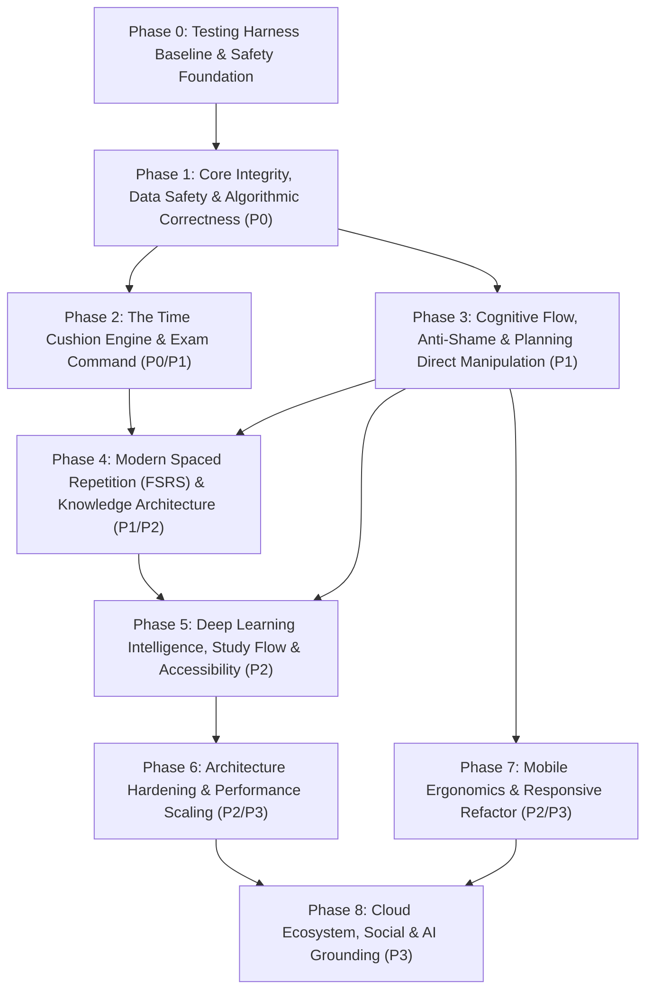

# Solis Master Engineering Implementation Plan (Aache Se Blueprint)

> **Document Status**: Authoritative Engineering Execution Blueprint  
> **Source Strategy**: [`docs/SOLIS_COMPREHENSIVE_AUDIT_AND_PRODUCT_STRATEGY.md`](file:///c:/Users/kunal/Desktop/Solis-Ultimate-Productivity-tracker-main/Solis-Ultimate-Productivity-tracker-main/docs/SOLIS_COMPREHENSIVE_AUDIT_AND_PRODUCT_STRATEGY.md)  
> **Target Audience**: Full-Stack Engineers, System Architects, UX Designers, QA Engineers  
> **Execution Rule**: Strict phased sequence. Zero speculative code changes. Each phase is gated by automated test verification (`npm test`, `npm run typecheck`, `npm run build`).

---

## 1. Executive Strategy & Engineering Governance

This document details the definitive, end-to-end engineering plan to implement all **55 prioritized audit findings, architectural repairs, and product enhancements** identified in the Solis Comprehensive Audit.

### 1.1 The Solis Product Paradigm Shift

```
[ Current Solis ]                                 [ Target Solis ]
Fragmented Dashboard                    -->       Unified Daily Sanctuary
Binary Shame-Inducing Streaks           -->       Frequency-Aware Forgiving Momentum
Passive Hours & Percentages             -->       Predictive Time Cushion Engine (Hours Available vs Needed)
Isolated Flashcards & SM-2 "Ease Hell"  -->       FSRS Memory Engine + Inline Note Extraction (`::`)
Friction-Heavy Planning (Tap "+1h")     -->       Tactile Drag-and-Drop Time Blocking
Silent Data Loss Traps (Notes / Auth)   -->       Lossless Debounced Auto-Save + Guest-to-Cloud Migration
Overwhelming & Rigid Visuals            -->       Living Solar Arc + Neurodivergent/ADHD Friendly Design
```

### 1.2 Core Architectural Principles

1. **Deterministic Over Heuristic**: Core calculations (time cushion, spaced repetition scheduling, cognitive load, streaks) must be pure, testable, deterministic TypeScript functions without hidden side effects.
2. **Zero Data Loss Guarantee**: Keystrokes in notes are captured in two tiers (1s local draft, 4s cloud debounce) with `beforeunload` guards. Guest data is never stranded on registration.
3. **Compassionate Anti-Shame UX**: Absences are met with gentle re-entry flows, not red alerts or broken streaks. Lapses are treated as natural rhythms.
4. **Offline Resilience**: Local state must be authoritative for instant UI responsiveness, synchronizing asynchronously with cloud storage.

---

## 2. Master Phase Hierarchy & Dependency Graph



---

## Phase 0: Testing Harness Baseline & Safety Foundation

> **Objective**: Establish regression fixtures and comprehensive test suites for all buggy or mission-critical subsystems *before* refactoring production code.  
> **Rule**: No production application code changes in Phase 0.

### 0.1 Subsystem Test Harness Creation
- **Files Created**:
  - `[NEW]` `src/utils/__tests__/streaks.frequency.test.ts`: Test matrix verifying all `HabitFrequency` types (`daily`, `weekdays`, `weekends`, `three_times_weekly`).
  - `[NEW]` `src/utils/__tests__/notes.autoSave.test.ts`: Verifies debounced draft saving and beforeunload state.
  - `[NEW]` `src/utils/tasks/__tests__/workloadCalculator.edgeCases.test.ts`: Tests missing durations, zero-hour capacities, and date boundaries.
  - `[NEW]` `src/utils/intelligence/__tests__/examReadiness.calibration.test.ts`: Reproduction tests ensuring 0 mastered topics cannot evaluate to "Prepared" or "Borderline".
  - `[NEW]` `src/utils/learning/__tests__/spacedRepetition.intraDay.test.ts`: Tests showing failed cards (`again`) must re-queue within the same session.
- **Verification Gate**:
  ```bash
  npm run typecheck
  npm test -- src/utils/__tests__/streaks.frequency.test.ts
  npm test -- src/utils/__tests__/notes.autoSave.test.ts
  npm test -- src/utils/tasks/__tests__/workloadCalculator.edgeCases.test.ts
  npm test -- src/utils/intelligence/__tests__/examReadiness.calibration.test.ts
  npm test -- src/utils/learning/__tests__/spacedRepetition.intraDay.test.ts
  ```

---

## Phase 1: Core Integrity, Data Safety & Algorithmic Correctness (P0 Blockers)

> **Theme**: Eliminating data loss bugs, algorithmic falsehoods, and silent auth failures. Trust is the foundation of user retention.

### 1.1 Frequency-Aware Habit Streak Engine
- **Audit Reference**: §18.1, §18.3, §19.1 (`Item #1`)
- **Problem**: `calculateStreaks()` in `src/utils/streaks.ts` (lines 31–44) unconditionally walks backward calendar day by calendar day. A `weekdays` habit resets to 0 every Saturday/Sunday; a `three_times_weekly` habit breaks on rest days.
- **Technical Specification**:
  - Refactor `calculateStreaks(history, options)` to accept `options: StreakCalculationOptions`.
  - For `weekdays`: Saturdays and Sundays are non-evaluating skip days. If Friday was completed, the streak remains alive on Saturday and Sunday.
  - For `weekends`: Monday through Friday are non-evaluating skip days.
  - For `three_times_weekly`: Evaluates rolling 7-day windows; if $\ge 3$ days completed in window, streak is incremented.
  - Add 1-day grace period: A single missed day in a 7-day window does not reset streak to 0 if grace period is active.
- **Affected Files**:
  - `[MODIFY]` `src/utils/streaks.ts`
  - `[MODIFY]` `src/types/habit.ts`
- **Data Contract**:
  ```ts
  export interface StreakCalculationOptions {
    frequency?: HabitFrequency;
    customDays?: number[]; // 0 = Sun, 1 = Mon ...
    allowGraceDays?: boolean;
    referenceDate?: Date;
  }
  ```
- **Verification Gate**: `npm test -- src/utils/__tests__/streaks.frequency.test.ts` passes with 100% assertions satisfied.

---

### 1.2 Lossless 2-Tier Notes Auto-Save Engine
- **Audit Reference**: §18.5 (`Item #2`)
- **Problem**: `NotesPage.tsx` lines 407–453 only saves upon `Ctrl+S` (`handleManualSave`). Browser crash, closing tab, or navigating away causes total text loss.
- **Technical Specification**:
  - Implement 2-tier persistence via a dedicated custom hook `useDebouncedAutoSave`:
    1. **Tier 1 (Instant Local Draft)**: 1,000ms debounce writing note content to `localStorage.setItem('solis_note_draft_${id}', content)`.
    2. **Tier 2 (Cloud / Primary DB)**: 4,000ms debounce calling `dataService.notes.updateNote(id, { content })`.
  - Bind `window.addEventListener('beforeunload', ...)` when dirty changes are uncommitted.
  - Add visual status pill in note header: `● Saving draft...` -> `✓ Saved locally` -> `✓ Cloud synced`.
  - On note mount, check if local draft is newer than DB timestamp; if so, prompt user to restore newer unsaved draft.
- **Affected Files**:
  - `[NEW]` `src/hooks/useDebouncedAutoSave.ts`
  - `[MODIFY]` `src/features/notes/NotesPage.tsx`
- **Verification Gate**: Simulate tab close after typing without `Ctrl+S`. Reload -> note restores perfectly.

---

### 1.3 Guest-to-Cloud Automatic Data Migration Protocol
- **Audit Reference**: §18.11, §27.3 (`Item #39`)
- **Problem**: In local/guest mode (`MockDataService`), user creates subjects, topics, and notes stored in `solis_mock_db_v2_*`. When they click "Sign Up" to sync, `ServiceContainer` switches to Supabase. Their cloud account is empty, stranding all local work. To the user, their semester's work was wiped out on account creation.
- **Technical Specification**:
  - Create `src/services/migration/guestMigration.ts`:
    - Reads all local keys: `solis_mock_db_v2_subjects`, `_topics`, `_tasks`, `_notes`, `_habits`, `_flashcards`.
    - If total records > 0, performs a batch insert into Supabase with the newly authenticated `user.id`.
    - Re-maps foreign keys (e.g., updates `subjectId` on migrated topics/notes to the newly assigned UUIDs).
  - In `AuthContext.tsx` `signup()` and `login()`:
    - Intercept successful auth session before switching service container.
    - If guest data detected, show migration modal: *"Syncing your local workspace to your new cloud account..."*.
    - Complete migration, then archive local mock keys with timestamp backup: `solis_mock_backup_${Date.now()}`.
- **Affected Files**:
  - `[NEW]` `src/services/migration/guestMigration.ts`
  - `[MODIFY]` `src/context/AuthContext.tsx`
  - `[MODIFY]` `src/services/dataService.ts`
- **Verification Gate**:
  - Create 2 subjects, 5 notes, and 3 habits in mock mode.
  - Sign up with a new test account.
  - Verify all 2 subjects, 5 notes, and 3 habits appear in the cloud dashboard immediately.

---

### 1.4 Spaced Repetition Intra-Day Re-Queueing (The "Tomorrow" Fix)
- **Audit Reference**: §18.10 (`Item #40`)
- **Problem**: When a student rates a card `again` in `spacedRepetition.ts` line 34, `intervalDays` is set to `1` and `nextReviewDate` is set to tomorrow. The card is ejected from the current drill immediately. The student cannot re-test themselves at the end of the session to encode short-term memory.
- **Technical Specification**:
  - Refactor `SpacedReviewsSanctuary.tsx` session state machine:
    - Maintain two review queues: `activeQueue` and `learningQueue`.
    - When card is rated `again`, push card to `learningQueue` with `step: 0`.
    - Present cards from `learningQueue` after `activeQueue` reaches completion (or after 5 intervening cards).
    - Only commit the final `nextReviewDate = tomorrow` after the student successfully passes the card (`good` or `easy`) within the session.
- **Affected Files**:
  - `[MODIFY]` `src/features/study/components/SpacedReviewsSanctuary.tsx`
  - `[MODIFY]` `src/utils/learning/spacedRepetition.ts`
- **Verification Gate**:
  - Start drill with 5 cards. Rate Card 1 `again`.
  - Card 1 reappears at the end of the 5 cards for re-testing.

---

### 1.5 Focus Session to Study Log Auto-Bridge
- **Audit Reference**: §18.4, §20.9 (`Item #4`)
- **Problem**: Finishing a focus session in Focus Sanctuary logs to `focus_sessions`, but never writes to `study_sessions`. Students must manually log study sessions in StudyPage (double-entry).
- **Technical Specification**:
  - In `PostFocusReflectionModal.tsx`, upon submitting reflection:
    - Invoke `dataService.study.createSession()` concurrently with:
      - `subjectId`: Passed from focus parameters.
      - `topicId`: If linked during focus.
      - `durationMinutes`: Elapsed focus time.
      - `retentionRating`: Mapped from session satisfaction (1–5).
      - `notes`: Reflection insights.
      - `completedAt`: ISO timestamp.
- **Affected Files**:
  - `[MODIFY]` `src/components/features/Focus/PostFocusReflectionModal.tsx`
- **Verification Gate**:
  - Complete 25-minute focus session on "Data Structures".
  - Open StudyPage -> Session appears automatically under Recent Sessions.

---

### 1.6 Secrets Hygiene & Settings Cloud Resilience
- **Audit Reference**: §18.6 (`Items #13, #14`)
- **Problem**: Gemini API key stored in plaintext `localStorage` (`solis_gemini_api_key`). Settings cloud save failure shows "Preferences Saved Locally" toast, hiding remote sync failure.
- **Technical Specification**:
  - Move client Gemini key to `sessionStorage` or encrypted client envelope with explicit warning banner.
  - In `SettingsPage.tsx` `handleSave()`:
    - If `updateProfile()` throws, display error alert: *"Cloud Sync Failed: Changes cached locally on this device only. [Retry Sync]"*.
    - Add integer validation bounds on inputs (`focusDuration`: 1–180m, `breakDuration`: 1–60m, `dailyGoal`: 15–960m) with inline `<FieldError>` messages.
- **Affected Files**:
  - `[MODIFY]` `src/features/settings/SettingsPage.tsx`
- **Verification Gate**:
  - Disconnect network, save settings -> Clear error banner appears with retry button.

---

## Phase 2: The Time Cushion Engine & Exam Command (P0/P1)

> **Theme**: Delivering the headline product differentiator. Telling students the honest mathematical truth about exam readiness in hours, not percentages.

### 2.1 Multi-Day Lookahead Time Cushion Engine
- **Audit Reference**: §20.1 (`Item #3`)
- **Mathematical Specification**:
  $$\text{Days Remaining} = \max(0, \lceil(\text{Exam Date} - \text{Today}) / 86400000\rceil)$$
  $$\text{Net Available Study Hours} = \sum_{d \in \text{Days}} \frac{\text{Daily Capacity}(d) - \text{Scheduled Commitments}(d)}{60}$$
  $$\text{Required Syllabus Hours} = \sum_{t \in \text{Unmastered Topics}} \text{Estimated Hours}(t)$$
  $$\text{Time Cushion (Hours)} = \text{Net Available Study Hours} - \text{Required Syllabus Hours}$$
  $$\text{Required Daily Pace} = \frac{\text{Required Syllabus Hours}}{\max(1, \text{Days Remaining})}$$
- **Data Contract**:
  ```ts
  export interface TimeCushionInput {
    examDate: string;
    subjectId: string;
    topics: StudyTopic[];
    dailyCapacityMinutes: number;
    existingCommitmentsMinutesByDay?: Record<string, number>;
    referenceDate?: Date;
  }

  export interface TimeCushionAnalysis {
    daysRemaining: number;
    grossAvailableHours: number;
    netAvailableStudyHours: number;
    estimatedHoursRequired: number;
    cushionHours: number; // positive = ahead, negative = deficit
    status: 'comfortable' | 'on_track' | 'tight' | 'critical_deficit';
    requiredHoursPerDay: number;
    deficitSeverityPercentage: number;
  }
  ```
- **Affected Files**:
  - `[NEW]` `src/utils/planning/timeCushion.ts`
  - `[NEW]` `src/utils/planning/__tests__/timeCushion.test.ts`
- **Verification Gate**: Unit tests verify cushion calculations under positive cushion (+12h), negative cushion (-8h), 0 days remaining, and empty syllabus.

---

### 2.2 Exam Readiness Formula Recalibration & Hard Gating
- **Audit Reference**: §18.2, §24 (`Item #15`)
- **Problem**: `calculateExamReadiness()` allows 0-studied topics to evaluate to "Borderline" (31/100) due to habit streaks and milestone checkboxes.
- **Technical Specification**:
  - Establish **Hard Gates**: If Topics Mastery is 0%, readiness score is capped at `15/100` (At Risk).
  - Unlinked Habits Fallback: If no habits are linked to the goal, redistribute habit weight (20%) to Topics Mastery (50%) and SM-2/FSRS Retention (35%), rather than penalizing with 0/20.
  - Proximity Decay: Urgent exams ($\le 5$ days) with unmastered topics experience an exponential readiness penalty.
- **Affected Files**:
  - `[MODIFY]` `src/utils/intelligence/masteryIntelligence.ts`
- **Verification Gate**: `npm test -- src/utils/intelligence/__tests__/examReadiness.calibration.test.ts` passes.

---

### 2.3 Exam Horizon & Workspace Modal Refactor
- **Audit Reference**: §18.2, §20.1
- **Technical Specification**:
  - `ExamWorkspaceModal.tsx`:
    - Replace raw "14 Days Remaining" badge with the **Time Cushion Diagnostic Card**:
      - Displays Available Study Hours vs Required Syllabus Hours.
      - Displays Required Pace: e.g. `2.4 hrs/day needed`.
      - Color tokens: Sage (comfortable, $+6$h), Amber (tight, $0$–$3$h), Terracotta (deficit, $-5$h).
    - Add primary CTA: `"Schedule Daily Focus Block (2.4h)"` pre-filling daily planner.
  - `ExamHorizonBar.tsx`:
    - Accept `goals`, `topics`, and `dailyCapacity` as props from Dashboard, eliminating redundant 12th parallel query.
- **Affected Files**:
  - `[MODIFY]` `src/components/features/Goals/ExamWorkspaceModal.tsx`
  - `[MODIFY]` `src/components/features/Goals/ExamHorizonBar.tsx`

---

### 2.4 Persistent Global D-Day Header Pill
- **Audit Reference**: §26.1 (`Item #49`)
- **Technical Specification**:
  - In `AppLayout.tsx` top navbar:
    - Display persistent countdown anchor for the most urgent active exam goal: e.g. `🎯 MCAT: D-38 • On Track (+4h)`.
    - Clicking pill opens `ExamWorkspaceModal` instantly from any page.
- **Affected Files**:
  - `[MODIFY]` `src/layouts/AppLayout.tsx`

---

## Phase 3: Cognitive Flow, Anti-Shame & Planning Direct Manipulation (P1)

> **Theme**: Eliminating cognitive overload, friction in daily planning, and guilt-inducing UI patterns.

### 3.1 Direct Drag-and-Drop Time Blocking & Unscheduled Shelf
- **Audit Reference**: §18.8, §26.4 (`Item #41`)
- **Problem**: Scheduling a task for 3:00 PM requires tapping `+1h` seven times.
- **Technical Specification**:
  - Integrate HTML5 Drag and Drop / Touch Pointer Drag between `unscheduledTasks` shelf and `HourlyPlannerView` grid:
    - Task chips have `draggable={true}` and `onDragStart`.
    - Hourly slots in `HourlyPlannerView` serve as drop targets (`onDragOver`, `onDrop`).
    - Dropping task on slot 14:00 automatically creates `TaskTimeBlock` with `startHour = 14`, `durationMinutes = task.estimatedMinutes || 60`.
    - Provide immediate tactile haptic feedback via `hapticsEngine.playMechanicalTick()`.
- **Affected Files**:
  - `[MODIFY]` `src/features/tasks/HourlyPlannerView.tsx`
  - `[MODIFY]` `src/components/features/Planning/TimeBlockGrid.tsx`
- **Verification Gate**: Drag task chip from backlog onto 3:00 PM slot -> time block renders at 15:00 instantly.

---

### 3.2 Dashboard Priority Triage & Habit Pulse Uncap
- **Audit Reference**: §18.1 (`Items #5, #6, #7`)
- **Technical Specification**:
  - In `DashboardPage.tsx`:
    - Sort `activeTasks` by priority (`urgent` -> `high` -> `medium` -> `low`) and due date *before* rendering.
    - Replace `slice(0, 5)` hardcap with top-5 view + `"Show all (N) tasks"` accordion.
    - Remove `slice(0, 4)` on habits — render all active daily habits in a scrollable/2-column grid.
    - Debounce Daily Intention `localStorage.setItem` to 1,000ms, eliminating flickering "Saved" pill.
    - Memoize session heatmap calculations with `useMemo([sessions])` pre-indexing dates.
- **Affected Files**:
  - `[MODIFY]` `src/features/dashboard/DashboardPage.tsx`

---

### 3.3 Zeigarnik Deferral (`→ Tomorrow`) & Calm Unreviewed Blocks Roll
- **Audit Reference**: §18.8, §19.3, §20.8 (`Items #17, #44`)
- **Technical Specification**:
  - Add `"→ Tomorrow"` one-tap button on overdue `TaskRow.tsx`:
    - Clicking sets `dueDate = tomorrow`, increments `deferralCount`, and shows undo toast.
  - In `HourlyPlannerView.tsx`:
    - Replace amber "Past blocks require review" guilt alert with a serene one-click prompt: *"You have 2 past incomplete blocks. Roll to today's schedule?"*.
- **Affected Files**:
  - `[MODIFY]` `src/features/tasks/components/TaskRow.tsx`
  - `[MODIFY]` `src/features/tasks/HourlyPlannerView.tsx`

---

### 3.4 "Welcome Back" Gentle Re-Entry Flow (3+ Day Absence)
- **Audit Reference**: §20.5, §20.10 (`Item #18`)
- **Technical Specification**:
  - When `Date.now() - lastActiveTimestamp >= 3 days`, render `WelcomeBackModal`:
    - Greeting: *"Welcome back. Let's ease into today without stress."*
    - Options:
      1. **Gentle Start**: Sets today's study capacity to 50%.
      2. **Streak Amnesty**: Protects habit continuity.
      3. **Priority Triage**: Hides backlog noise, presenting only the Top 3 tasks.
- **Affected Files**:
  - `[NEW]` `src/components/features/Activation/WelcomeBackModal.tsx`
  - `[MODIFY]` `src/features/dashboard/DashboardPage.tsx`

---

### 3.5 Habit Rhythm Story & Anti-Shame UX
- **Audit Reference**: §18.1, §19.1 (`Item #19`)
- **Technical Specification**:
  - In `HabitsPage.tsx`:
    - Remove prominent `Best: X days` when current streak is low.
    - Display **Rhythm Story**: *"14 completions this month • Consistent Scholar"*.
    - Fire haptic *after* successful toggle completion, avoiding false sensory feedback.
    - Add top summary pill: `"5 of 7 rituals complete today"`.
- **Affected Files**:
  - `[MODIFY]` `src/features/habits/HabitsPage.tsx`

---

### 3.6 Instant Client-Side Notes Search & StudyPage Linkage
- **Audit Reference**: §18.4, §18.5, §20.7 (`Items #12, #16`)
- **Technical Specification**:
  - `NotesPage.tsx`:
    - Remove `searchQuery` from `loadData()` dependency array.
    - Implement instant client-side filtering via `useMemo([notes, searchQuery, filterCategory, filterSubjectId])` with 0 network calls per keystroke.
  - `StudyPage.tsx`:
    - Add **"Notes"** tab to Subject Workspace linking to `/app/notes?subjectId=${subject.id}`.
- **Affected Files**:
  - `[MODIFY]` `src/features/notes/NotesPage.tsx`
  - `[MODIFY]` `src/features/study/StudyPage.tsx`

---

## Phase 4: Modern Spaced Repetition (FSRS) & Knowledge Architecture (P1/P2)

> **Theme**: Transitioning from 1987 SM-2 to modern cognitive science (FSRS-5) and supporting hierarchical syllabi.

### 4.1 FSRS (Free Spaced Repetition Scheduler) Engine Implementation
- **Audit Reference**: §18.10, §26.2 (`Item #46`)
- **Technical Specification**:
  - Create `src/utils/learning/fsrsEngine.ts`:
    - Implements DSR model: Difficulty $D \in [1, 10]$, Stability $S > 0$, Retrievability $R \in [0, 1]$.
    - Retention probability formula:
      $$R(t, S) = \left(1 + 0.19 \cdot \frac{t}{S}\right)^{-0.5}$$
    - Rating outcomes (`again`, `hard`, `good`, `easy`) update $S$ and $D$ predictably without Ease Hell.
    - Includes backward-compatibility mapper converting existing SM-2 `easeFactor` and `intervalDays` into initial FSRS $(S, D)$ states.
- **Affected Files**:
  - `[NEW]` `src/utils/learning/fsrsEngine.ts`
  - `[NEW]` `src/utils/learning/__tests__/fsrsEngine.test.ts`
  - `[MODIFY]` `src/utils/learning/spacedRepetition.ts`
- **Verification Gate**: FSRS unit tests verify card interval growth over 50 consecutive reviews without Ease Hell.

---

### 4.2 Hierarchical Syllabus Tree (`Unit -> Chapter -> Concept`)
- **Audit Reference**: §18.10, §26.5 (`Item #47`)
- **Technical Specification**:
  - Enhance `StudyTopic` type with optional `parentId?: string`, `level: 'unit' | 'chapter' | 'concept'`.
  - Refactor `SyllabusTopicTree.tsx`:
    - Renders collapsible nested tree structure.
    - Computes mastery rollup: Unit mastery % is weighted average of child concepts.
- **Affected Files**:
  - `[MODIFY]` `src/types/study.ts`
  - `[MODIFY]` `src/features/study/components/SyllabusTopicTree.tsx`

---

### 4.3 Inline Flashcard Extraction Syntax (`::`)
- **Audit Reference**: §19.4, §20.2 (`Item #30`)
- **Technical Specification**:
  - Create `src/utils/notes/inlineCardParser.ts`:
    - Regex parser detecting `Term :: Definition` and `Q: Question? :: A: Answer`.
    - Excludes code blocks and blockquotes.
  - In `NotesPage.tsx`:
    - Upon note save, parse inline cards and auto-create `Flashcard` entities tagged with note's `subjectId`.
    - Toast feedback: `✓ 3 flashcards extracted into Spaced Repetition deck`.
- **Affected Files**:
  - `[NEW]` `src/utils/notes/inlineCardParser.ts`
  - `[NEW]` `src/utils/notes/__tests__/inlineCardParser.test.ts`
  - `[MODIFY]` `src/features/notes/NotesPage.tsx`

---

### 4.4 Anki (`.apkg`) & Quizlet Client-Side Deck Importer
- **Audit Reference**: §27.1, §27.2 (`Item #45`)
- **Technical Specification**:
  - Create client-side importer in `src/utils/import/deckImporter.ts`:
    - Parses text-separated exports (Quizlet) and unzips `.apkg` packages (using client-side zip/sql parser).
    - Extracts Cloze markers `{{c1::term}}` and maps to Solis cloze format.
  - Add "Import Deck" button to StudyPage / Flashcards view.
- **Affected Files**:
  - `[NEW]` `src/utils/import/deckImporter.ts`
  - `[MODIFY]` `src/components/features/ImportModal/ImportModal.tsx`

---

## Phase 5: Deep Learning Intelligence, Study Flow & Accessibility (P2)

> **Theme**: Enhancing active study sessions, audio flow, and neurodivergent accessibility.

### 5.1 Pre-Session Energy Check-In (3-Tap Calibration)
- **Audit Reference**: §20.2, §20.3 (`Item #21`)
- **Technical Specification**:
  - Add 3-icon row on `FocusPage.tsx` launch screen:
    - 🔋 **Low**: Recommends flashcard review or short 15m session.
    - ⚡ **Steady**: Standard 25m/50m pomodoro.
    - 🚀 **Sharp**: Prompts challenging deep-work topic or 90m block.
  - Store `preSessionEnergy` in `FocusSession` record.
- **Affected Files**:
  - `[MODIFY]` `src/types/focus.ts`
  - `[MODIFY]` `src/features/focus/FocusPage.tsx`

---

### 5.2 Subject-Specific One-Tap Live Stopwatch
- **Audit Reference**: §26.1 (`Item #48`)
- **Technical Specification**:
  - On each subject card in StudyPage and Dashboard, add a 1-tap "Quick Stopwatch" icon.
  - Launches count-up timer docked in `MiniFocusPlayer` tied to subject without modal configuration.
- **Affected Files**:
  - `[MODIFY]` `src/features/study/StudyPage.tsx`
  - `[MODIFY]` `src/context/FocusContext.tsx`

---

### 5.3 Visual Analog Pie Timer for ADHD Scholars
- **Audit Reference**: §28.1 (`Item #53`)
- **Technical Specification**:
  - In `FocusPage.tsx`, offer toggle between digital numbers (`24:59`) and **Analog Pie Sweep**:
    - SVG circular arc physically sweeps down as minutes elapse, providing non-symbolic time perception.
  - Add 2-minute "Soft Landing" chime before session concludes.
- **Affected Files**:
  - `[NEW]` `src/components/features/Focus/AnalogPieTimer.tsx`
  - `[MODIFY]` `src/features/focus/FocusPage.tsx`

---

### 5.4 Task Micro-Stepping Assistant
- **Audit Reference**: §28.2 (`Item #54`)
- **Technical Specification**:
  - For tasks with estimated duration $\ge 60$m, provide a 1-click **"Break Down Task"** button.
  - Deterministically or via AI decomposes task into 3 sub-tasks $< 20$m each.
- **Affected Files**:
  - `[NEW]` `src/utils/tasks/taskMicroStepper.ts`
  - `[MODIFY]` `src/features/tasks/components/TaskRow.tsx`

---

### 5.5 2D Thermal Difficulty Matrix & Analytics Polish
- **Audit Reference**: §18.2, §20.9 (`Items #8, #9, #10, #11, #25`)
- **Technical Specification**:
  - `AnalyticsPage.tsx`:
    - Add color-coded **Heatmap Legend** with hour thresholds.
    - Sort retention forecasts by decay urgency (`OVERDUE` first).
    - Scope toggle (`today` | `this_week` | `28_days`) applies to all analytics sections consistently.
    - Neglect warnings include 1-click `"Focus Subject (25m)"` action button.
  - Render **Thermal Difficulty Matrix**: Plots Topic Mastery ($X$) vs Self-Reported Difficulty ($Y$) highlighting the Red Alert Zone.
- **Affected Files**:
  - `[NEW]` `src/components/features/Analytics/ThermalDifficultyMatrix.tsx`
  - `[MODIFY]` `src/features/analytics/AnalyticsPage.tsx`

---

### 5.6 Deterministic 5-Sentence Weekly Narrative Report
- **Audit Reference**: §20.4 (`Item #23`)
- **Technical Specification**:
  - Create `src/utils/intelligence/narrativeReport.ts`:
    - Converts `SolisIntelligenceReport` into an encouraging 5-sentence paragraph (study volume, rhythm, top subject, neglected area, strategic goal).
  - In `WeeklyReviewPage.tsx`: Surface narrative in Step 1. Default `nextWeekTargetHours` to `lastWeekActual * 1.1`.
- **Affected Files**:
  - `[NEW]` `src/utils/intelligence/narrativeReport.ts`
  - `[MODIFY]` `src/features/review/WeeklyReviewPage.tsx`

---

### 5.7 HTML5 Audio & MediaSession API Mobile Keepalive
- **Audit Reference**: §18.12 (`Item #42`)
- **Technical Specification**:
  - In `soundscapeEngine.ts`, attach a silent 1-second looping HTML5 `<audio>` element and configure `navigator.mediaSession`:
    ```ts
    if ('mediaSession' in navigator) {
      navigator.mediaSession.metadata = new MediaMetadata({
        title: 'Solis Focus Soundscape',
        artist: 'Deep Work Flow'
      });
    }
    ```
  - Prevents iOS Safari and Android Chrome from killing the Web Audio context when the screen locks.
- **Affected Files**:
  - `[MODIFY]` `src/utils/focus/soundscapeEngine.ts`

---

## Phase 6: Architecture Hardening & Performance Scaling (P2/P3)

> **Theme**: Eliminating query storms, handling partial network failures, and fixing collaborative room failover.

### 6.1 Scoped Entity Pub/Sub Event Bus
- **Audit Reference**: §18.1, §23.1 (`Item #28`)
- **Problem**: A single habit toggle notifies all subscribers globally, firing 66+ parallel queries across mounted pages.
- **Technical Specification**:
  - Enhance `IDataService.subscribe()`:
    ```ts
    export type DataEntityChannel = 'tasks' | 'habits' | 'notes' | 'study' | 'focus' | 'goals' | 'all';
    subscribe(listener: () => void, channels?: DataEntityChannel[]): () => void;
    notifySubscribers(channel: DataEntityChannel): void;
    ```
  - Pages subscribe strictly to their entities (e.g., HabitsPage subscribes only to `'habits'`).
- **Affected Files**:
  - `[MODIFY]` `src/services/api.interface.ts`
  - `[MODIFY]` `src/services/dataService.ts`
  - `[MODIFY]` `src/features/habits/HabitsPage.tsx`
  - `[MODIFY]` `src/features/notes/NotesPage.tsx`
  - `[MODIFY]` `src/features/dashboard/DashboardPage.tsx`

---

### 6.2 Study Room Host Failover & Local Multi-Tab Sync
- **Audit Reference**: §18.9 (`Item #43`)
- **Technical Specification**:
  - In `useStudyRoom.ts`:
    - Host Failover: If host disconnects, PostgreSQL trigger or oldest remaining participant auto-promotes to host.
    - Local Demo Sync: In mock mode, connect `BroadcastChannel('solis_room_${roomId}')` so multi-tab demo rooms synchronize presence and timer ticks in real time.
- **Affected Files**:
  - `[MODIFY]` `src/hooks/useStudyRoom.ts`
  - `[MODIFY]` `src/features/rooms/ActiveRoomView.tsx`

---

### 6.3 Partial Fetch Failure Resilience
- **Audit Reference**: §18.1, §23.3 (`Item #29`)
- **Technical Specification**:
  - Create `PartialDataWarningBanner.tsx`: Renders when 1+ promises reject in `Promise.allSettled`.
  - Informs student gently: *"Some recent logs could not be synced from cloud. Showing cached data. [Retry]"*.
- **Affected Files**:
  - `[NEW]` `src/components/feedback/PartialDataWarningBanner.tsx`
  - `[MODIFY]` `src/features/dashboard/DashboardPage.tsx`
  - `[MODIFY]` `src/features/analytics/AnalyticsPage.tsx`

---

## Phase 7: Mobile Ergonomics & Responsive Refactor (P2/P3)

> **Theme**: Native touch feel on 375px viewports. 40–60% of students review on phones.

### 7.1 Mobile 7-Day Rolling Habit Matrix & Vertical Agenda
- **Audit Reference**: §22.1, §22.3 (`Items #31, #32`)
- **Technical Specification**:
  - `HabitsPage.tsx`: On viewports $< 768$px, collapse 14-day table into 7-day rolling window (`M T W T F S S`).
  - `TimeBlockGrid.tsx`: On mobile, collapse 24-hour horizontal grid into vertical chronological **Agenda List**.
- **Affected Files**:
  - `[MODIFY]` `src/features/habits/HabitsPage.tsx`
  - `[MODIFY]` `src/components/features/Planning/TimeBlockGrid.tsx`

---

### 7.2 Dedicated 5-Tab Mobile Bottom Navigation & 48px Touch Targets
- **Audit Reference**: §22.1, §22.3 (`Item #33`)
- **Technical Specification**:
  - Create fixed bottom tab bar active on viewports $< 768$px:
    - 🏠 **Today** (`/app/dashboard`)
    - ⏱️ **Focus** (`/app/focus`)
    - 🧠 **Review** (`/app/study`)
    - 📝 **Tasks** (`/app/tasks`)
    - 📊 **Progress** (`/app/analytics`)
  - Ensure Apple HIG 48px minimum touch targets in `SpacedReviewsSanctuary.tsx` for rating buttons.
- **Affected Files**:
  - `[NEW]` `src/components/layout/MobileNavBar/MobileNavBar.tsx`
  - `[MODIFY]` `src/layouts/AppLayout.tsx`
  - `[MODIFY]` `src/features/study/components/SpacedReviewsSanctuary.tsx`

---

### 7.3 OpenDyslexic & Low-Stimulation Sepia Theming
- **Audit Reference**: §28.3 (`Item #55`)
- **Technical Specification**:
  - In `themes.css` & `tokens.css`:
    - Add `@font-face` for OpenDyslexic / Atkinson Hyperlegible.
    - Add `data-theme="sepia"` low-stimulation palette (warm monochrome tones, zero saturated blue/red alerts).
  - Add toggles in `SettingsPage.tsx`.
- **Affected Files**:
  - `[MODIFY]` `src/styles/themes.css`
  - `[MODIFY]` `src/features/settings/SettingsPage.tsx`

---

## Phase 8: Cloud Ecosystem, Social & AI Grounding (P3)

> **Theme**: Long-term defensibility, platform integration, and academic AI accuracy.

### 8.1 One-Way Read-Only `.ics` Calendar Feed
- **Audit Reference**: §20.8 (`Item #38`)
- **Technical Specification**:
  - Create `src/utils/calendar/icsGenerator.ts` generating RFC 5545 standard `.ics` data from `TimeBlock`s and `ExamHorizon` targets.
  - Students subscribe via Google Calendar / Apple Calendar with zero brittle 2-way OAuth.
- **Affected Files**:
  - `[NEW]` `src/utils/calendar/icsGenerator.ts`
  - `[MODIFY]` `src/features/settings/SettingsPage.tsx`

---

### 8.2 Grounded RAG Flashcard Citations & Server-Side AI Proxy
- **Audit Reference**: §18.5, §20.6, §26.5 (`Items #36, #51, #52`)
- **Technical Specification**:
  - Move Gemini calls to authenticated Supabase Edge Function (`api/generate-cards`).
  - Extract candidate flashcards strictly from student notes chunks with `sourceLineIndex`. Generated cards include clickable citation back to note paragraph.
- **Affected Files**:
  - `[MODIFY]` `src/services/ai/ai.service.ts`
  - `[MODIFY]` `src/features/notes/NotesPage.tsx`

---

### 8.3 Passive Quiet Peer Presence & Study Pact Accountability
- **Audit Reference**: §20.3, §26.1 (`Items #35, #50`)
- **Technical Specification**:
  - Global header shows anonymous live count: *"142 scholars focusing right now"*.
  - Study Pact: Pair 2 students in weekly mutual goal commitments with automatic end-of-week progress summaries.
- **Affected Files**:
  - `[NEW]` `src/types/studyPact.ts`
  - `[MODIFY]` `src/features/rooms/RoomsPage.tsx`

---

### 8.4 Offline-First PWA Write-Ahead Log
- **Audit Reference**: §20.7 (`Item #37`)
- **Technical Specification**:
  - ServiceWorker + IndexedDB write-ahead mutation queue for uninterrupted offline library study.
- **Affected Files**:
  - `[NEW]` `src/services/offline/pwaSync.ts`

---

## 3. Comprehensive Implementation Matrix (All 55 Items)

| Phase | # | Feature / Fix | Target File | Priority | Effort | Verification |
| :--- | :--- | :--- | :--- | :--- | :--- | :--- |
| **P0** | 0 | Test Harness Baseline | `src/utils/__tests__/*.test.ts` | **P0** | Low | `npm test` |
| **P1** | 1 | Frequency-Aware Streak Engine | `src/utils/streaks.ts` | **P0** | Low | Unit Test Suite |
| **P1** | 2 | Lossless Notes Auto-Save Engine | `NotesPage.tsx`, `useDebouncedAutoSave.ts` | **P0** | Low | Unload Simulation |
| **P1** | 39 | Guest-to-Cloud Data Migration Protocol | `AuthContext.tsx`, `guestMigration.ts` | **P0** | Medium | Registration Test |
| **P1** | 40 | Intra-Day Flashcard Re-Queueing | `spacedRepetition.ts`, `SpacedReviewsSanctuary.tsx` | **P0** | Low | Session Drill Test |
| **P1** | 4 | Focus-to-Study Auto-Bridge | `PostFocusReflectionModal.tsx` | **P0** | Low | Integration Test |
| **P1** | 13 | Settings Cloud Sync Failure Alert | `SettingsPage.tsx` | **P1** | Very Low | Offline Test |
| **P1** | 14 | Client Secrets Hygiene | `SettingsPage.tsx` | **P1** | Low | Storage Inspection |
| **P2** | 3 | Time Cushion Calculation Engine | `src/utils/planning/timeCushion.ts` | **P0** | Medium | Unit Test Suite |
| **P2** | 15 | Exam Readiness Hard Gates & Proximity Decay | `masteryIntelligence.ts` | **P1** | Medium | Calibration Test |
| **P2** | 2.3 | Exam Workspace Diagnostic Cushion Card | `ExamWorkspaceModal.tsx` | **P1** | Medium | Visual QA |
| **P2** | 49 | Persistent Global D-Day Header Pill | `AppLayout.tsx` | **P2** | Low | Visual QA |
| **P3** | 41 | Direct Drag-and-Drop Time Blocking | `HourlyPlannerView.tsx`, `TimeBlockGrid.tsx` | **P1** | High | Interaction Test |
| **P3** | 5 | Dashboard Priority Triage | `DashboardPage.tsx` | **P1** | Very Low | Render Test |
| **P3** | 6 | Dashboard Task List Uncap / Accordion | `DashboardPage.tsx` | **P1** | Low | Render Test |
| **P3** | 7 | Dashboard Habit Pulse Uncap | `DashboardPage.tsx` | **P1** | Very Low | Render Test |
| **P3** | 17 | Zeigarnik `→ Tomorrow` Deferral | `TaskRow.tsx` | **P1** | Low | Interaction Test |
| **P3** | 44 | Calm Incomplete Past Blocks Roll | `HourlyPlannerView.tsx` | **P1** | Low | Interaction Test |
| **P3** | 18 | "Welcome Back" Gentle Re-Entry Modal | `WelcomeBackModal.tsx` | **P1** | Medium | Date Shift Test |
| **P3** | 19 | Habit Rhythm Story (Remove Best Streak) | `HabitsPage.tsx` | **P1** | Low | Visual QA |
| **P3** | 12 | Instant Client-Side Notes Search | `NotesPage.tsx` | **P1** | Medium | Keystroke Profiling |
| **P3** | 16 | StudyPage Subject Notes Tab Link | `StudyPage.tsx` | **P1** | Very Low | Navigation Test |
| **P4** | 46 | FSRS Memory Algorithm Engine | `src/utils/learning/fsrsEngine.ts` | **P1** | Medium | 50-Review Simulation |
| **P4** | 47 | Hierarchical Syllabus Tree | `SyllabusTopicTree.tsx` | **P2** | Medium | Tree Render Test |
| **P4** | 30 | Inline Flashcard Extraction Syntax (`::`) | `inlineCardParser.ts`, `NotesPage.tsx` | **P2** | Medium | Parsing Test Suite |
| **P4** | 45 | Anki (`.apkg`) & Quizlet Deck Importer | `deckImporter.ts` | **P1** | Medium | File Import Test |
| **P5** | 21 | Pre-Session Energy Check-In (3-Tap) | `FocusPage.tsx` | **P2** | Low | Interaction Test |
| **P5** | 48 | Subject-Specific One-Tap Stopwatch | `StudyPage.tsx`, `FocusContext.tsx` | **P2** | Low | Timer Test |
| **P5** | 53 | Visual Analog Pie Timer for ADHD | `AnalogPieTimer.tsx` | **P2** | Low | Visual Sweep Test |
| **P5** | 54 | Task Micro-Stepping Assistant | `taskMicroStepper.ts` | **P2** | Medium | Heuristic Test |
| **P5** | 8 | Analytics Heatmap Legend | `AnalyticsPage.tsx` | **P1** | Low | Visual QA |
| **P5** | 9 | Urgency-Sorted Retention Forecasts | `AnalyticsPage.tsx` | **P1** | Low | Urgency Sort Test |
| **P5** | 10 | Analytics Scope Consistency Fix | `AnalyticsPage.tsx` | **P1** | Medium | Scope Switch Test |
| **P5** | 11 | 1-Click Action on Neglect Alerts | `AnalyticsPage.tsx` | **P1** | Low | Navigation Test |
| **P5** | 25 | 2D Thermal Difficulty Matrix | `ThermalDifficultyMatrix.tsx` | **P2** | Medium | Visual QA |
| **P5** | 23 | Deterministic Weekly Narrative Report | `narrativeReport.ts` | **P2** | Medium | String Snapshot Test |
| **P5** | 42 | MediaSession Background Audio Keepalive | `soundscapeEngine.ts` | **P1** | Low | Mobile Screen Lock |
| **P6** | 28 | Scoped Entity Pub/Sub Event Bus | `dataService.ts`, all pages | **P2** | High | Network Profiling |
| **P6** | 43 | Study Room Host Failover & Demo Sync | `useStudyRoom.ts` | **P1** | Medium | Multi-Tab Test |
| **P6** | 29 | Partial Fetch Failure Warning Banner | `PartialDataWarningBanner.tsx` | **P2** | Medium | Simulation Test |
| **P7** | 31 | Mobile 7-Day Rolling Habit Matrix | `HabitsPage.tsx` | **P2** | Medium | Viewport $< 768$px |
| **P7** | 32 | Mobile Vertical Agenda Schedule | `TimeBlockGrid.tsx` | **P2** | High | Viewport $< 768$px |
| **P7** | 33 | 5-Tab Mobile Bottom Navigation | `MobileNavBar.tsx` | **P3** | High | Viewport $< 768$px |
| **P7** | 55 | OpenDyslexic & Low-Stimulation Sepia Theme | `themes.css`, `SettingsPage.tsx` | **P3** | Low | Visual QA |
| **P8** | 38 | Read-Only `.ics` Calendar Feed | `icsGenerator.ts` | **P3** | Medium | Calendar Client Test |
| **P8** | 36 | Secure Server-Side AI Proxy | `ai.service.ts` | **P3** | High | Edge Function Test |
| **P8** | 51 | Syllabus PDF / Outline Parsing | AI Service | **P2** | High | PDF Parse Test |
| **P8** | 52 | Grounded RAG Flashcard Citations | `NotesPage.tsx` | **P2** | High | Citation Link Test |
| **P8** | 50 | Passive Quiet Peer Presence | `RoomsPage.tsx` | **P2** | Medium | Realtime Counter |
| **P8** | 35 | Study Pact Accountability System | `studyPact.ts` | **P3** | High | E2E Scenario |
| **P8** | 37 | Offline-First PWA Write-Ahead Log | `pwaSync.ts` | **P3** | Very High | Offline Mode Test |

---

## 4. Execution Protocol: Step-by-Step Developer Runbook

### Pre-Flight Verification Before Every Commit
```bash
# 1. Typecheck: Zero TypeScript errors tolerated
npm run typecheck

# 2. Test Suites: All tests must pass (83+ suites, 750+ tests)
npm test

# 3. Production Build: Bundling must succeed without warnings
npm run build
```

### Exact Order of Implementation
1. **Initialize Phase 0**: Create test harness files for streaks, notes, and workload.
2. **Execute Phase 1 in sequence**:
   - `1.1` Frequency streaks -> `1.2` Notes auto-save -> `1.3` Guest migration -> `1.4` Intra-day flashcards -> `1.5` Focus auto-bridge -> `1.6` Settings hygiene.
3. **Execute Phase 2 (Headline Differentiator)**:
   - `2.1` `timeCushion.ts` -> `2.2` Exam readiness formula -> `2.3` Diagnostic card -> `2.4` D-Day pill.
4. **Execute Phase 3 (Tactile & Calm Flow)**:
   - `3.1` Drag-and-drop planning -> `3.2` Dashboard triage -> `3.3` Zeigarnik roll -> `3.4` Welcome back modal -> `3.5` Rhythm story -> `3.6` Notes search.
5. **Execute Phase 4 (Memory & Knowledge)**:
   - `4.1` FSRS engine -> `4.2` Hierarchical tree -> `4.3` Inline `::` cards -> `4.4` Anki importer.
6. **Execute Phase 5 (Intelligence & Accessibility)**:
   - `5.1` Energy check-in -> `5.2` Stopwatch -> `5.3` Analog pie timer -> `5.4` Micro-stepper -> `5.5` Thermal matrix -> `5.6` Narrative report -> `5.7` Audio keepalive.
7. **Execute Phases 6 & 7 (Hardening & Mobile)**:
   - Scoped pub/sub, room failover, 5-tab mobile nav, 7-day habit matrix, sepia theme.
8. **Execute Phase 8 (Ecosystem & Grounded AI)**:
   - `.ics` feed, grounded RAG citations, study pacts, PWA offline sync.

---

> **Ready for Implementation**: When instructed, development will begin strictly with **Phase 0 (Testing Harness Baseline)**.
