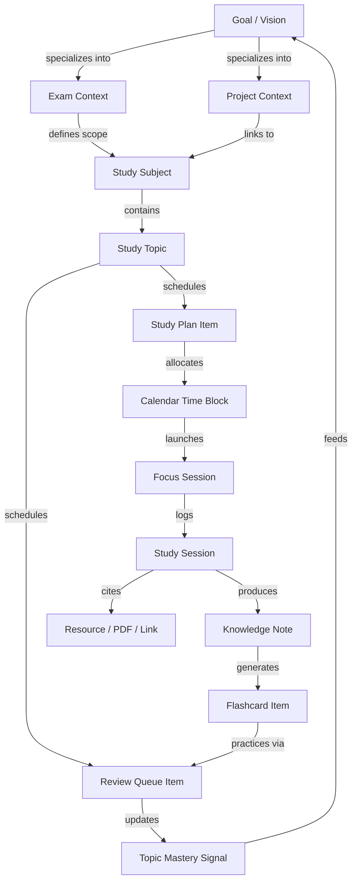

# SOLIS — PRODUCT ARCHITECTURE 2.0
### Complete Feature Expansion, Learning Graph & Performance-First Architecture

**Version**: `2.0.0-PROD-ARCH`  
**Status**: Formal Architectural Blueprint  
**Authors**: Principal Product Architect, Senior Learning Systems Designer, Staff Performance Engineer  

---

## 1. Executive Summary & Core Product Thesis

Solis is not a collection of isolated productivity widgets. It is a sovereign, calm, and deterministic operating environment for serious scholars, engineers, and deep thinkers.

### The Central Learning & Execution Loop
Every capability added to Solis in Architecture 2.0 strengthens at least one stage of the continuous mastery loop:

```text
    ┌──────────────────────────────────────────────────────────┐
    │                                                          │
    ▼                                                          │
  PLAN (Syllabus, Goals, Exams, Projects)                      │
    ↓                                                          │
  SCHEDULE (Time Blocking, Calendar, Recurring Intentions)     │
    ↓                                                          │
  FOCUS (Sanctuary Timers, Templates, Ambient Soundscapes)     │
    ↓                                                          │
  LEARN (Deep Study Sessions, Resource Reading, Notes)         │
    ↓                                                          │
  RECALL (Active Retrieval, Flashcard Prompts, Cloze Tests)    │
    ↓                                                          │
  REMEMBER (Spaced Review Signal, Mastery State Tracking)      │
    ↓                                                          │
  REFLECT (Post-Session Notes, Daily Journal, Weekly Review)   │
    ↓                                                          │
  ADAPT (Cognitive Rhythm Analytics, Adaptive Recommendations) │
    │                                                          │
    └──────────────────────────────────────────────────────────┘
```

---

## 2. Final Information Architecture (IA)

### The Primary Navigation Invariant: 4 High-Level Environments
We reject the anti-pattern of adding a top-level sidebar tab for every feature. The external surface remains uncluttered, while deep capabilities are revealed contextually inside 4 dedicated environments:

```text
┌────────────────────────────────────────────────────────────────────────┐
│                        SOLIS NAVIGATION ARCHITECTURE                   │
├───────────────────┬───────────────────┬───────────────────┬────────────┤
│       TODAY       │     KNOWLEDGE     │     HORIZONS      │   SYSTEM   │
├───────────────────┼───────────────────┼───────────────────┼────────────┤
│ • Daily Flow      │ • Knowledge Studio│ • Goals & Horizons│ • Settings │
│ • Task Sanctuary  │ • Living Syllabus │ • Habit Matrix    │ • Account  │
│ • Study Studio    │ • Topic Roadmaps  │ • Exams Mode      │ • Data Hub │
│ • Focus Sanctuary │ • Resource Library│ • Projects Hub    │ • Backups  │
│ • Study Calendar  │ • Spaced Reviews  │ • Mastery Trends  │ • Shortcuts│
│   (Time Blocking) │ • Flashcard Decks │ • Weekly Review   │            │
│                   │ • Memory Backlinks│ • Long-term Review│            │
│                   │ • Daily Journal   │                   │            │
└───────────────────┴───────────────────┴───────────────────┴────────────┘
```

---

## 3. The Unified "Study Graph"

All features connect to a unified relational domain graph. No feature operates in an isolated data silo:



### Invariant Rules Preventing Duplicate Engines

| High-Level Concept | Underlying Primitives Reused (Zero Engine Duplication) |
| :--- | :--- |
| **Exam** | `Goal` (deadline) + `Subject` (syllabus scope) + `Topic` (mastery checklist) + `StudyPlanItem` (queue) + `ReviewQueueItem` (retention) |
| **Project** | `Goal` (milestones) + `Task` (actionable items) + `StudySubject` (domain context) + `Note` (documentation) + `FocusSession` (hours logged) |
| **Flashcard** | `StudyTopic` (domain node) + `Note` (source text) + `StudySession` (retrieval log) + `ReviewQueueItem` (interval schedule) |
| **Resource** | `StudySubject` + `StudyTopic` + `Note` (backlinks) + `StudyPlanItem` (scheduled reading) |

---

## 4. Feature Expansion Modules (Bundles A through F)

### BUNDLE A — Learning Engine
1. **Review Scheduler (Solis Spaced Retrieval Signal)**:
   - Computes dynamic review intervals based on session retention ratings ($1\dots 5$), historical repetitions, and elapsed decay.
   - Explainable signals: *"Due today based on 4-day retention interval from Deep Study Session #14"*.
2. **Active Recall Prompting**:
   - Retrieval modes: Question $\to$ Answer, Cloze deletion (`{{hidden text}}`), and Key Concept Summary.
3. **Flashcards & Topic Decks**:
   - Direct flashcard generation from Knowledge Notes and Study Topics.
   - Self-rating difficulty buttons (*Again, Hard, Good, Easy*) that adjust the Spaced Review interval.
4. **Explainable Mastery Refinement**:
   - Enhances Phase 6 mastery models with active recall outcomes and interval consistency.

---

### BUNDLE B — Study Planning & Calendar Engine
1. **Study-Aware Calendar & Time Blocking**:
   - View weekly/daily distribution of Study Plans, Focus Blocks, Tasks, and Exam deadlines.
   - Direct drag-and-drop conversion of pending Study Plans into specific calendar time slots.
2. **Recurring Study Plans**:
   - Schedule cadence: *Daily, Weekdays, Weekly, Custom Day Intervals*.
3. **Exam Mode Workspace**:
   - Countdown timer, syllabus coverage %, mastery readiness score, and revision backlog.
4. **Project Mode Workspace**:
   - Milestone tracking, linked project tasks, reference notes, and cumulative focus hours.

---

### BUNDLE C — Knowledge & Resource Library
1. **Resource Library**:
   - Links PDFs, web articles, textbooks, research papers, and video lectures to Subjects, Topics, and Notes.
2. **Document & PDF Workspace**:
   - Lazy-loaded PDF reader supporting text selection, highlighting, and instant conversion of highlighted excerpts into Knowledge Notes.
3. **Backlinks & Knowledge Connections**:
   - Bidirectional reference panel showing all related Notes, Topics, Study Sessions, Flashcards, and Resources linked to a given entity.
4. **Knowledge Graph Visualization**:
   - Lightweight SVG/Canvas relationship visualizer mapping connections between Subjects, Topics, and Notes without requiring an external graph database.

---

### BUNDLE D — Reflection & Journal
1. **Daily Cognitive Journal**:
   - Structured evening prompts (*"What became clearer?", "Where did friction occur?", "What is tomorrow's single priority?"*).
   - Auto-surfaces real activity context (total focus minutes, completed tasks, topics mastered) without fake generation.
2. **Session Reflection Flow**:
   - Seamless 30-second post-focus prompt converting momentary insights into permanent Knowledge Notes.
3. **5-Pillar Weekly Review Ritual**:
   - Integrated weekly calibration synthesizing Momentum, Knowledge, Friction, Attention, and Commitments.
4. **Long-Term Horizons Review**:
   - Monthly and quarterly reflection across Goals, Projects, and Mastery trajectory.

---

### BUNDLE E — Focus Sanctuary Enhancements
1. **Focus Templates**:
   - Specialized presets: *Deep Study (50m/10m), Active Recall Drill (25m/5m), Problem Solving (90m/20m), Mock Exam (120m/15m)*.
2. **Ambient Soundscapes**:
   - Synthesized Web Audio binaural frequencies and soothing ambient audio (Rain, Library, Cafe, White Noise) with zero external media bloat.
3. **Focus History Analytics**:
   - Historical distribution of deep work by hour of day, subject allocation, and interruption patterns.

---

### BUNDLE F — Intelligence 2.0 & AI Boundary
1. **Deterministic Intelligence Foundation**:
   - Exam Readiness Signal derived from syllabus coverage %, average retention rating, and review backlog.
   - Adaptive study plan balancing based on observed execution velocity.
2. **Strict AI Boundary**:
   - Source Records $\to$ Deterministic Calculations $\to$ Structured Context $\to$ Optional AI Copilot $\to$ User Explanation.
   - Zero AI output in the foundational data layer.

---

## 5. Contextual Action Matrix (Do More Without Adding Navigation)

Users trigger advanced features directly in place:

```text
┌──────────────────┬────────────────────────────────────────────────────────┐
│ Context Node     │ Contextual Actions Available                           │
├──────────────────┼────────────────────────────────────────────────────────┤
│ Study Topic      │ [Start Focus] [Review Flashcards] [Add Note] [Plan]    │
│ Study Plan Item  │ [Launch Focus Sanctuary] [Convert to Task] [Timeblock] │
│ Knowledge Note   │ [Create Flashcard] [Link Resource] [View Backlinks]    │
│ Focus Completion │ [Log Reflection] [Capture Note] [Update Topic Mastery] │
│ Goal / Milestone │ [Open Exam Workspace] [Open Project Workspace] [Tasks] │
│ Resource Item    │ [Open Reader] [Extract Highlight to Note] [Link Topic] │
└──────────────────┴────────────────────────────────────────────────────────┘
```

---

## 6. Performance Architecture & Non-Negotiable Budgets

```text
┌────────────────────────────────────────────────────────────────────────┐
│                        PERFORMANCE ENFORCEMENT                         │
├────────────────────────────┬──────────────────┬────────────────────────┤
│ Metric                     │ Budget           │ Enforcement Strategy   │
├────────────────────────────┼──────────────────┼────────────────────────┤
│ Initial Route JS Payload   │ < 280 kB         │ Route-level code-split │
│ Focus Timer Render Cost    │ 1 FPS (1 Hz)     │ Bailout intervals      │
│ In-Memory Search (2,000 it)│ < 25 ms          │ Linear indexed scan    │
│ PDF / Reader Chunk Loading │ Lazy on-demand   │ Suspense boundary      │
│ Startup Intelligence Calc  │ 0 ms (Lazy eval) │ Route-specific queries │
│ Theme Switching / FOUC     │ 0 ms (Instant)   │ Inline head hydration  │
└────────────────────────────┴──────────────────┴────────────────────────┘
```

---

## 7. PostgreSQL Database Schema & RLS Strategy 2.0

### New Entity Schemas (Normalized, Relational & Acyclic)

```sql
-- 1. Flashcards Table
CREATE TABLE IF NOT EXISTS public.flashcards (
  id UUID PRIMARY KEY DEFAULT gen_random_uuid(),
  user_id UUID NOT NULL REFERENCES auth.users(id) ON DELETE CASCADE,
  subject_id UUID NOT NULL REFERENCES public.subjects(id) ON DELETE CASCADE,
  topic_id UUID REFERENCES public.study_topics(id) ON DELETE SET NULL,
  note_id UUID REFERENCES public.notes(id) ON DELETE SET NULL,
  front_prompt TEXT NOT NULL,
  back_answer TEXT NOT NULL,
  card_type TEXT NOT NULL DEFAULT 'standard' CHECK (card_type IN ('standard', 'cloze', 'concept')),
  difficulty_rating TEXT NOT NULL DEFAULT 'good' CHECK (difficulty_rating IN ('again', 'hard', 'good', 'easy')),
  repetition_count INT NOT NULL DEFAULT 0,
  interval_days INT NOT NULL DEFAULT 1,
  ease_factor NUMERIC(4,2) NOT NULL DEFAULT 2.50,
  next_review_date DATE NOT NULL DEFAULT CURRENT_DATE,
  last_reviewed_at TIMESTAMPTZ,
  created_at TIMESTAMPTZ NOT NULL DEFAULT NOW(),
  updated_at TIMESTAMPTZ NOT NULL DEFAULT NOW()
);

-- 2. Spaced Review Queue Table
CREATE TABLE IF NOT EXISTS public.review_queue_items (
  id UUID PRIMARY KEY DEFAULT gen_random_uuid(),
  user_id UUID NOT NULL REFERENCES auth.users(id) ON DELETE CASCADE,
  subject_id UUID NOT NULL REFERENCES public.subjects(id) ON DELETE CASCADE,
  topic_id UUID NOT NULL REFERENCES public.study_topics(id) ON DELETE CASCADE,
  flashcard_id UUID REFERENCES public.flashcards(id) ON DELETE CASCADE,
  due_date DATE NOT NULL DEFAULT CURRENT_DATE,
  priority TEXT NOT NULL DEFAULT 'medium' CHECK (priority IN ('urgent', 'high', 'medium', 'low')),
  reason TEXT NOT NULL,
  completed BOOLEAN NOT NULL DEFAULT FALSE,
  completed_at TIMESTAMPTZ,
  created_at TIMESTAMPTZ NOT NULL DEFAULT NOW()
);

-- 3. Resources Table
CREATE TABLE IF NOT EXISTS public.study_resources (
  id UUID PRIMARY KEY DEFAULT gen_random_uuid(),
  user_id UUID NOT NULL REFERENCES auth.users(id) ON DELETE CASCADE,
  subject_id UUID NOT NULL REFERENCES public.subjects(id) ON DELETE CASCADE,
  topic_id UUID REFERENCES public.study_topics(id) ON DELETE SET NULL,
  title TEXT NOT NULL,
  resource_type TEXT NOT NULL CHECK (resource_type IN ('pdf', 'url', 'book', 'video', 'paper', 'doc')),
  url_or_path TEXT NOT NULL,
  notes TEXT,
  file_size_bytes BIGINT,
  created_at TIMESTAMPTZ NOT NULL DEFAULT NOW(),
  updated_at TIMESTAMPTZ NOT NULL DEFAULT NOW()
);

-- 4. Daily Journals Table
CREATE TABLE IF NOT EXISTS public.daily_journals (
  id UUID PRIMARY KEY DEFAULT gen_random_uuid(),
  user_id UUID NOT NULL REFERENCES auth.users(id) ON DELETE CASCADE,
  entry_date DATE NOT NULL DEFAULT CURRENT_DATE,
  clarity_entry TEXT,
  friction_entry TEXT,
  intention_entry TEXT,
  total_focus_minutes INT NOT NULL DEFAULT 0,
  tasks_completed_count INT NOT NULL DEFAULT 0,
  created_at TIMESTAMPTZ NOT NULL DEFAULT NOW(),
  updated_at TIMESTAMPTZ NOT NULL DEFAULT NOW(),
  UNIQUE(user_id, entry_date)
);

-- Enable RLS on all 4 tables
ALTER TABLE public.flashcards ENABLE ROW LEVEL SECURITY;
ALTER TABLE public.review_queue_items ENABLE ROW LEVEL SECURITY;
ALTER TABLE public.study_resources ENABLE ROW LEVEL SECURITY;
ALTER TABLE public.daily_journals ENABLE ROW LEVEL SECURITY;

-- Apply strict single-tenant RLS policies
CREATE POLICY "flashcards_user_isolation" ON public.flashcards FOR ALL USING (auth.uid() = user_id);
CREATE POLICY "review_queue_user_isolation" ON public.review_queue_items FOR ALL USING (auth.uid() = user_id);
CREATE POLICY "study_resources_user_isolation" ON public.study_resources FOR ALL USING (auth.uid() = user_id);
CREATE POLICY "daily_journals_user_isolation" ON public.daily_journals FOR ALL USING (auth.uid() = user_id);
```

---

## 8. Service Interface Extensions (`IDataService` 2.0)

```ts
export interface IReviewService {
  getDueReviewItems(): Promise<ReviewQueueItem[]>;
  recordReviewOutcome(itemId: string, rating: 'again' | 'hard' | 'good' | 'easy'): Promise<ReviewQueueItem>;
  scheduleTopicReview(topicId: string, daysAhead: number, reason: string): Promise<ReviewQueueItem>;
}

export interface IFlashcardService {
  getFlashcards(filter?: { subjectId?: string; topicId?: string }): Promise<Flashcard[]>;
  createFlashcard(card: Partial<Flashcard>): Promise<Flashcard>;
  updateFlashcard(id: string, updates: Partial<Flashcard>): Promise<Flashcard>;
  deleteFlashcard(id: string): Promise<boolean>;
  recordCardAttempt(cardId: string, rating: 'again' | 'hard' | 'good' | 'easy'): Promise<Flashcard>;
}

export interface IResourceService {
  getResources(subjectId?: string): Promise<StudyResource[]>;
  createResource(resource: Partial<StudyResource>): Promise<StudyResource>;
  deleteResource(id: string): Promise<boolean>;
}

export interface IJournalService {
  getJournalEntry(date: string): Promise<DailyJournal | null>;
  saveJournalEntry(entry: Partial<DailyJournal>): Promise<DailyJournal>;
}
```

---

## 9. Implementation Roadmap & Dependency Sequence

```text
STAGE A — LEARNING CORE (Spaced Review Scheduler, Active Recall, Flashcards, Mastery 2.0)
   ↓
STAGE B — PLANNING CORE (Study Calendar, Time Blocking, Recurring Plans, Exam & Project Workspaces)
   ↓
STAGE C — KNOWLEDGE CORE (Resource Library, Document Viewer, Backlinks, Knowledge Graph)
   ↓
STAGE D — REFLECTION & JOURNAL (Daily Cognitive Journal, Session Reflection, Horizons Review)
   ↓
STAGE E — FOCUS SANCTUARY (Focus Templates, Ambient Soundscapes, Focus History)
   ↓
STAGE F — INTELLIGENCE 2.0 (Exam Readiness Signals, Adaptive Planning, Structured AI Boundary)
   ↓
CROSS-DOMAIN INTEGRATION & PERFORMANCE REGRESSION BENCHMARKING
```

---

## 10. Verification & Quality Gates

Every stage will undergo:
1. **Pure Deterministic Unit Tests** (`src/__tests__/*.test.ts`).
2. **TypeScript Strict Typecheck** (`tsc -b`).
3. **Database Migration & Acyclic RLS Verification**.
4. **Large-Data Performance Profile** (sub-50ms execution).
5. **Day / Night Aesthetic Integrity & Accessibility Check**.
